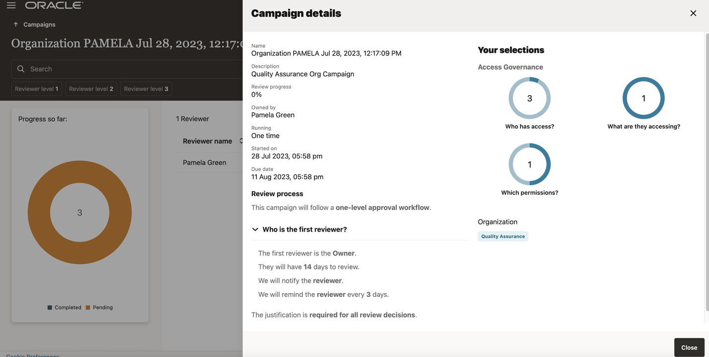

# Perform Access Review Tasks

## Introduction

Access reviews can be carried out from the Oracle Access Governance console by users (Mark Hernandez, Harlan Bullard, Jerry Poland) and will be reviewed by the Access Governance Administrator (Pamela Green)

* Persona: Campaign Reviewer and Campaign Administrator

*Estimated Time*: 15 minutes


Watch the video below for a quick walk-through of the lab.
[Oracle Video Hub video with no sizing](videohub:1_0sz90jrj)

### Objectives

In this lab, you will:

* Create Access Review requests as Access Governance users
* Create Campaign as the Campaign Administrator
* Approve Access Review requests as Access Governance Campaign Administrator


## Task 1: Login Oracle Access Governance as Employee User to create Access Requests


1. Log in to Oracle Access Governance as an employee user - Mark Hernandez with the username and password mentioned below. 


    **Username:**
    ```
    <copy>mhernandez</copy>
    ```

    **Password:**
    ```
    <copy>Oracl@123456</copy>
    ```


  You will be navigated to the home page of your Oracle Access Governance Console.

  3. On the Oracle Access Governance Console home page, from the navigation menu, select **My Stuff -> Request a new access** 

     


  4. Under **What access are you requesting?** select **Which access would like?**.

     


  5. Request a new access -> Select "Yes" . Click **Next**

     

  6. Under What would you like access to -> Select **DB-Manage-Access** -> Click **Next**

    

  7. Under We need some additional information for this request -> Provide Justification.

     

  8. Click on **Submit Request**


  9. Log in to Oracle Access Governance as an employee user - Harlan Bullard with the username and password mentioned below. 


    **Username:**
    ```
    <copy>harlan.bullard</copy>
    ```

    **Password:**
    ```
    <copy>Oracl@123456</copy>
    ```


  You will be navigated to the home page of your Oracle Access Governance Console.

  10. On the Oracle Access Governance Console home page, from the navigation menu, select **My Stuff -> Request a new access** 


  11. Under **What access are you requesting?** select **Which access would like?**.


  12. Request a new access -> Select "Yes" . Click **Next**

  13. Under What would you like access to -> Select **DB-Manage-Access** -> Click **Next**


  14. Under We need some additional information for this request -> Provide Justification.

  15. Click on **Submit Request**

  16. Log in to Oracle Access Governance as an employee user - Jerry Poland with the username and password mentioned below. 


    **Username:**
    ```
    <copy>jerry.poland</copy>
    ```

    **Password:**
    ```
    <copy>Oracl@123456</copy>
    ```


  You will be navigated to the home page of your Oracle Access Governance Console.

  17. On the Oracle Access Governance Console home page, from the navigation menu, select **My Stuff -> Request a new access** 


  18. Under **What access are you requesting?** select **Which access would like?**.


  19. Request a new access -> Select "Yes" . Click **Next**

  20. Under What would you like access to -> Select **DB-Manage-Access** -> Click **Next**


  21. Under We need some additional information for this request -> Provide Justification.

  22. Click on **Submit Request**

## Task 2: Login Oracle Access Governance as Access Governance Administrator to approve Access Requests


1. Log in to Oracle Access Governance as an employee user - Pamela Green with the username and password mentioned below. 


    **Username:**
    ```
    <copy>pamela.green</copy>
    ```

    **Password:**
    ```
    <copy>Oracl@123456</copy>
    ```


  You will be navigated to the home page of your Oracle Access Governance Console.

2. Navigate to MyStuff -> Approvals.You will see requests from user Harlan Bulllard, Mark Hernandez and Jerry Poland for **DB-Manage-Access** . 

3. Under Actions, click on approve and Approve the request for the users Harlan Bullard, Mark Hernandez and Jerry Poland. 

## Task 3: Run a Manual Dataload

1. On the Access Governance console home page, navigate to Service Administration -> Connected System. 

   


2. On the Connected Systems page, select the **OAG-DB** connected system. 

   

3. Click on  Actions -> Load Data Now. This will perform a manual data load. 

    

4. Once the data load is complete, the status will be shown as Success. 


## Task 4: Login Oracle Access Governance as Access Governance Administrator to Create Campaign 

1. Log in to Oracle Access Governance as an employee user - Pamela Green with the username and password mentioned below.


    **Username:**
    ```
    <copy>pamela.green</copy>
    ```

    **Password:**
    ```
    <copy>Oracl@123456</copy>
    ```

2. Navigate to Access Reviews -> Campaigns . Click on **Create a Campaign**

  

  

3. Under What type of access review campaign would you like to do? -> Select **Review systems managed by Access Governance**.

  

4. Select **Who has access?**. Search for Organization **Quality Assurance**. Click **Apply my selections**

  

  

5. Click on **I'm good to go with the workflow**

  

6. Select **I'll choose my own workflow**. Click **Next**


7. Select **How many levels of approval do you want?** -> One-level approval workflow

8. Select **Who is the first reviewer?** -> Owner. Click Save and Click Next

  

9. Under **How would you like to schedule your campaign?** -> Select **Run now**.Provide **How do you want to describe this campaign?** and Click **Next**

  

10. Click Create. Now the campaign has been created. 

11. To view the campaign created, navigate to Access Reviews -> Campaigns

  

12. Click on the campaign to view details. 

  

13. Click on Additional details to view more information on the campaign created. 


  

14. Navigate to Access Reviews -> My Access Reviews .

   


15. You will see requests from user Harlan Bulllard, Mark Hernandez and Jerry Poland for DB-Manage-Access . Click on view to review the insights of the requests.

  

  

  


16. Under Actions, click on Accept and accept the request for the users Harlan Bullard, Mark Hernandez and Jerry Poland.


  You may now **proceed to the next lab**. 

## Learn More

* [Oracle Access Governance Create Access Review Campaign](https://docs.oracle.com/en/cloud/paas/access-governance/pdapg/index.html)
* [Oracle Access Governance Product Page](https://www.oracle.com/security/cloud-security/access-governance/)
* [Oracle Access Governance Product tour](https://www.oracle.com/webfolder/s/quicktours/paas/pt-sec-access-governance/index.html)
* [Oracle Access Governance FAQ](https://www.oracle.com/security/cloud-security/access-governance/faq/)

## Acknowledgements
* **Authors** - Anuj Tripathi, Indira Balasundaram, Anbu Anbarasu 
* **Last Updated By/Date** - Anbu Anbarasu, July 2023
