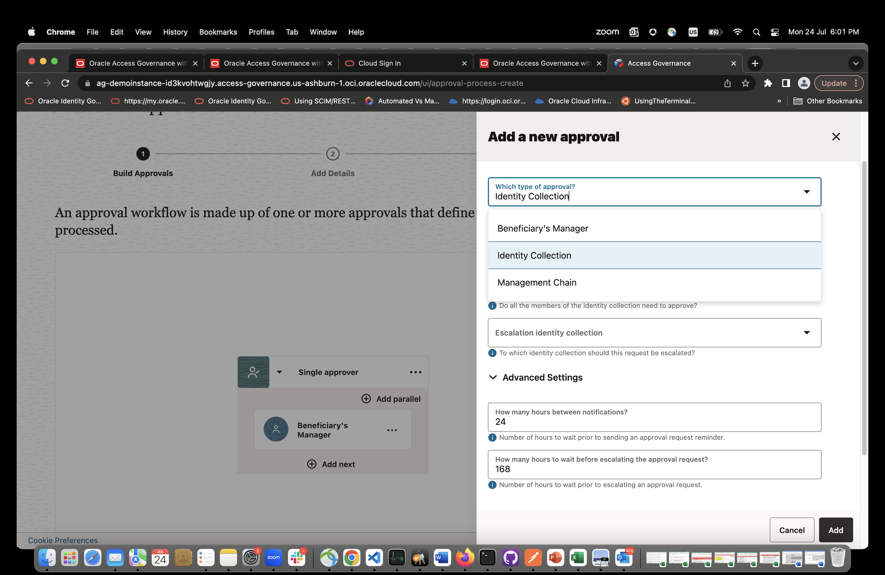

# Create an Approval Workflow with parallel escalation rules

## Introduction

In this lab we will create an Approval Workflow with parallel escalation rules

*Estimated Time*: 15 minutes

### Objectives

In this lab, you will:
 * Create an Approval Workflow with parallel escalation rules

## Task 1: Create an Approval Workflow 

1. On the Access Governance console home page, click the Access Controls tab. Then, click Select on the Manage Approval Workflows tile. 

   

2. On the Approval Workflows page, your created approval workflows will be listed here. Click Create approval workflow to create your first Approval Workflow.

    

    
    

3. Let’s build your approval workflow now. Click the “+” button and configure your approval workflow based on the following:

    •	Which type of approval?: Beneficiary’s Manager 
    •	For all other fields, leave as default
    •	Click Add

     

     

4. Now let’s define a parallel approval rule. This means you are defining a two-level approval workflow to approve the request. Click Add parallel and configure based on the following:

     

    •	Which type of approval?: Identity Collection
    •	Approval identity collection: IT Management
    •	For all other fields, leave as default
    •	Click Add

     

     

    Your approval workflow should look like the depicted image below, except for the name. Be sure to select All above the approval rules. All approvers will be required to approve the request, whereas Any means either approver can approve the request. After confirming your configuration matches the following, click Next

5. On the Add Details page, name your Approval Workflow: Approval-Workflow-IT-Management. Then, provide any description. Click Next to review your configurations so far, then click Publish.

     

     

    You may now **proceed to the next lab.**

## Learn More

* [Oracle Access Governance Create Access Review Campaign](https://docs.oracle.com/en/cloud/paas/access-governance/pdapg/index.html)
* [Oracle Access Governance Product Page](https://www.oracle.com/security/cloud-security/access-governance/)
* [Oracle Access Governance Product tour](https://www.oracle.com/webfolder/s/quicktours/paas/pt-sec-access-governance/index.html)
* [Oracle Access Governance FAQ](https://www.oracle.com/security/cloud-security/access-governance/faq/)

## Acknowledgments
* **Authors** - Anuj Tripathi, Indira Balasundaram, Anbu Anbarasu 