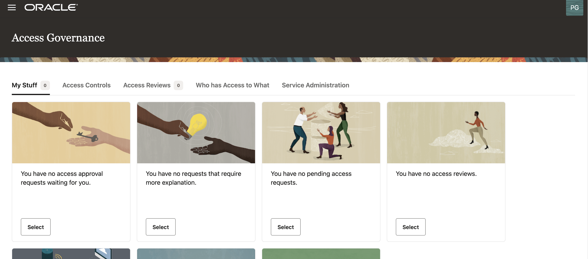
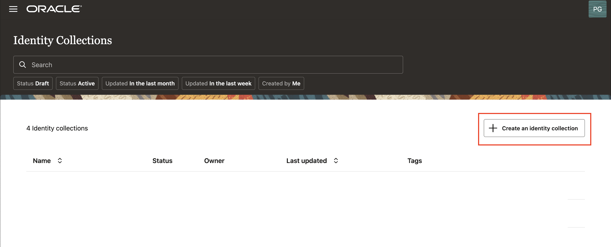
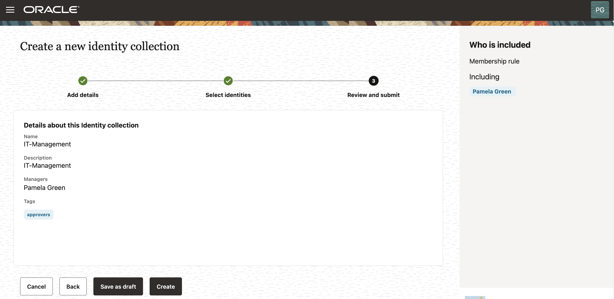

# Create an Identity Collection

## Introduction

In this lab we will create an Identity Collection

*Estimated Lab Time*: 15 minutes

### Objectives

In this lab, you will:
 * Create an Identity Collection

## Task 1: Create an Identity Collection - IT Management

1. On the Access Governance console home page, click the Access Controls tab. Then, click Select on the Identity Collections tile. 

     

      

2. On the Identity Collections page, your created Identity Collections will be listed here. Click Create identity collection to Create an Identity Collection.

   

3. Enter the below mentioned details Under Add Details tab:

    What do you want to call this identity collection? : IT-Management
    How would you describe this collection? : IT-Management
    Who can manage this identity collection : pamela.green
    Would you like to add any tags? : approvers

    Click on *Next*

   

4. Under Select Identities -> Included named identities , select the below mentioned option.

    Select *Pamela Green*

    Click on *Next*

    

5. Click on *Create*

    

## Task 2: Create an Identity Collection - IT Operations

1. On the Access Governance console home page, click the Access Controls tab. Then, click Select on the Identity Collections tile. 

2. On the Identity Collections page, your created Identity Collections will be listed here. Click Create identity collection to Create an Identity Collection.

    

   

  

3. Enter the below mentioned details Under Add Details tab:

    What do you want to call this identity collection? : IT-Operations
    How would you describe this collection? : IT-Operations
    Who can manage this identity collection : pamela.green
    Would you like to add any tags? : DB, database, operations

    Click on *Next*

    

4. Under Select Identities -> Membership rule , select the below mentioned option.

    Select the *All* checkbox.

    Select attribute: Organization
    Condition: Begins with 
    Attribute field: Software 

    

    Under Select Identities -> Included named identities , select the below mentioned option.

    Select *marian.smith*

    Click on *Next*

    

5. Click on *Create*

    

    You may now **proceed to the next lab.**

## Learn More

* [Oracle Access Governance Create Access Review Campaign](https://docs.oracle.com/en/cloud/paas/access-governance/pdapg/index.html)
* [Oracle Access Governance Product Page](https://www.oracle.com/security/cloud-security/access-governance/)
* [Oracle Access Governance Product tour](https://www.oracle.com/webfolder/s/quicktours/paas/pt-sec-access-governance/index.html)
* [Oracle Access Governance FAQ](https://www.oracle.com/security/cloud-security/access-governance/faq/)

## Acknowledgments
* **Authors** - Anuj Tripathi, Indira Balasundaram, Anbu Anbarasu 