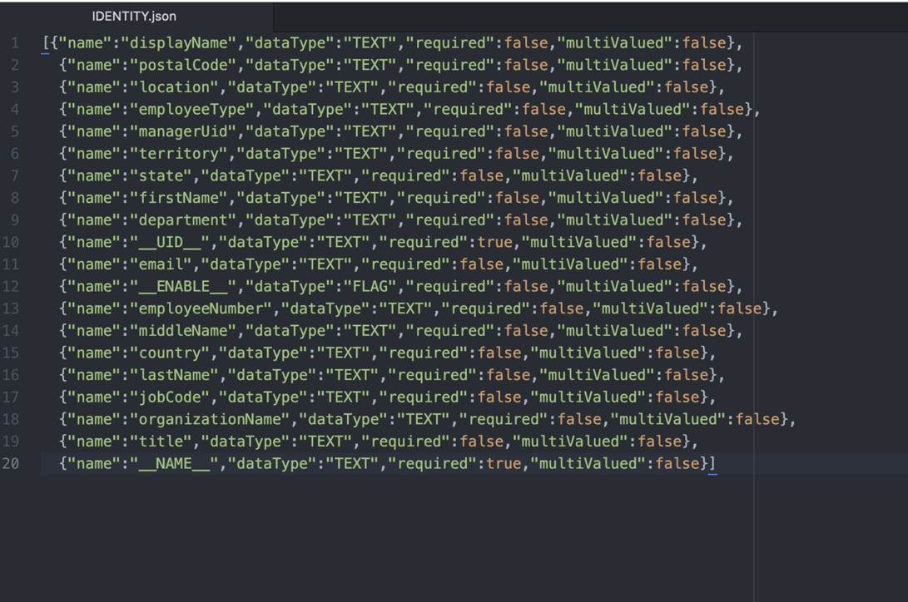
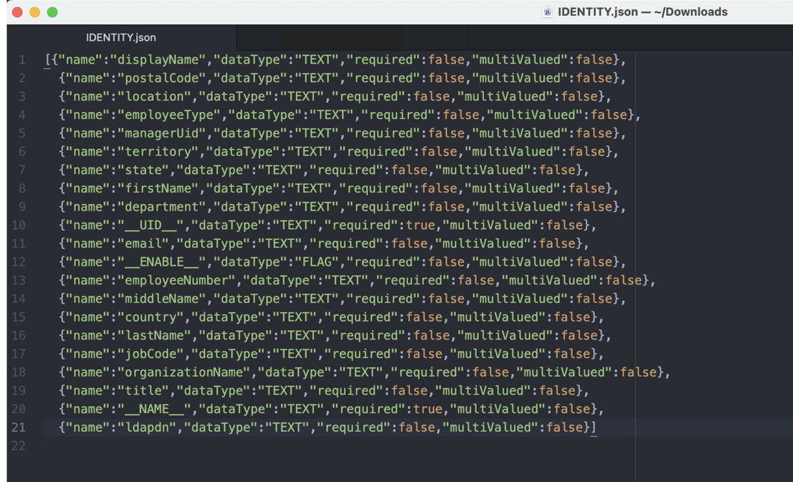
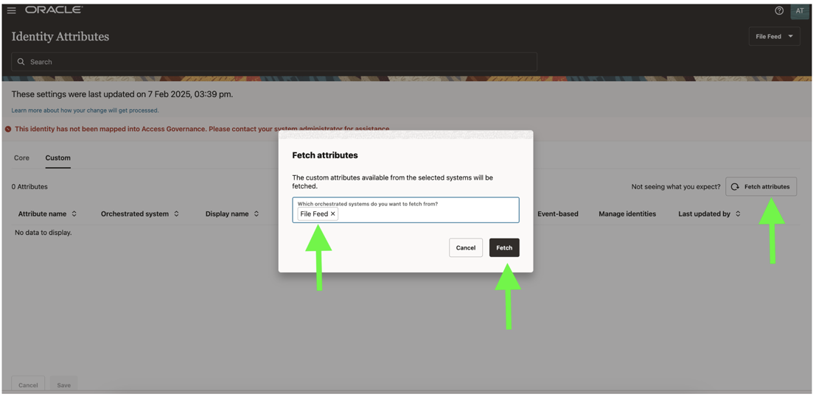
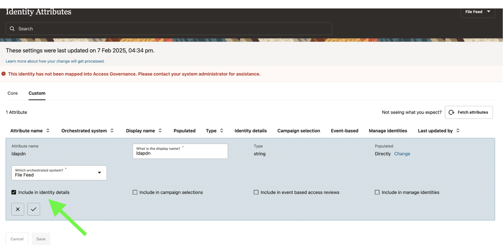
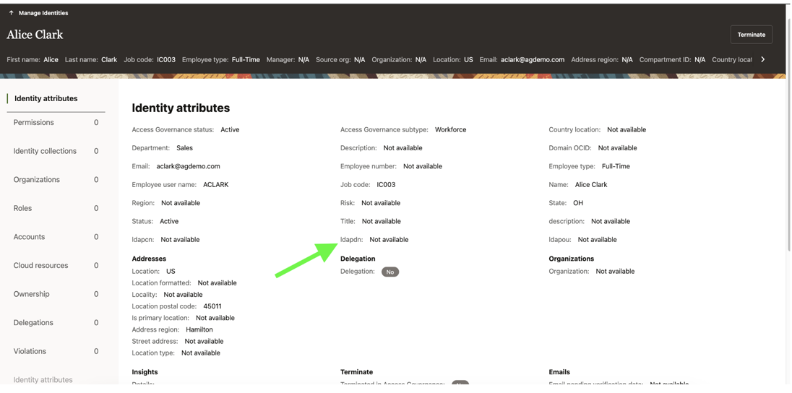
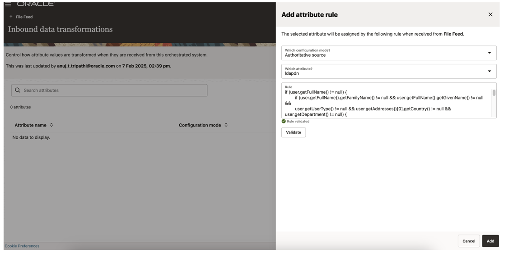
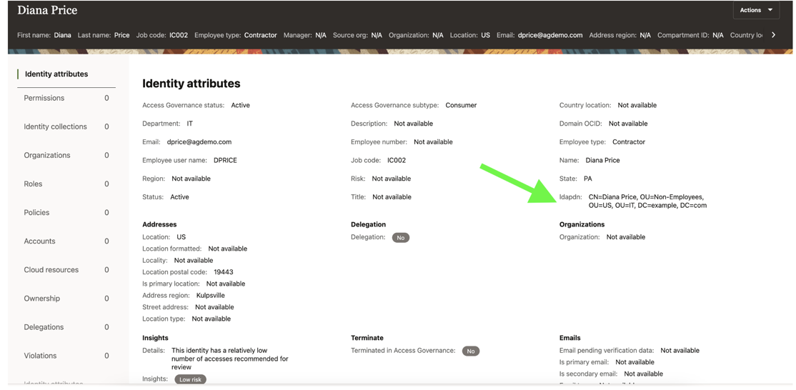

# Integrate Oracle Access Governance with Flat File

## Introduction

As **Access Governance Administrators** they can learn to setup identity orchestration between Oracle Access Governance and a flat file. 

* Estimated Time: 10 minutes
* Persona: Access Governance Administrator

### Objectives

In this lab, you will:

* Set Up Identity Orchestration between Oracle Access Governance and a Flat File

## Task 1: Add custom attribute in the schema file : download schema file, modify it, re-upload it

In this task, we will add a custom attribute in the identity schema file.

1.  Go to the OCI Console and navigate to the bucket for the flat file.

    
2.  Download the identity schema file IDENTITY.json residing in the folder <ServiceInstanceName/OrchestratedSystemName/schema>. If not customized previously, the default schema file should have the following content:

   

3. Download the file and add a new row for a custom attribute ldapdn. The modified schema file should have the following content:

      

4. Re-upload the file. DO NOT rename the schema file; ensure it remains as IDENTITY.json.

## Task 2: Fetch the Custom Attribute in Oracle Access Governance Cloud Service

In this task, we will fetch the custom attribute added. 

1.  Go to Oracle Access Governance Cloud Service, navigate to Service Administration and click Identity Attributes.

    
2.  Click Custom and Fetch attributes. Ensure to select the Flat file orchestrated system, if not populated automatically and click Fetch. It might take a couple of minutes for the attribute to be synchronized.

   

3. Once the ldapdn attribute is synchronized, click the three dots (:) icon and click Edit.

4. Select Include in Identity Details, click Apply and Save. 

   

5. If you view a user's profile, you should see the ldapdn attribute. At this stage, the attribute appears but remains unpopulated since no transformation rule has been applied.

  

## Task 3: Apply the Transformation Rule in Oracle Access Governance Cloud Service

In this task, we will apply the transformation logic to the custom attribute in Oracle Access Governance Cloud Service.

1. Go to Oracle Access Governance Cloud Service, navigate to Service Administration and click Orchestrated Systems.

    
2.  Locate the orchestrated system for flat file, click the three-dots (⋮) icon and select Manage Integration.

3. Under Inbound data transformations, click Manage and Add attribute rule.

4. Select Authoritative source as Configuration mode and select ldapdn as the attribute. Enter the following rule in the rule window.

      if (user.getFullName() != null) {
      if (user.getFullName().getFamilyName() != null &&
         user.getFullName().getGivenName() != null &&
         user.getUserType() != null &&
         user.getAddresses()[0].getCountry() != null &&
         user.getDepartment() != null) {

         if (user.getUserType().toUpperCase() == "FULL-TIME") {
               "CN=" + user.getFullName().getGivenName() + " " + user.getFullName().getFamilyName() +
               ", OU=Employees, OU=" + user.getAddresses()[0].getCountry() +
               ", OU=" + user.getDepartment() +
               ", DC=example, DC=com";
         } else {
               "CN=" + user.getFullName().getGivenName() + " " + user.getFullName().getFamilyName() +
               ", OU=Non-Employees, OU=" + user.getAddresses()[0].getCountry() +
               ", OU=" + user.getDepartment() +
               ", DC=example, DC=com";
         }
      }
   }

5. Click Validate. Upon successful validation, click Add.

  

## Task 4: Validate the Data Transformation by Running the Data Load

In this task, we will run the data load and validate the transformed attribute value.

1. Go to Oracle Access Governance Cloud Service, navigate to Service Administration and under Who has access to what, click Enterprise-wide browser.

    
2.  Select Identities.

3. Click View details for any of the previous users and then click Identity attributes.

4. Notice that the attribute ldapdn is populated based on the transformation logic supplied.

    

5. Optionally, validate ldapdn value for other users.

 

  You may now **proceed to the next lab**. 

## Learn More

* [Oracle Access Governance Create Access Review Campaign](https://docs.oracle.com/en/cloud/paas/access-governance/pdapg/index.html)
* [Oracle Access Governance Product Page](https://www.oracle.com/security/cloud-security/access-governance/)
* [Oracle Access Governance Product tour](https://www.oracle.com/webfolder/s/quicktours/paas/pt-sec-access-governance/index.html)
* [Oracle Access Governance FAQ](https://www.oracle.com/security/cloud-security/access-governance/faq/)

## Acknowledgements
* **Authors** - Indira Balasundaram, Anuj Tripathi, Anbu Anbarasu 
* **Last Updated By/Date** - Indira Balasundaram, March 2025