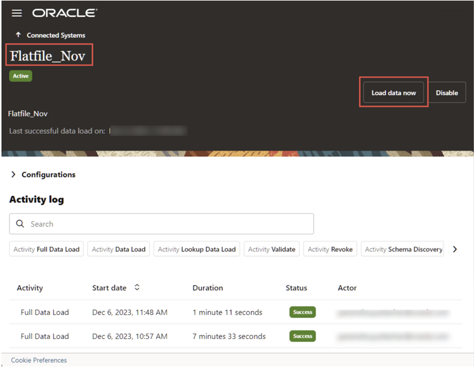

# Check Folder Structure

## Introduction

As **Access Governance Administrators** they can learn to setup identity orchestration between Oracle Access Governance and a flat file. 

* Estimated Time: 10 minutes
* Persona: Access Governance Administrator

### Objectives

In this lab, you will:

* Set Up Identity Orchestration between Oracle Access Governance and a Flat File

## Task 1: Check bucket folder structure

To check the bucket folder structure login to the OCI Console and navigate to Object Storage. Select your connected system bucket. Under the Resources menu, select Objects, and confirm the folder structure. <ServiceInstanceName>/<ConnectedSystemName> failed inbox outbox sample schema

   

1.  These folders fulfill the following purposes:

   failed: Files with any kind of data issue will be moved to this folder under the respective entity folder, in the event of a data load operation failure.

   inbox: Contains the entity subfolders in which CSV files should be placed to be included in the data load operation.

   outbox: Used to output the provisioning events for each entity.

   sample: Contains example CSVs with the expected header. These can be used as a reference for generating data and putting in the inbox for data load. These files should not be altered.

   schema: Contains the JSON representation of each entity’s schema. This can be referred to for understanding details like:

   - datatype
   - Mandatory attributes
   - Whether an attribute is multivalued or not
   - If the attribute is complex and has nested attributes (datatype will be CUSTOM)
   - Supported datatypes are:
         TEXT
         NUMBER
         DECIMAL_NUMBER
         DATE
         FLAG
         CUSTOM
    

## Task 2: Place the CSV flat files in the bucket folder

Perform the following steps to upload the CSV flat files into the bucket object storage.

1.  Access the bucket on OCI and click the inbox folder to upload the CSV flat files.

   

   
    
2.  Click the three dots corresponding to the folders to upload the CSV flat files:

   IDENTITY - To upload identity.csv
   PERMISSION - To upload permission.csv
   TARGETACCOUNT - To upload targetaccount.csv

3. Click Upload.

4. In the Upload Objects popup screen, click select files link in the Choose Files from your Computer field.

5. Browse and locate the file and click Upload.

    

6. Perform the similar steps to upload other required CSV flat files.

      

## Task 3:  Run Dataload and Manage Identities in the Oracle Access Governance

After placing the relevant CSV flat files into the inbox folder we must run a dataload on demand. Each time you run a dataload it is always a full data load and there is no incremental data load.

If there is any kind of failure (single record or complete file failure), the data load operation will be marked as failed. The files that have been processed successfully will stay in the inbox while the failed files will be moved to the failed folder. After fixing the data issue, you are expected to put the files back in the inbox again and retry the dataload operation. Data integrity issues, such as a permission being assigned to an account that is missing in the CSV can cause the dataload operation to fail. However, in such cases the CSV files will not be moved to the failed folder. Files will be moved to the failed folder only when there are issues reading the data itself, such as missing mandatory data.

1. To run dataload: 

   - Log onto the Oracle Access Governance console.

   - From the Oracle Access Governance navigation menu icon select Service Administration > Connected Systems.

   - Click the flat file connected system.

   - Click Load data now button.

       

   - Wait for the data load to complete and then access the integrated files.

   To Manage Identities:

   - Log onto the Oracle Access Governance console.

   - From the Oracle Access Governance navigation menu icon select Service Administrator > Manage Identities.

   - Select Active from the Manage Identities page.

   - Select Any if any one of the set conditions should be satisfied, or select All if all the set conditions must be satisfied for that identity. For this tutorial, select Any.

   - Select the attribute name Status from the list.

   - Select the Equals conditional operator.

   - Select the Active attribute value.

   
    

2. Once you have defined your rules, select Preview summary based on the rule above to go to the Preview Summary popup

  You may now **proceed to the next lab**. 

## Learn More

* [Oracle Access Governance Create Access Review Campaign](https://docs.oracle.com/en/cloud/paas/access-governance/pdapg/index.html)
* [Oracle Access Governance Product Page](https://www.oracle.com/security/cloud-security/access-governance/)
* [Oracle Access Governance Product tour](https://www.oracle.com/webfolder/s/quicktours/paas/pt-sec-access-governance/index.html)
* [Oracle Access Governance FAQ](https://www.oracle.com/security/cloud-security/access-governance/faq/)

## Acknowledgements
* **Authors** - Indira Balasundaram, Anuj Tripathi, Anbu Anbarasu 
* **Last Updated By/Date** - Indira Balasundaram, March 2025