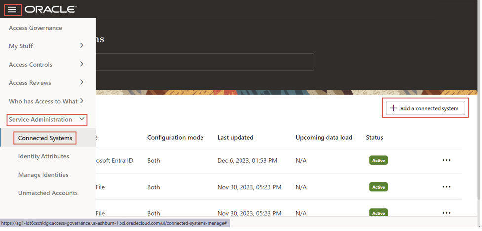
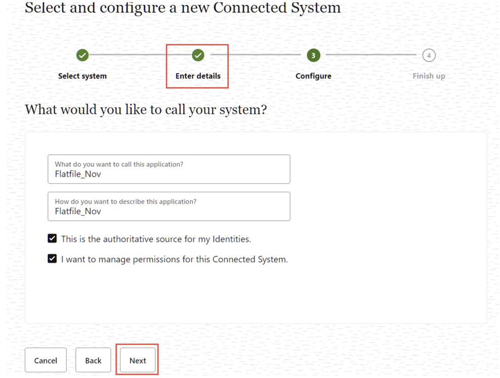

# Integrate Oracle Access Governance with Flat File

## Introduction

As **Access Governance Administrators** they can learn to setup identity orchestration between Oracle Access Governance and a flat file. 

* Estimated Time: 10 minutes
* Persona: Access Governance Administrator

### Objectives

In this lab, you will:

* Set Up Identity Orchestration between Oracle Access Governance and a Flat File

## Task 1: Create a bucket in the Oracle Cloud Infrastructure (OCI)

To load the data into the Oracle Access Governance you need to place the data files in a bucket created using OCI object storage service. The bucket can be created in any compartment of your OCI tenancy.

1.  Log onto the Oracle Cloud Infrastructure (OCI) console. Open the navigation menu icon and click **Storage**

   
    
2.  Under **Object Storage & Archive Storage** click **Buckets**

   

3. Select the required compartment from the **List scope** Click **Create Bucket** The Create Bucket dialog box appears.

      

4. **Bucket Name:** The system generates a default bucket name that reflects the current year, month, day, and time, for example bucket-2019030620230306-1359. If you change this default to any other bucket name, use letters, numbers, dashes, underscores, and periods. Avoid entering confidential information.

5. Ignore or leave the other settings as is and click **Create**

 

## Task 2: Create a service user and assign ‘manage’ privileges to the bucket

1.  Create a local identity user agcs_user in the same compartment as that of the bucket. In this example, the bucket is created in the accessgov compartment.

    
2.  Create an identity group agcs_flatfilegroup in the same domain and compartment as that of the local identity user. In this example, the domain name is default and the compartment name is accessgov. 

3. Assign the identity user agcs_user to the identity group agcs_flatfilegroup.

4. Create a policy, agcs_flatfilepolicy, with the following policy statement:

  Syntax

  allow group <groupname> to manage objects in compartment <compartmentname> where target.bucket.name = <’bucketname’>

## Task 3: Generate API key for service user

1. In the Oracle Cloud Infrastructure (OCI) console, select Identity & Security, and then Domains -> Default Domain, and then from the left pane, select Users.

    
2. Select the agcs_user user name that was created previously.

3. On the left navigation panel, in the Resources section, select API keys.

4. Click Add API key then select Generate API key pair.

5. Click Download private key and save it.

  

6. Click Add. The configuration file is created displaying fingerprint, and config file details. Save the information available on the configuration file in a separate text file.

  

## Task 4: Establish connection between bucket and Oracle Access Governance

You can establish a connection between your bucket and Oracle Access Governance by entering connection details. To achieve this, use the Connected Systems functionality available in the Oracle Access Governance Console.

1. Log onto an Oracle Access Governance Instance.
    
2.  From the Oracle Access Governance navigation menu icon select Service Administration > Connected Systems.

3. Click Add a connected system.

      

4. In the Select and configure a new Connected System step, select the Flat File tile and click Next.

    

5. In the Enter details step, enter a name for the application you want to connect to in the What do you want to call your Flat File? field.

6. Enter a description for the application in the How do you want to describe this Flat File? field.

7. Determine if this connected system is an authoritative source, and if Oracle Access Governance can manage permissions for existing users by setting the following checkboxes.

  - This is the authoritative source for my Identities - If selected, allows you to load the identities into the Access Governance system as a user.

  - I want to manage permissions for this Connected System - If selected, allows you to load the account and permissions into the Access Governance system.

  Note: A combination of both options would load the identities into the system, followed by the account details, and will create an interlink between the identities and the accounts.

8. Click Next.

    

9. In the Configure step, enter the following details and click Add.

  - In the What is the OCI user’s OCID? field, add the OCID for the OCI user owning the bucket containing the flat files you want to integrate. For example, the information in the user field.

  - In the What is the fingerprint of the OCI user’s API key? field enter the fingerprint for the OCU user’s API key. For example, the information in the fingerprint field.

  - Enter the user’s private API key, in PEM format into the What is the OCI user’s private API key in PEM format? field. For example, open the previously downloaded private key in any text editor and copy the content of the file and place it in the What is the OCI user’s private API key in PEM format? field.

  - Enter the tenancy into the What is the tenancy of the OCI user? field. For example, the information present in the tenancy field.

  - Enter the home region code of the tenancy into the What us the OCI tenancy’s home region code? field. For example, the information in the region field.

  - Enter the bucket namespace of the tenancy in the What is the namespace for the bucket? field.

    To get the bucket namespace details:

    In the Oracle Cloud Infrastructure (OCI) console, select Storage and then under Object Storage & Archive Storage click Buckets.

    Click on the previously created bucket. In this case bucket-2019030620230306-1359.

    From the Bucket Information tab copy the bucket namespace.

    

  - In the What is the name of the bucket? field, enter the name of the bucket where your flat file is stored in OCI object storage. In this case bucket-2019030620230306-1359.

  - Enter the encoding into the Encoding field. Default is UTF-8.

  - In the Field Delimiter field, enter the field delimiter character used in the flat file. Default is ,.

  - In the Sub Field Delimiter field, enter the sub field delimiter character used in the flat file. Default is #.

  - In the MultiValue Delimiter field, enter the multivalue delimiter character used in the flat file. Default is ;.

  - In the Text Qualifier field, enter the character used in the flat file to act as a text qualifier. Default is “.

  - If you want to check the connectivity to your Flat File, click the Test Connectivity button. Once you have confirmed the connectivity, click Add to save your configuration.

  

  

  You may now **proceed to the next lab**. 

## Learn More

* [Oracle Access Governance Create Access Review Campaign](https://docs.oracle.com/en/cloud/paas/access-governance/pdapg/index.html)
* [Oracle Access Governance Product Page](https://www.oracle.com/security/cloud-security/access-governance/)
* [Oracle Access Governance Product tour](https://www.oracle.com/webfolder/s/quicktours/paas/pt-sec-access-governance/index.html)
* [Oracle Access Governance FAQ](https://www.oracle.com/security/cloud-security/access-governance/faq/)

## Acknowledgements
* **Authors** - Anuj Tripathi, Indira Balasundaram, Anbu Anbarasu 
* **Last Updated By/Date** - Indira Balasundaram, Nov 2024