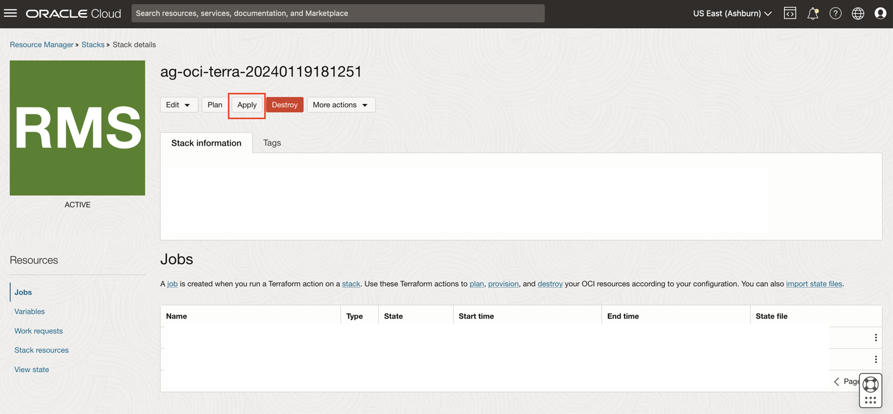

# Deploy Infrastructure Using Terraform

## Introduction

In this lab we will use pre-configured terraform scripts to resources - Compartment, Identity Domain, AGCS User, Groups and Policies for Access Governance, OCI policies and VCN needed to run the OCI-IAM Policy reviews.

* Estimated Time: 15 minutes
* Persona: Default Domain Administrator

### Objectives

In this lab, you will: 

* Create the following resources using Terraform stack:

  

## Task 1: Download Oracle Resource Manager (ORM) stack zip file

1. Click on the link below to download the Resource Manager zip file you need to build your environment:

    
   - [oracle_access_governance-terraform-stack-oci.zip](https://c4u04.objectstorage.us-ashburn-1.oci.customer-oci.com/p/EcTjWk2IuZPZeNnD_fYMcgUhdNDIDA6rt9gaFj_WZMiL7VvxPBNMY60837hu5hga/n/c4u04/b/livelabsfiles/o/security-library/ag-terra-oci_iam.zip)

  Save in your downloads folder.

## Task 2: Deploying Infrastructure using Terraform

1. Login to the OCI console **Default Domain** as the **Default Domain Administrator**

    

2. In the OCI console, click the Navigation Menu icon in the top left corner to display the Navigation menu. Click *Developer Services* in the Navigation menu. Select *Stacks* from the list of products.

     

3. Click on *Create Stack*. Enter the following details to create the stack

    

  **Choose the origin of the Terraform configuration:** My configuration

  **Stack Configuration -> Terraform Configuration Source** Select .zip file

  Browse the Downloaded stack file from previous step and upload it. 

  

  Click *Next*

  Under Access Governance Configuration Parameters, enter the below details. 

  **NOTE:** We will be using **ag-compartment** and **ag-domain** throughout this LiveLab. Kindly use a compartment and domain in your tenancy accordingly. 

  **Identity Domain administrator email:** Enter the Identity Domain administrator email

  **Access Governance Service administrator email:** Enter the Access Governance Service administrator email

  **Access Governance Compartment Name:** Provide name of the compartment to be created for Access Governance and associated resources. (In this LiveLab we are using ag-compartment)
  
  **Access Governance OCI Identity Domain Name:** Provide name of the OCI IAM Domain to be created for Access Governance and associated resources. (In this LiveLab we are using ag-domain)

  **AG-OCI Integration Service User:** agcs_user

  **AG-OCI Integration Service Group:** agcs_group
  

  Click *Next*.

   

  Click on *Create*.

  

4. The stack has now been created. Click on *Plan job* and once it is completed successful.

    

    
    
    
     Click on *Apply job* and wait till it is completed successful.

    

    

5. The resources should have been created successfully by the terraform script. Please verify the resources created. *You will receive activation mail for the Identity Domain administrator and Access Governance Service administrator. Ensure you reset the password.*

  You may now **proceed to the next lab**. 

## Learn More

* [Oracle Access Governance Create Access Review Campaign](https://docs.oracle.com/en/cloud/paas/access-governance/pdapg/index.html)
* [Oracle Access Governance Product Page](https://www.oracle.com/security/cloud-security/access-governance/)
* [Oracle Access Governance Product tour](https://www.oracle.com/webfolder/s/quicktours/paas/pt-sec-access-governance/index.html)
* [Oracle Access Governance FAQ](https://www.oracle.com/security/cloud-security/access-governance/faq/)

## Acknowledgements
* **Authors** - Anuj Tripathi, Indira Balasundaram, Anbu Anbarasu 
* **Last Updated By/Date** - Indira Balasundaram , Sept 2024
