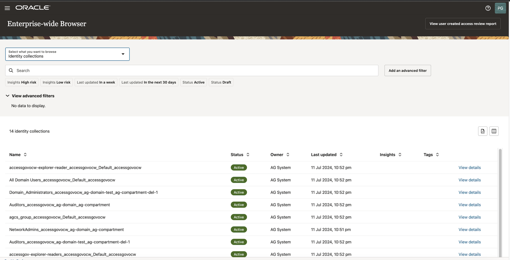
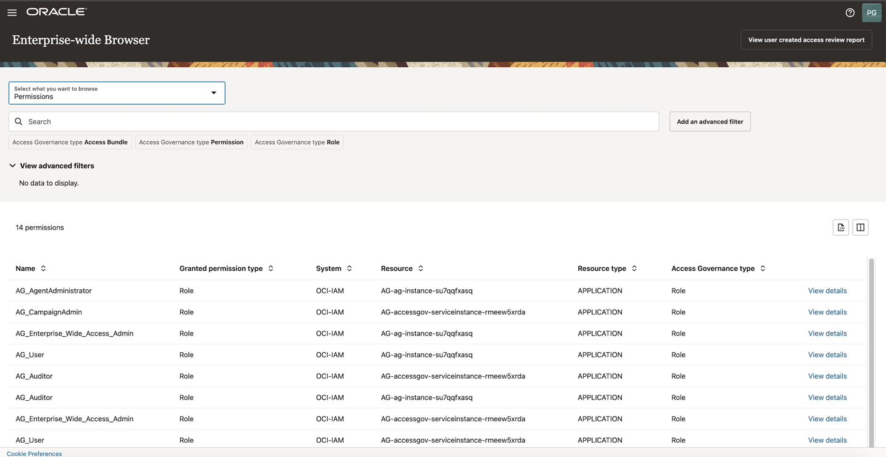

# Review Who Has Access To What

## Introduction

Access Governance Administrator (Pamela Green) can view who has access to what. 

* Estimated Time: 5 minutes
* Persona: Access Governance Administrator

### Objectives

In this lab, you will:

* Explore **My Access**
* Explore **Enterprise Wide Browser**


## Task 1: Review Who Has Access to What - MyAccess

  In this task, you will review **Who has Access to What - MyAccess**


1. From your browser, navigate to the Oracle Access Governance Console using the URL specified in *Lab 2: Task 1: Step 4* 


2. Enter **Oracle Access Governance Administrator** username and password (Pamela Green)

    **Username:**
    ```
    <copy>pamela.green</copy>
    ```

    **Password:**
    
    The password you have set for the user in *Lab 1: Task 2: Step 5*
    

     

     
  You will be navigated to the home page of your Oracle Access Governance Console.

  3. On the Oracle Access Governance Console home page, from the navigation menu, select **My Stuff -> My Access** 

    


  4. Click on **Permissions** to view the **Cloud Resources** the user **Pamela Green** has access to. 

  

  5. Click on the **Accounts** , to view the user's account details. 

  

  6.  Click on the **Identity Attributes** to view the user's identity attributes.

  


## Task 2: Review Who Has Access to What -  Enterprise Wide Access

  1. On the Oracle Access Governance Console home page, from the navigation menu, select **Who has Access to What -> Enterprise-wide Browser** 


  


  2. Under **Select what you want to browse** , click on **Identities** to view the user identities that have access to particular resources. 


    

  3. Click on **View details** for user **Mark Hernandez** to view individual user details.

    

  4. You can click on **View Resources details, View Account details,View Permission details** to view them. Clicking on **create access review** will proceed to create an access review campaign for the user. 

    

    

    

    

    


  5. Under **Select what you want to browse** , click on **Identity Collections** to view Identity Collections that are present in the system. 

    

    Click on **View Details** 

    

  6. Under **Select what you want to browse** , click on **Permissions** to view permissions of the user identities.  
   

    


  7. Under **Select what you want to browse** , click on **Policies** to view Policies present in OCI IAM.  

    

     Click on **View Details**

    

  6. Under **Select what you want to browse** , click on **Resources** to view the resources associated with the user identities. Click on **View Details** to view all the user identities that have access to the particular resource.  

    

 
  7. Click on the **view all accesses** to view all the access of user. 

    


  You may now **proceed to the next lab**. 

## Learn More

* [Oracle Access Governance Create Access Review Campaign](https://docs.oracle.com/en/cloud/paas/access-governance/pdapg/index.html)
* [Oracle Access Governance Product Page](https://www.oracle.com/security/cloud-security/access-governance/)
* [Oracle Access Governance Product tour](https://www.oracle.com/webfolder/s/quicktours/paas/pt-sec-access-governance/index.html)
* [Oracle Access Governance FAQ](https://www.oracle.com/security/cloud-security/access-governance/faq/)

## Acknowledgements
* **Authors** - Anuj Tripathi, Indira Balasundaram, Anbu Anbarasu 
* **Last Updated By/Date** - Indira Balasundaram , Sept 2024
