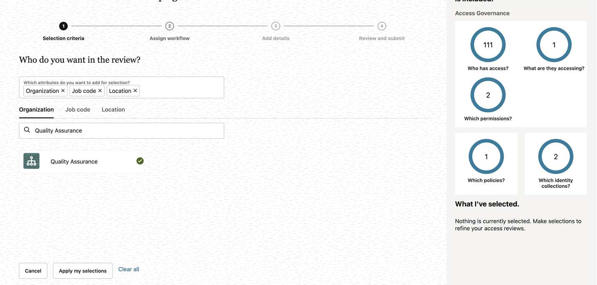
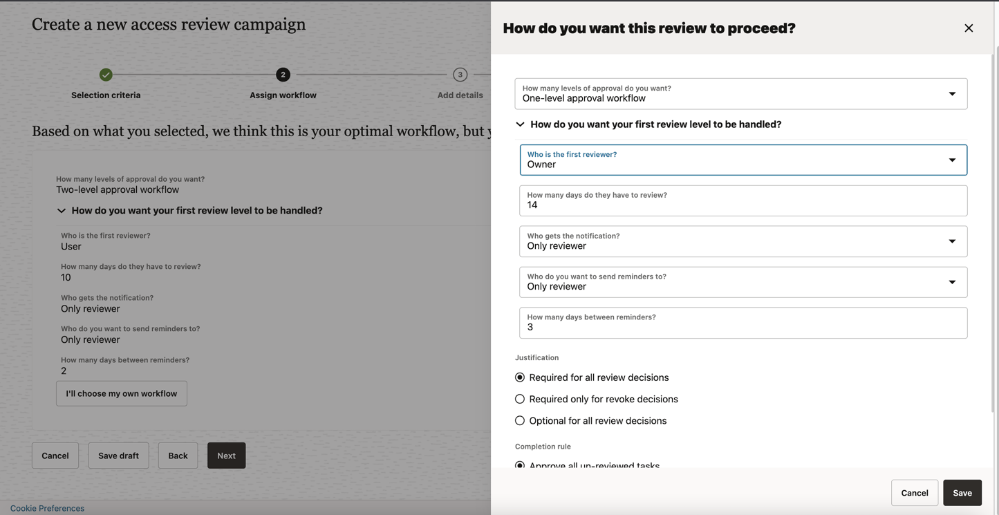
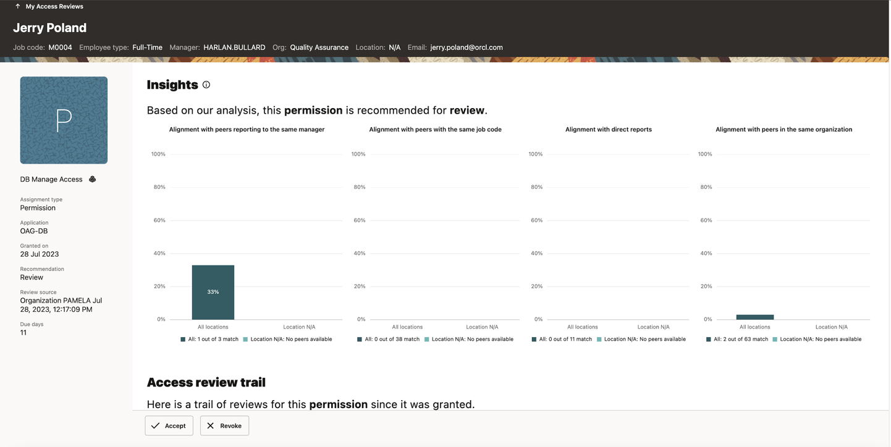

# Perform Access Reviews for database

## Introduction

Access reviews can be carried out from the Oracle Access Governance console by users (Mark Hernandez, Harlan Bullard, Jerry Poland) and will be reviewed by the Access Governance Administrator (Pamela Green)

* Persona: Campaign Reviewer and Campaign Administrator

*Estimated Time*: 15 minutes

Watch the video below for a quick walk-through of the lab.
[Oracle Video Hub video with no sizing](videohub:1_uf74n82i)

### Objectives

In this lab, you will:

* Create Campaign as the Campaign Administrator
* Approve Access Review requests as Access Governance Campaign Administrator

### Prerequisites

This lab assumes you have:

A valid Oracle OCI tenancy, with OCI administrator privileges.

## Task 1: Create a Campaign

1. From your browser, navigate to the Oracle Access Governance Console using the URL specified in *Lab 2: Task 1: Step 4*


2. Enter **Oracle Access Governance Administrator** username and password (Pamela Green)

    **Username:**
    ```
    <copy>pamela.green</copy>
    ```

    **Password:**
    
    The password you have set for the user in *Lab 1: Task 2: Step 5*


  You will be navigated to the home page of your Oracle Access Governance Console.


2. Navigate to Access Reviews -> Campaigns . Click on **Create a Campaign**

  

  

3. Under What type of access review campaign would you like to do? -> Select **Review systems managed by Access Governance**.

  

4. Select **Who has access?**. Search for Organization **Quality Assurance**. Click **Apply my selections**

  

  

5. Click on **I'm good to go with the workflow**

  

6. Select **I'll choose my own workflow**. Click **Next**

7. Select **How many levels of approval do you want?** -> One-level approval workflow

8. Select **Who is the first reviewer?** -> Owner. Click Save and Click Next

  

9. Under **How would you like to schedule your campaign?** -> Select **Run now**.Provide **How do you want to describe this campaign?** and Click **Next**

  

10. Click Create. Now the campaign has been created.

11. To view the campaign created, navigate to Access Reviews -> Campaigns

  

12. Click on the campaign to view details.

  

13. Click on Additional details to view more information on the campaign created.

  

## Task 2: Review the Access

1. Navigate to Access Reviews -> My Access Reviews .

   

2. You will see access review tasks for user Harlan Bulllard, Mark Hernandez and Jerry Poland for DB-Manage-Access. Click on view to review the insights of the review tasks.

  

  

  

3. Under Actions, click on Accept to the request for the users Harlan Bullard, Mark Hernandez and Jerry Poland.

  You may now **proceed to the next lab**.

## Learn More

* [Oracle Access Governance Create Access Review Campaign](https://docs.oracle.com/en/cloud/paas/access-governance/pdapg/index.html)
* [Oracle Access Governance Product Page](https://www.oracle.com/security/cloud-security/access-governance/)
* [Oracle Access Governance Product tour](https://www.oracle.com/webfolder/s/quicktours/paas/pt-sec-access-governance/index.html)
* [Oracle Access Governance FAQ](https://www.oracle.com/security/cloud-security/access-governance/faq/)

## Acknowledgements

* **Authors** - Anuj Tripathi
* **Contributors** - Anbu Anbarasu
* **Last Updated By/Date** - Indira Balasundaram  29 May 2024
