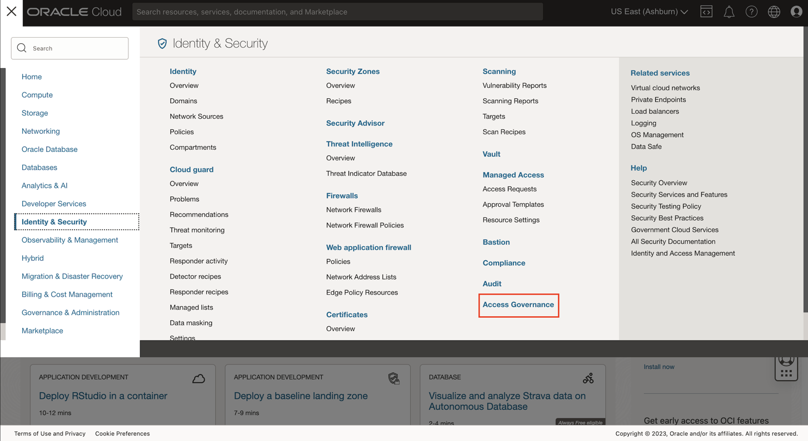
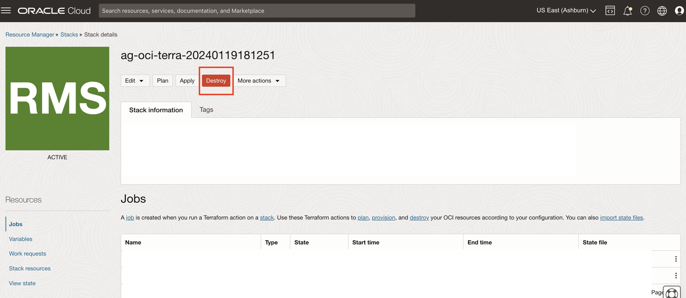
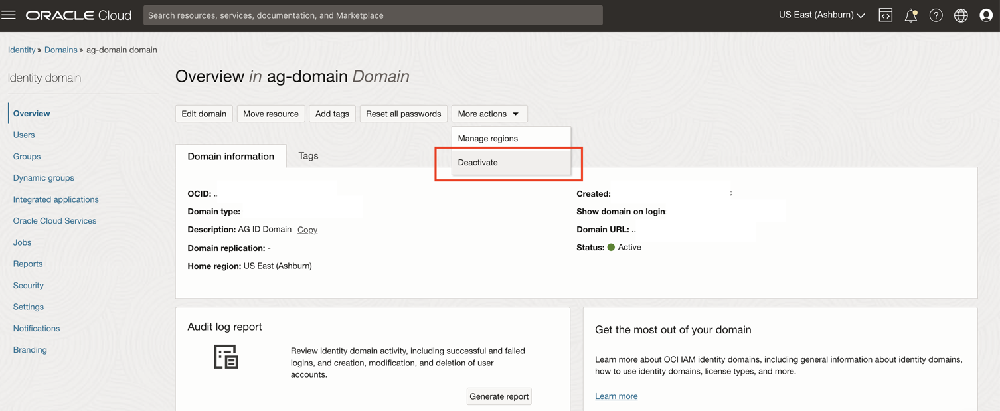
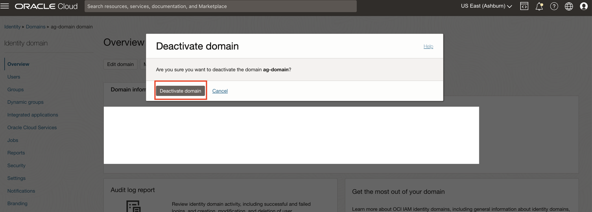
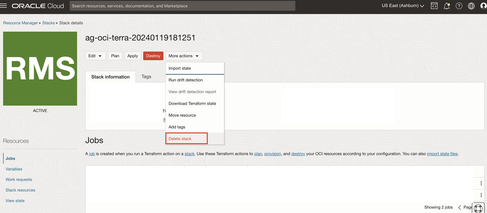

# Cleanup the Environment 

## Introduction

Upon completing your labs, we recommend that you perform a cleanup to dispose the Access Governance service instance. This lab will guide you to properly destroy the resource.

*Estimated Lab Time*: 5 minutes

### Objectives

In this lab, you will:

 * Delete the Access Governance service instance, OCI Identity domain and OCI Resources

### Prerequisites

This lab assumes you have:

A valid Oracle OCI tenancy, with OCI administrator privileges.

## Task 1: Delete the Access Governance service instance

1. Log in to Oracle Cloud as the **Default Domain Administrator**

   

2. Click the Navigation Menu icon in the top left corner to display the Navigation menu. Click Identity and Security in the Navigation menu. Select Access Governance from the list of products.

   
    

    
3. On the Access Governance page, select Service Instances. Click on the Service Instance **service-instance** you created in *Lab 2: Task 1* 
 

     

4. Click on *Delete*. Prompt appears, confirm the *Delete* option. 

     

5. Now the Access Governance service instance has been successfully deleted. 

## Task 2: Run the Destroy Job  

1. Navigate to **Resource Manager -> Stacks -> Stack details** 

    

2. Click on **Destroy** job. 

## Task 3: Deactivate Identity Domain

1. Navigate to **Identity -> Domain -> ag-domain**. Click on **More actions -> Deactivate**

    

2. Click on **Deactivate domain**

    

## Task 4: Destroy Terraform Stack that was used to create resources - Compartment, Identity Domain, AG Users and Policies for Access Governance 

1. Navigate to **Resource Manager -> Stacks -> Stack details** 

    

2. Click on **Destroy** job. Once it has completed, Under **More Actions** select **Delete stack**

    

    You may now **proceed to the next lab.**

## Learn More

* [Oracle Access Governance Create Access Review Campaign](https://docs.oracle.com/en/cloud/paas/access-governance/pdapg/index.html)
* [Oracle Access Governance Product Page](https://www.oracle.com/security/cloud-security/access-governance/)
* [Oracle Access Governance Product tour](https://www.oracle.com/webfolder/s/quicktours/paas/pt-sec-access-governance/index.html)
* [Oracle Access Governance FAQ](https://www.oracle.com/security/cloud-security/access-governance/faq/)

## Acknowledgements
* **Authors** - Anuj Tripathi, Indira Balasundaram, Anbu Anbarasu 
* **Last Updated By/Date** - Anbu Anbarasu, May 2023