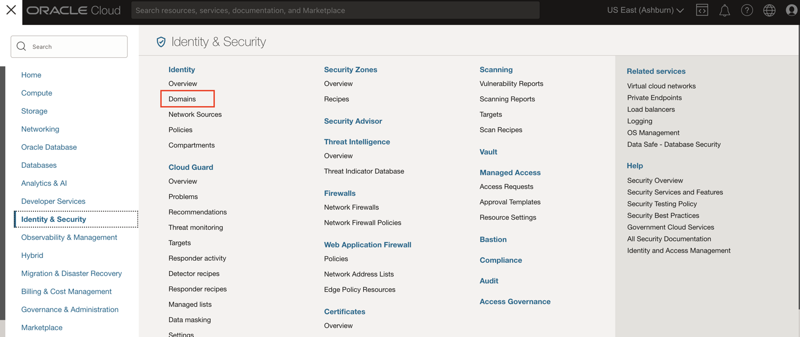
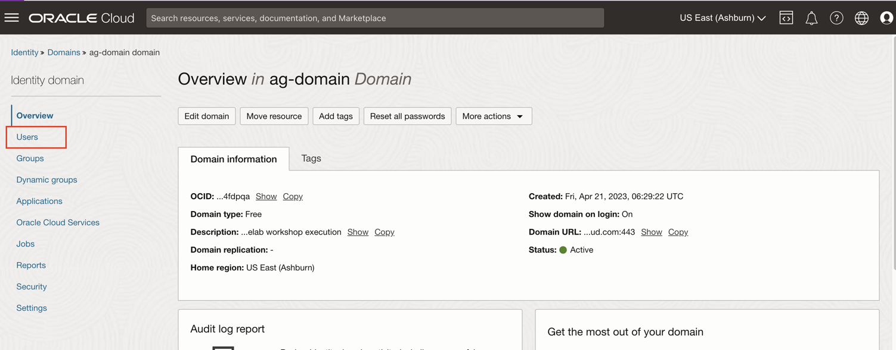
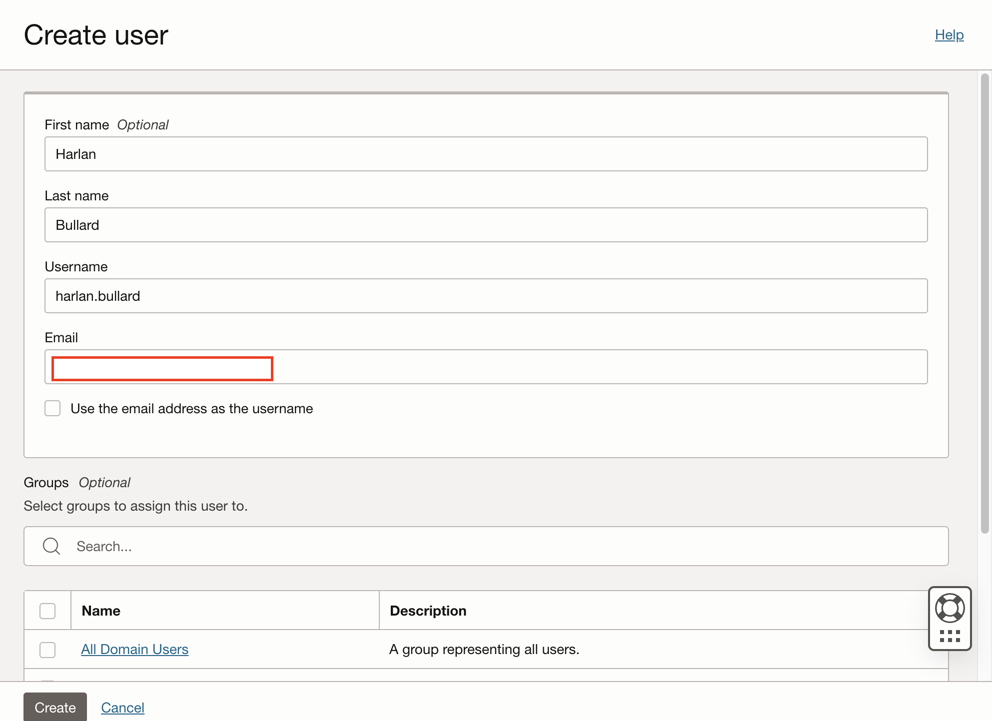
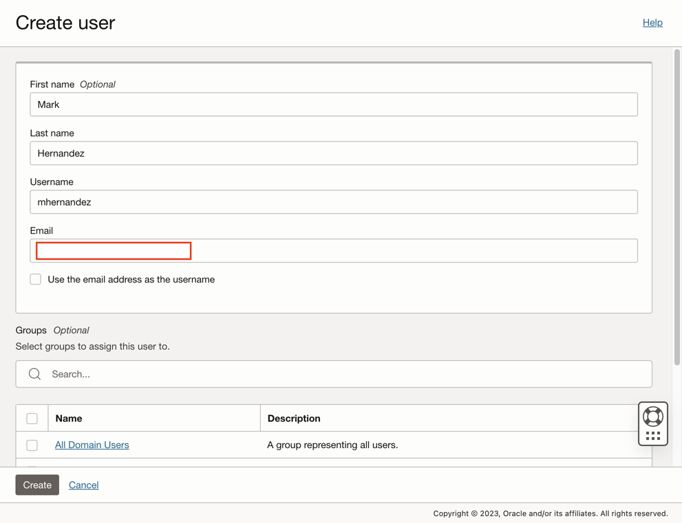

# Create IAM Policy and Users for Access Governance

## Introduction

Create IAM Policy and Users for Access Governance.

* Persona: Default Domain Administrator

*Estimated Time*: 15 minutes

Watch the video below for a quick walk-through of the lab.
[Oracle Video Hub video with no sizing](videohub:1_x0vzlnhh)

### Objectives

In this lab, you will:

* Setup **policy** for Domain Administrator Access
* OCI IAM Users manually

## Task 1 : Create IAM Policy

1. In the OCI console, click the Navigation Menu icon in the top left corner to display the *Navigation menu.* Click *Identity and Security* in the *Navigation menu*. Select *Policies* from the list of products.

2. On the Policies page, Click on *Create Policy* to create the policy : ag-access-policy in the root compartment.

    ```
    Name: ag-access-policy
    Description: IAM policy for granting Domain_Administrators access to manage access governance instances
    Compartment: Ensure your  root compartment is selected
    Policy Builder: Select the show manual editor checkbox
    Statements :
    ```

    ```
    <copy>Allow group ag-domain/Domain_Administrators to manage agcs-instance in compartment ag-compartment
    Allow group ag-domain/Domain_Administrators to read objectstorage-namespace in tenancy</copy>
    ```

    Click *Create*

## Task 2: Create Users in OCI IAM

1. Click the Navigation Menu icon in the top left corner to display the Navigation menu. Click Identity and Security in the Navigation menu. Select Domains from the list of products.

    

2. On the Domains page, Click on Identity-domain : *ag-domain* you have created.

    

   Select *Users*. Click on *Create User*

     

3. Uncheck "Use the email address as the username"

4. Enter the following details to create 3 users - Pamela Green (Campaign Administrator), Harlan Bullard (Manager), Mark Hernandez (Employee User) in IAM. Be sure to use different email IDs for different users.

    ```
    First Name: Pamela
    Last Name: Green
    Username: pamela.green
    Email: Specify unique email-id to which you will be receiving activation mail for password reset for the user. 
    ```

    

    Click *Create*

    ```
    First Name: Harlan
    Last Name: Bullard
    Username: harlan.bullard
    Email: Specify unique email-id to which you will be receiving activation mail for password reset for the user. 
    ```

    

    Click *Create*

    ```
    First Name: Mark
    Last Name: Hernandez
    Username: mhernandez
    Email: Specify unique email-id to which you will be receiving activation mail for password reset for the user. 
    ```

    

    Click *Create*

    ```
    First Name: Jerry
    Last Name: Poland
    Username: jerry.poland
    Email: Specify unique email-id to which you will be receiving activation mail for password reset for the user. 
    ```

    Click *Create*

5. Sign out from the cloud console.

6. For each user created, an activation mail will be sent to the email-id provided in the *Task 3: Step 4* . Reset the password for the 3 users using the *Activation mail* recieved for each of them.
    Reset password to the below mentioned password:

    **Password:**

    ```
    <copy>Oracl@123456</copy>
    ```

  You may now **proceed to the next lab**.

## Learn More

* [Oracle Access Governance Create Access Review Campaign](https://docs.oracle.com/en/cloud/paas/access-governance/pdapg/index.html)
* [Oracle Access Governance Product Page](https://www.oracle.com/security/cloud-security/access-governance/)
* [Oracle Access Governance Product tour](https://www.oracle.com/webfolder/s/quicktours/paas/pt-sec-access-governance/index.html)
* [Oracle Access Governance FAQ](https://www.oracle.com/security/cloud-security/access-governance/faq/)

## Acknowledgements

* **Authors** - Anuj Tripathi, Anbu Anbarasu
* **Last Updated By/Date** - Anuj Tripathi, October 2023
