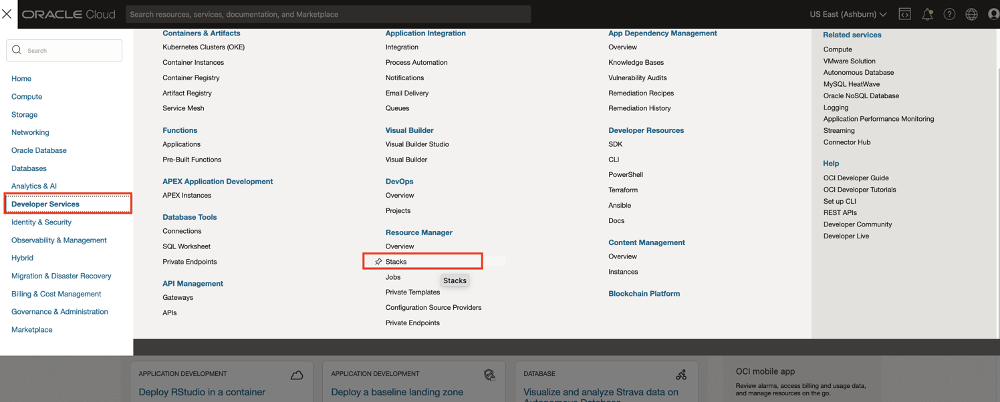
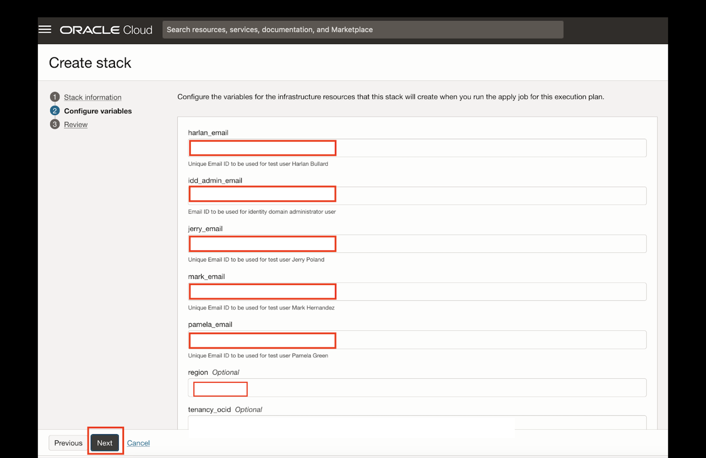
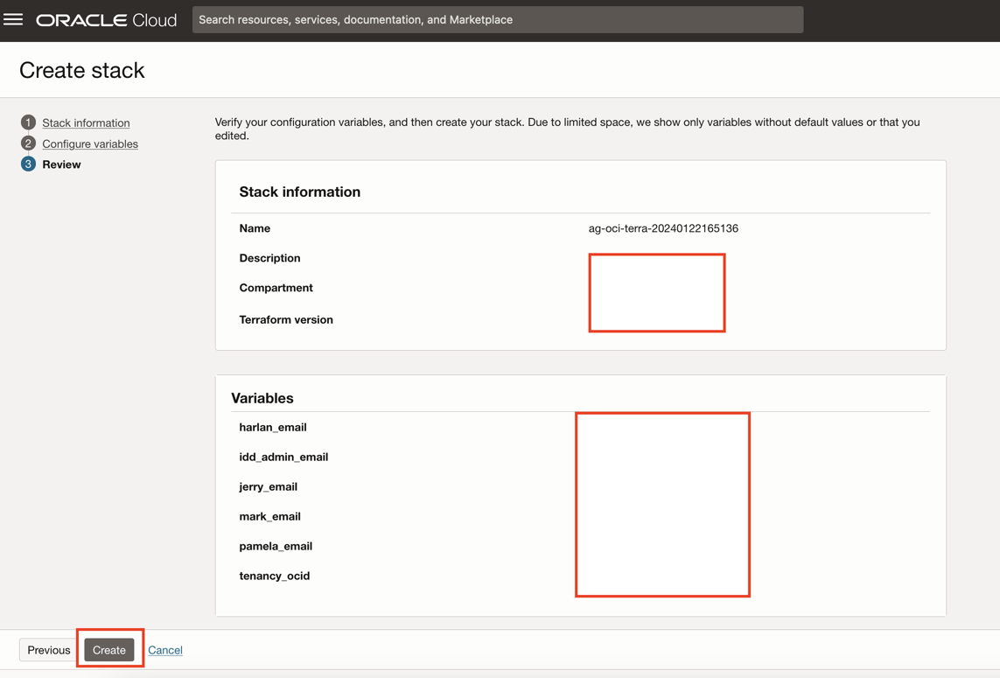

# Deploy Access Governance Resources Using Terraform

## Introduction

In this lab we will use pre-configured terraform scripts to resources - Compartment, Identity Domain, AG Users and Policies for Access Governance. 

* Estimated Time: 15 minutes
* Persona: Default Domain Administrator

Watch the video below for a quick walk-through of the lab.
[Oracle Video Hub video with no sizing](videohub:1_pbemrp27)

### Objectives

In this lab, you will: 

* Create the following resources using Terraform stack:

  - Compartment : ag-compartment
  - Identity Domain: ag-domain 
  - Policies for Access Governance 
  - AG Users: Pamela Green, Mark Hernandez, Harlan Bullard and Jerry Poland

### Prerequisites

  This lab assumes you have:
  
  An Oracle Cloud account

## Task 1: Download Oracle Resource Manager (ORM) stack zip file

 **NOTE : If you have performed the *Perform OCI IAM Policy Reviews with Oracle Access Governance lab (ID:3704)* then you have already created the resources required to perform this workshop, you can skip this lab and move to the next lab** 

1. Click on the link below to download the Resource Manager zip file you need to build your environment:
    
   - [oracle_access_governance-terraform-stack-oigdb.zip](https://c4u04.objectstorage.us-ashburn-1.oci.customer-oci.com/p/EcTjWk2IuZPZeNnD_fYMcgUhdNDIDA6rt9gaFj_WZMiL7VvxPBNMY60837hu5hga/n/c4u04/b/livelabsfiles/o/security-library/ag-terra-oigdb_implementation.zip)

  Save in your downloads folder.

## Task 2: Deploying Infrastructure using Terraform

1. Login to the OCI console **Default Domain** as the **Default Domain Administrator**

    

2. In the OCI console, click the Navigation Menu icon in the top left corner to display the Navigation menu. Click *Developer Services* in the Navigation menu. Select *Stacks* from the list of products.

     

3. Click on *Create Stack*. Enter the following details to create the stack

    

  **Choose the origin of the Terraform configuration:** My configuration

  **Stack Configuration -> Terraform Configuration Source** Select .zip file

  Browse the Downloaded stack file from previous step and upload it. 

  

  Click *Next*

  Enter Unique Email IDS for each of the users, including a valid email address for idd-admin email and other users where you can receive the activation email. 

  Enter the region code
  
  **NOTE : Select your home region such that you can host Oracle Access Governance within your geographic region to create and manage service instances. For supported regions code, please refer [Oracle Access Governance Regions ](https://docs.oracle.com/en/cloud/paas/access-governance/cagsi/#GUID-9D3A580D-767A-4C39-8A61-8A14CD045270)** 
  
  Click *Next*.

   

  Click on *Create*.

  

4. The stack has now been created. Click on *Plan job* and once it is completed successful.

    

    
    
    
     Click on *Apply job* and wait till it is completed successful.

    

    

5. The resources should have been created successfully by the terraform script. Please verify the resources created. *You will receive activation mails for the users created and ensure you reset the password for users Pamela Green, Mark Hernandez, Harlan Bullard and Jerry Poland*

  You may now **proceed to the next lab**. 

## Learn More

* [Oracle Access Governance Create Access Review Campaign](https://docs.oracle.com/en/cloud/paas/access-governance/pdapg/index.html)
* [Oracle Access Governance Product Page](https://www.oracle.com/security/cloud-security/access-governance/)
* [Oracle Access Governance Product tour](https://www.oracle.com/webfolder/s/quicktours/paas/pt-sec-access-governance/index.html)
* [Oracle Access Governance FAQ](https://www.oracle.com/security/cloud-security/access-governance/faq/)

## Acknowledgements
* **Authors** - Anuj Tripathi, Indira Balasundaram, Anbu Anbarasu 
* **Last Updated By/Date** - Indira Balasundaram 29 May 2024
