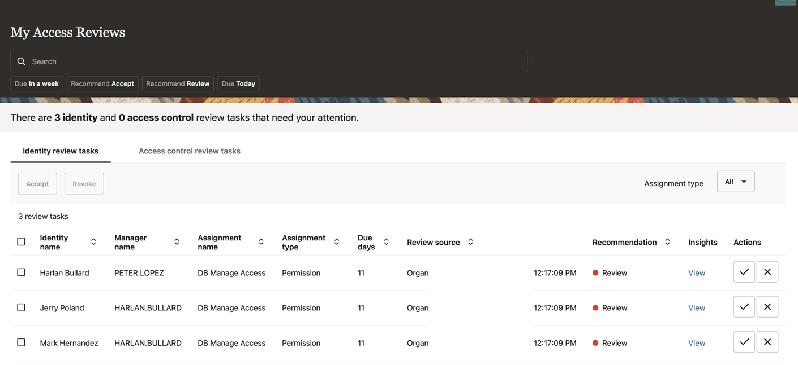

# Perform Access Reviews for database

## Introduction

Access reviews can be carried out from the Oracle Access Governance console by Livelab User and will be reviewed by the Livelab User

* Persona: LiveLabs User

*Estimated Time*: 15 minutes

### Objectives

In this lab, you will:

* Create Campaign as the Campaign Administrator
* Approve Access Review requests as Access Governance Campaign Administrator

### Prerequisites

This lab assumes you have:

A valid Oracle OCI tenancy, with OCI administrator privileges.

## Task 1: Create a Campaign

1. From your browser, navigate to the Oracle Access Governance Console using the URL specified in *Lab 1: Task 1: Step 4*

2. Enter **Livelab** username and password. You will be navigated to the home page of your Oracle Access Governance Console.

3. Navigate to Access Reviews -> Campaigns . Click on **Create a Campaign**

  

  

3. Under What type of access review campaign would you like to do? -> Select **Review systems managed by Access Governance**.

  

4. Select **Who has access?**. Search for Organization **Quality Assurance**. Click **Apply my selections**

  

  

5. Click on **I'm good to go with the workflow**

  

6. Select **I'll choose my own workflow**. Click **Next**

7. Select **Which approval workflow should be used?** -> One-level approval workflow

8. Click **Next**

  

9. Under **How would you like to schedule your campaign?** -> Select **Run now**.Provide **How do you want to describe this campaign?** and Click **Next**

  

10. Click Create. Now the campaign has been created.

   

   

## Task 2: Review the Access

1. Navigate to Access Reviews -> My Access Reviews .

2. You will see access review tasks for LiveLab user for DB-Manage-Access.Under Actions, click on Accept to the request for the users Livelab user. 

  

  You may now **proceed to the next lab**.

## Learn More

* [Oracle Access Governance Create Access Review Campaign](https://docs.oracle.com/en/cloud/paas/access-governance/pdapg/index.html)
* [Oracle Access Governance Product Page](https://www.oracle.com/security/cloud-security/access-governance/)
* [Oracle Access Governance Product tour](https://www.oracle.com/webfolder/s/quicktours/paas/pt-sec-access-governance/index.html)
* [Oracle Access Governance FAQ](https://www.oracle.com/security/cloud-security/access-governance/faq/)

## Acknowledgements

* **Authors** - Anuj Tripathi
* **Contributors** - Anbu Anbarasu
* **Last Updated By/Date** - Indira Balasundaram  29 May 2024
