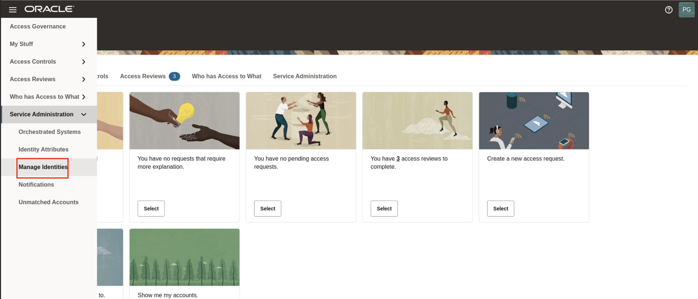
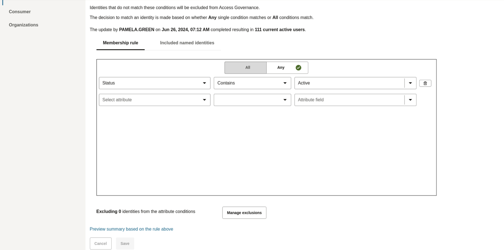
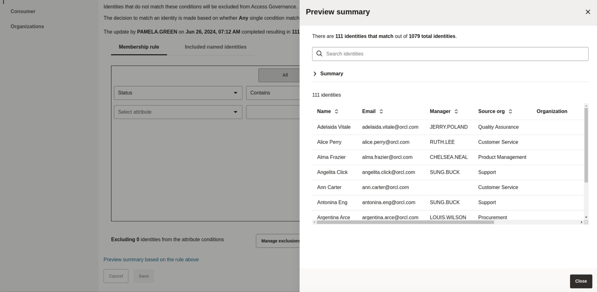
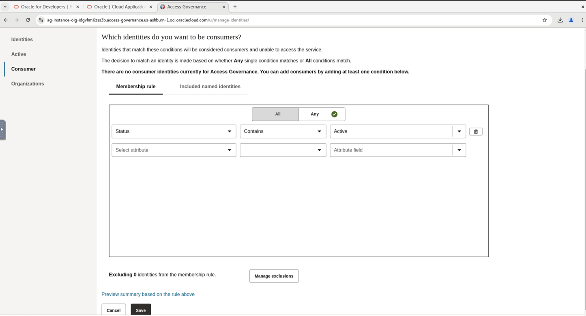
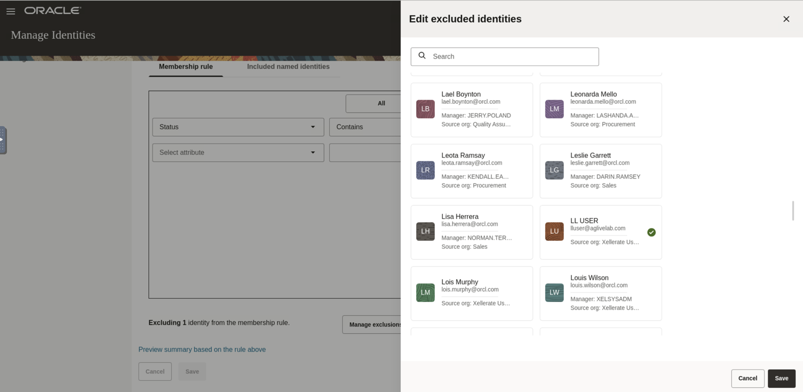
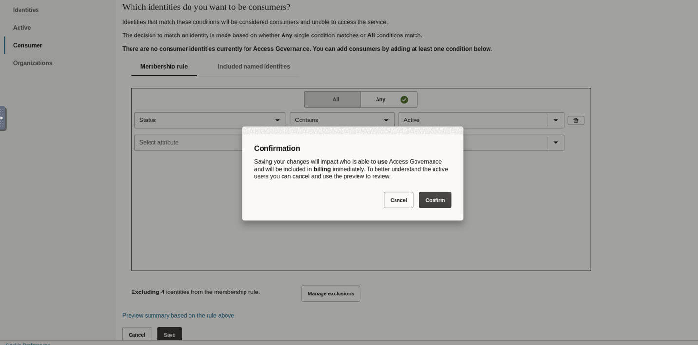

# Mark the Identities for Access Governance

## Introduction

Access Governance User (LiveLab User) will activate the identities.

* Persona: Livelabs User

*Estimated Time*: 15 minutes

### Objectives

In this lab, you will:

* Activate the Identities

### Prerequisites

This lab assumes you have:

A valid Oracle OCI tenancy. 

## Task 1: Sign in to Oracle Access Governance Console

1. From your browser, navigate to the Oracle Access Governance Console using the URL specified in *Lab 1: Task 1: Step 4*

2. Enter **Oracle Access Governance Administrator** username and password (Livelab User). You will be navigated to the home page of your Oracle Access Governance Console.

## Task 2: Activate the Identities

In this task, you will select the identities that you want to include in your service.

1. In the Oracle Access Governance Console, navigate to Service Administration -> Manage Identities -> Active

  

2. Select **Any** condition match option.

   

3. Select the below options for the condition to match the identities that you want to include.

      * Select attribute: Status
      * Select operator: Contains
      * Attribute value: Active

    Hit **Enter**

4. Click on **Preview Summary based on the rule above**. The identities that match the rule will be visible.

5. Close the pop-up and click on **Save**

  

## Task 3: Assign the Selected Users as Consumer Users

In this task, you will assign the Livelab User as Workforce user and the remaining users as Consumer users. 

1. Navigate to Service Administration -> Manage Identities -> Consumer

  

2. Select **Any** condition match option. Select the below options for the condition to match the identities that you want to include.

      * Select attribute: Status
      * Select operator: Contains
      * Attribute value: Active

       Hit **Enter**

3. Click on **Manage Exclusions**. Under **Edit excluded identities** , select user **Livelab user** and click on **Save**.

  

  Click on **Save** and **Confirm**. 

  

  Now the *Livelab* user has been marked as the Workforce users and the remaining users have been marked as Consumer users. 

  You may now **proceed to the next lab**.

## Learn More

* [Oracle Access Governance Create Access Review Campaign](https://docs.oracle.com/en/cloud/paas/access-governance/pdapg/index.html)
* [Oracle Access Governance Product Page](https://www.oracle.com/security/cloud-security/access-governance/)
* [Oracle Access Governance Product tour](https://www.oracle.com/webfolder/s/quicktours/paas/pt-sec-access-governance/index.html)
* [Oracle Access Governance FAQ](https://www.oracle.com/security/cloud-security/access-governance/faq/)

## Acknowledgements

* **Authors** - Anuj Tripathi, Anbu Anbarasu
* **Last Updated By/Date** - Indira Balasundaram 29 May 2024
