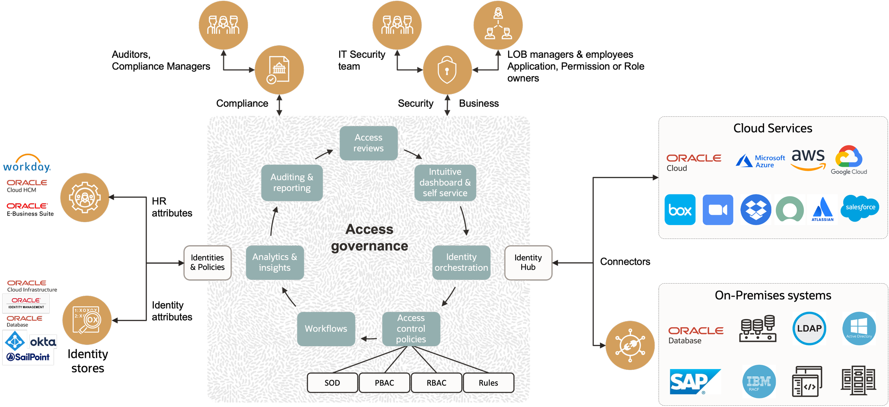

# Introduction

## About this Workshop

Oracle Access Governance is a cloud-native identity governance and administration (IGA) service that provides enterprise-wide visibility to govern access to cloud and on-premises environments. With an intuitive user experience, dynamic access control, and a prescriptive analytics–driven access review process, it helps customers automate access provisioning, get insights into access permission and cloud infrastructure policy reviews, identify anomalies, and remediate security risks. Using advanced analytics, Oracle Access Governance offers an intuitive user experience, providing recommendations and insights into access entitlements, behaviors, and risks.

 The graphic below shows the high level architecture of Oracle Access Governance.

  

This workshop walks you through the steps to get started using Oracle Access Governance with use cases including **access controls** implementation, **user access reviews**, and **enterprise-wide** visibility for systems managed using Access Governance. In this workshop, a fictitious corporation is using Oracle Access Governance to manage and govern the application access of its employees and contractors. This lab shows how the database is connected to AG as a target system and implement access control by creating identity collections, approval workflows, roles, access bundles, and centralized policies. It also shows how to perform access review campaigns, and associated review tasks.

**Oracle Access Governance** allows :

- **Administrator** to perform various system, service, and access control administrative tasks
- **Campaign administrator** to run intelligent access review campaigns for access governance and compliance
- **Cloud Access Reviewers** to review policy access insights and take informed decisions based on **prescriptive analytics**
- **Users** and **user managers** to validate access assigned to self and their direct reports, respectively.
- **Access Control Administrator** to automate access through Access Bundles, Roles, Identity Collections, Policies, and Approval Workflows.
- **Users** to submit access requests for provisioning to various target systems.

*Estimated Workshop Time:* 3 Hours

### Objectives

In this workshop, you will learn how to:

- Setup and configure Oracle Access Governance service instance
- Install and configure Oracle Access Governance agents for the Oracle Identity Governance and the Database
- Perform data load and activate users in Access Governance
- Define Access Controls including Identity Collections, Access Bundles, Policies, and Approval Workflows
- Review who has access to what using enterprise-wide browser
- Create Access Review Campaign and perform access reviews for the target database system

### Prerequisites

This lab assumes you have:

- An OCI tenancy with administrative access

## Learn More

- [Oracle Access Governance Product Page](https://www.oracle.com/security/cloud-security/access-governance/)
- [Oracle Access Governance Documentation](https://docs.oracle.com/en/cloud/paas/access-governance/index.html)
- [Oracle Access Governance Product tour](https://www.oracle.com/webfolder/s/quicktours/paas/pt-sec-access-governance/index.html)
- [Oracle Access Governance FAQ](https://www.oracle.com/security/cloud-security/access-governance/faq/)
- [Oracle Access Governance Announcement Blog](https://blogs.oracle.com/cloudsecurity/post/intelligent-cloud-delivered-access-governance-with-prescriptive-analytics)

## Acknowledgements

- **Authors** - Anuj Tripathi, Anbu Anbarasu
- **Last Updated By/Date** - Anuj Tripathi, October 2023
