# Review Who Has Access To What 

## Introduction

In this lab, Access Governance Administrator (Pamela Green) can view who has access to what.

*Estimated Time*: 15 minutes

Watch the video below for a quick walk-through of the lab.
[Oracle Video Hub video with no sizing](videohub:1_k3xmziy7)

### Objectives

In this lab, you will:

* Explore My Directs' Access
* Explore Enterprise Wide Browser

### Prerequisites

This lab assumes you have:

A valid Oracle OCI tenancy, with OCI administrator privileges.

## Task 1: Review Who Has Access to What - My Directs' Access

In this task, you will review Who has Access to What 

1. On the Access Governance console home page, click the **Who has Access to What** tab. 

     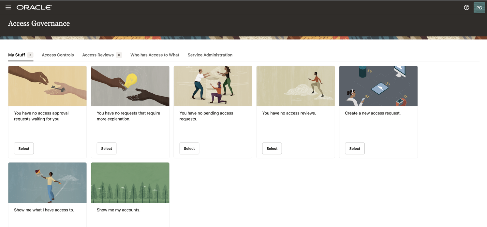

     Then, click on **My Directs' Access**

      

2. On the **My Directs' Access** page, you will see the users under **Pamela Green** will be listed here. 

   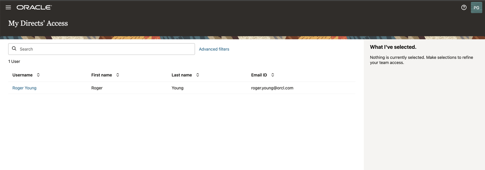

3. **Roger Young** is listed under **My Directs' Access**. Click on the user to view more details about the user. 

   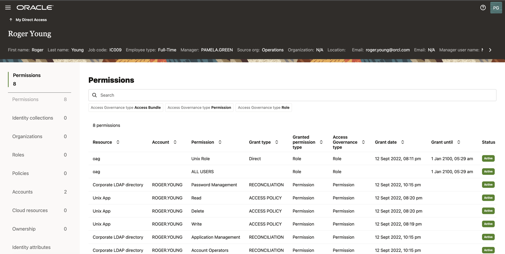

    

4. Under **Permissions** , we can view the user's access to Resources,Account, Permission, Grant type,Grant permission type , Access Governance type, Grant date, Grant until and Status. 

    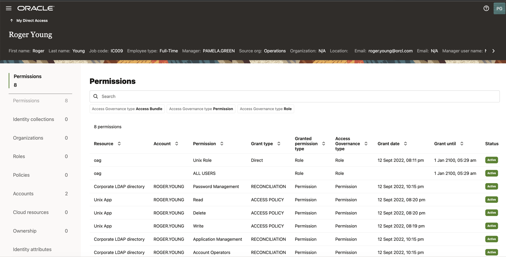

5. Under **Accounts**, we can view the Accounts,Target, Resource, Grant type, Password Change Status and Password Changed on details. 

    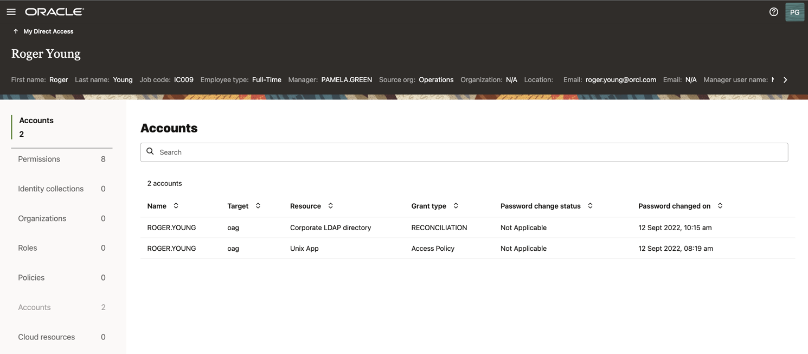

## Task 2: Review Who Has Access to What - Enterprise-wide Browser

1. On the Access Governance console home page, click the **Who has Access to What** tab. Then, click on **Enterprise-wide Access**. 

     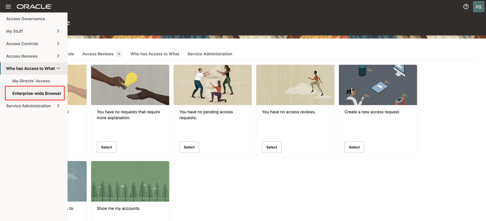

2. Under **Select what you want to browse** , click on **Identites** to view user identities that have access to particular resources. 

    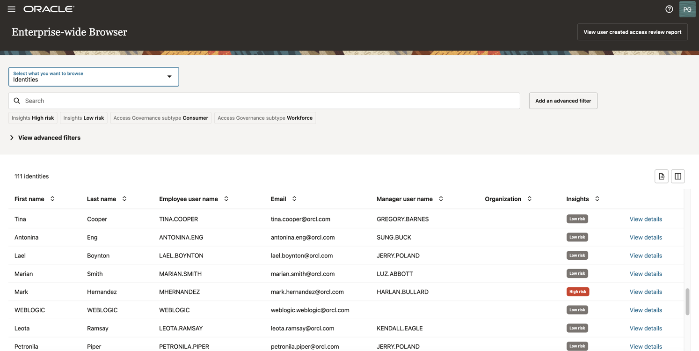

    Click on **View Details** to view individual user details. 

    

    Click on the **Identity Attributes** to view the user's identity attributes. 

     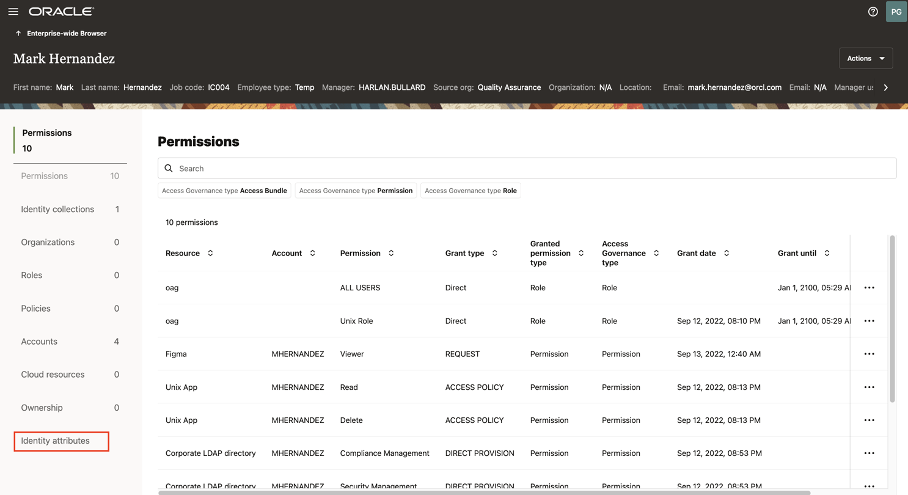

    Here we can view the identity attributes of user **Mark Hernandez**

    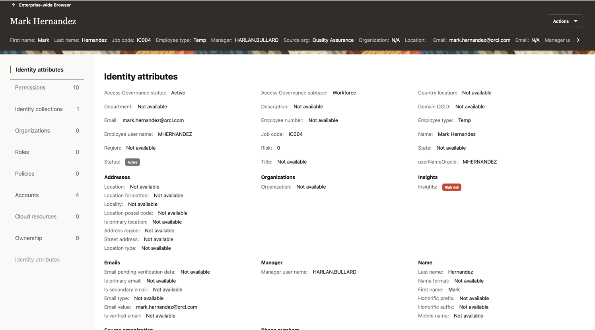

3. Click on **Identity Collections** to view Identity Collections that are present in the system. 

    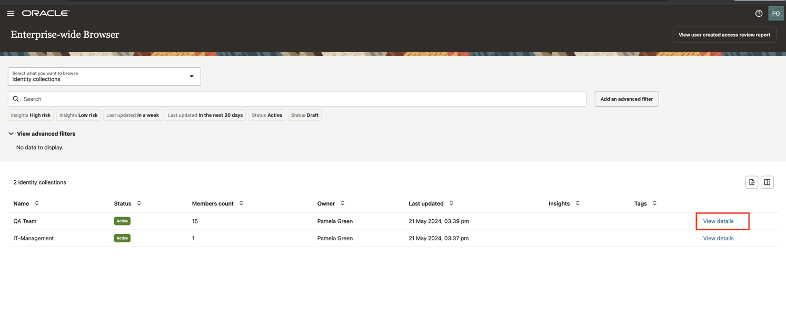

    Click on **View Details** 

    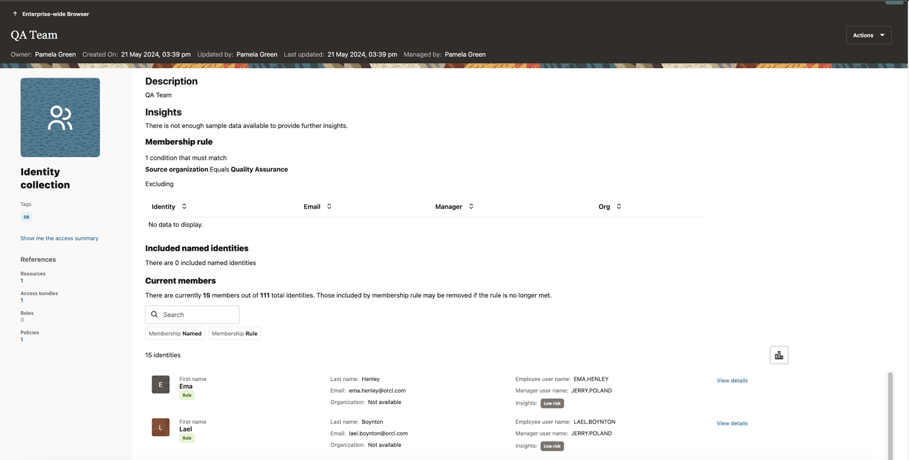

4. Click on **Permissions** to view Access Bundles and permissions of the user identities.  
   

    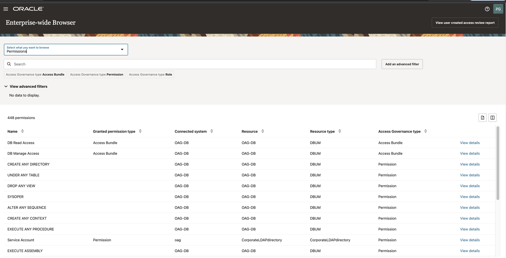

    Click on **View Details**

    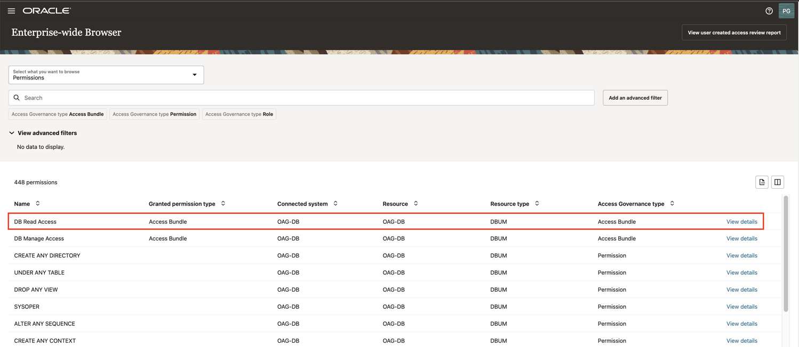

    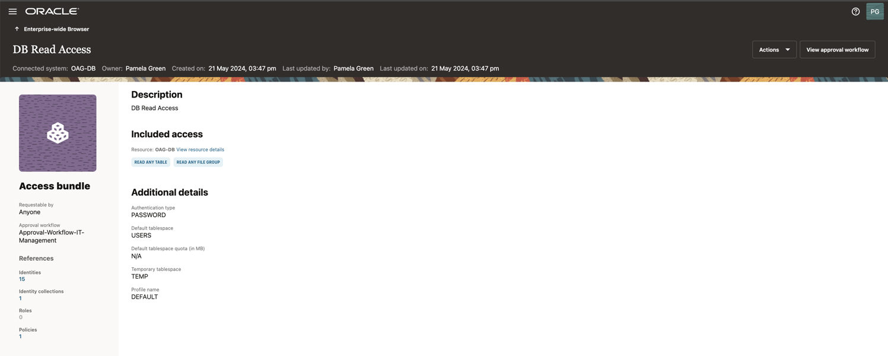

5. Click on **Policies** to view Policies created to provision access privileges. 

    

     Click on **View Details**

    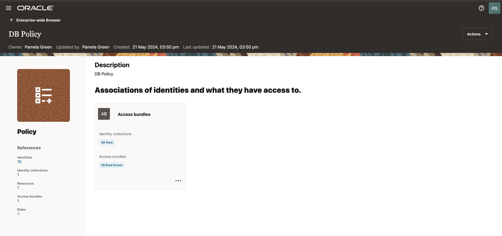

6. Click on **Resources** to view the resources associated with the user identities. Click on **View Details** to view the Identities, Permissions , Identity Collection, Roles, Policies and Accounts associated with them. 

     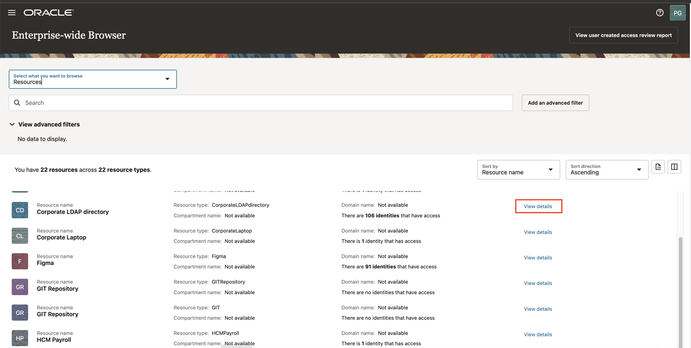

      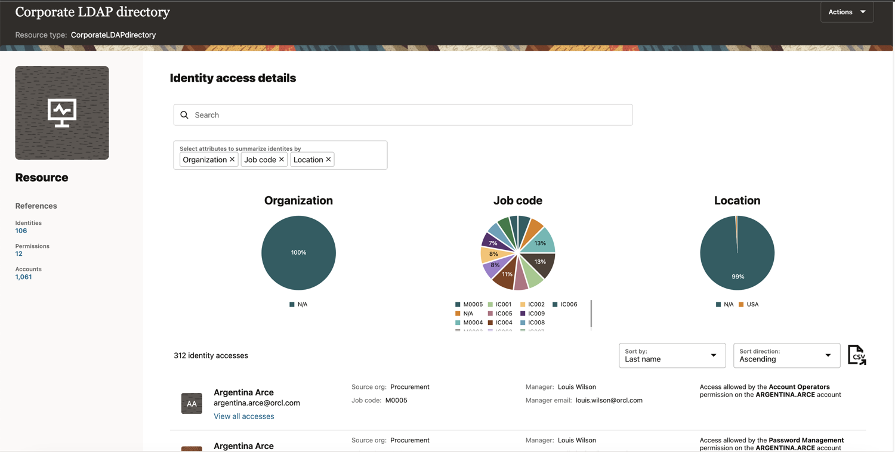

    You may now **proceed to the next lab.**

## Learn More

* [Oracle Access Governance Create Access Review Campaign](https://docs.oracle.com/en/cloud/paas/access-governance/pdapg/index.html)
* [Oracle Access Governance Product Page](https://www.oracle.com/security/cloud-security/access-governance/)
* [Oracle Access Governance Product tour](https://www.oracle.com/webfolder/s/quicktours/paas/pt-sec-access-governance/index.html)
* [Oracle Access Governance FAQ](https://www.oracle.com/security/cloud-security/access-governance/faq/)

## Acknowledgements

* **Authors** - Indira Balasundaram
* **Contributors** - Anbu Anbarasu
* **Last Updated By/Date** - Indira Balasundaram 2024
