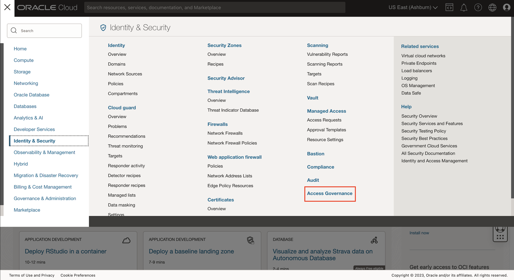

# Access Governance service instance cleanup 

## Introduction

Upon completing your labs, we recommend that you perform a cleanup to dispose the Access Governance service instance. This lab will guide you to properly destroy the resource.

*Estimated Lab Time*: 10 minutes

### Objectives

In this lab, you will:
 * Destroy the Access Governance service instance

### Prerequisites
This lab assumes you have:

   * An Oracle Cloud account
   * You have completed:
       - Lab: Prepare Setup
       - Lab: Environment Setup

## Task 1: Destroy the Access Governance service instance

1. Log in to Oracle Cloud

   

2. Click the Navigation Menu icon in the top left corner to display the Navigation menu. Click Identity and Security in the Navigation menu. Select Access Governance from the list of products.

   
    

    
3. On the Access Governance page, select Service Instances. Click on the Service Instance **service-instance** you created in *Lab 4: Task 1* 
 

     

4. Click on *Delete*. Prompt appears, confirm the *Delete* option. 

     

5. Now the Access Governance service instance has been successfully deleted. 

    You may now **proceed to the next lab.**

## Learn More

* [Oracle Access Governance Create Access Review Campaign](https://docs.oracle.com/en/cloud/paas/access-governance/pdapg/index.html)
* [Oracle Access Governance Product Page](https://www.oracle.com/security/cloud-security/access-governance/)
* [Oracle Access Governance Product tour](https://www.oracle.com/webfolder/s/quicktours/paas/pt-sec-access-governance/index.html)
* [Oracle Access Governance FAQ](https://www.oracle.com/security/cloud-security/access-governance/faq/)

## Acknowledgments
* **Authors** - Anuj Tripathi, Indira Balasundaram, Anbu Anbarasu 
* **Last Updated By/Date** - Anbu Anbarasu, May 2023