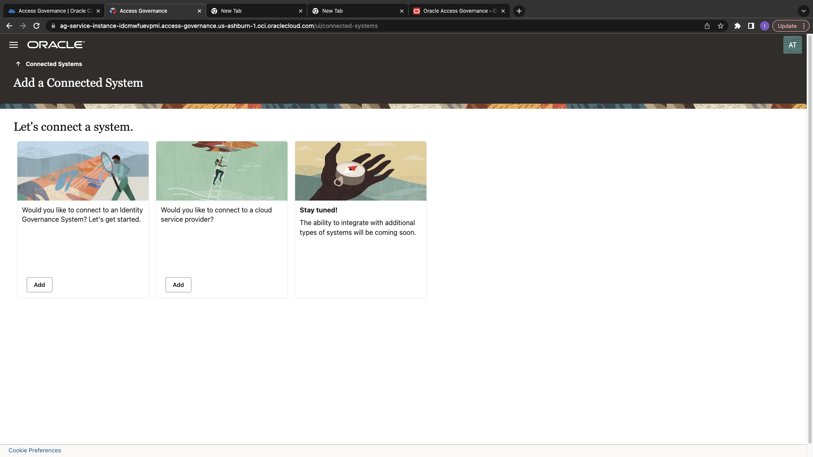
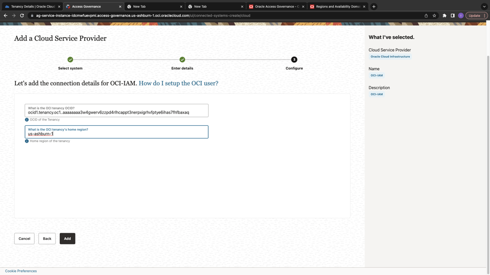

# Integrate Oracle Access Governance with OCI IAM 

## Introduction

As OCI Tenancy Administrators and Access Governance Administrators they can learn to integrate Oracle Access Governance with OCI IAM. 

* Estimated Time: 15 minutes
* Persona: Administrator

### Objectives

In this lab, you will:
* Generate API Keys and Oracle Cloud Identifier (OCID) for an Identity User
* Configure a new OCI IAM Cloud Service Connection in Oracle Access Governance Console

ANBU - Generate API Keys steps are missing; Let us add a Task for that if needed; I did not need it to complete as pamela.green - ANBU

## Task 1: Setup Policy to allow Oracle Access Governance to connect OCI

1. In the OCI console, click the Navigation Menu icon in the top left corner to display the Navigation menu. Click Identity and Security in the Navigation menu. Select Policies from the list of products.

ANBU - In the following step, separate the policy statements (without Statement n:), and make is copy-able - ANBU
2. On the Policies page, In the root compartment click on Create Policy to create a policy : oci-iam-policy

    ```
    Name: oci-iam-policy
    Description: Allow Oracle Access Governance to connect OCI in tenancy
    Compartment: Ensure your root compartment is selected
    Policy Builder: Select the show manual editor checkbox 
    Statement 1: allow resource accessgov-agent resource-scanner to read all-resources in tenancy
    Statement 2: allow resource accessgov-agent resource-manager to manage domains in tenancy
    Statement 3: allow resource accessgov-agent resource-manager to manage policies in tenancy
    ```
 
    Click Create


## Task 2: Configure a new OCI IAM Cloud Service Connection in Oracle Access Governance Console

ANBU - Let us ask them to login as pamela.green specifically - ANBU
1.  In a browser, navigate to the Oracle Access Governance service home page and log in as a user with the Administrator application role.

2.  On the Oracle Access Governance service home page, click on the Navigation Menu icon, and select **Service Administration → Connected Systems**

3. Select the **Add a connected system** button from the Connected Systems page.

      

4.  Select the **Would you like to connect to a cloud service provider?** tile by clicking the Add button.
    

5. In the **Select system** step, select the **Oracle Cloud Infrastructure** tile and then click **Next.**

  

6. Enter name (local-oci-iam) and description (Local OCI IAM) of the connected system, and then click **Next.**

  

7. Enter the Tenancy OCID and Region details. (ANBU - Add a step to get the OCID and link to the region codes (give example us-ashburn-1) - ANBU)

  

8. Click **Add.** (ANBU - I had to click on manage to see the status - ANBU) If the connection details are successfully validated, you will see the **Success** status for the **Validate** operation. The Full Data Load operation may take upto a few minutes, depending upon the data available in your OCI tenancy. The incremental data load is run every four hours for this connected system to sync the data.

  


  You may now **proceed to the next lab**. 

## Learn More

* [Oracle Access Governance Create Access Review Campaign](https://docs.oracle.com/en/cloud/paas/access-governance/pdapg/index.html)
* [Oracle Access Governance Product Page](https://www.oracle.com/security/cloud-security/access-governance/)
* [Oracle Access Governance Product tour](https://www.oracle.com/webfolder/s/quicktours/paas/pt-sec-access-governance/index.html)
* [Oracle Access Governance FAQ](https://www.oracle.com/security/cloud-security/access-governance/faq/)

## Acknowledgments
* **Authors** - Anuj Tripathi, Indira Balasundaram, Anbu Anbarasu 
* **Contributors** - Abhishek Juneja 
* **Last Updated By/Date** - Anbu Anbarasu, Cloud Platform COE, January 2023