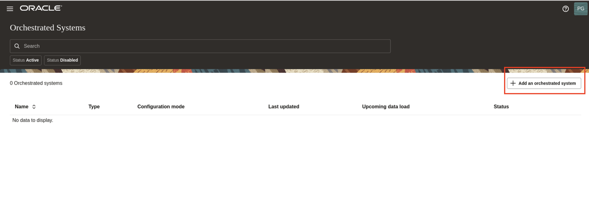
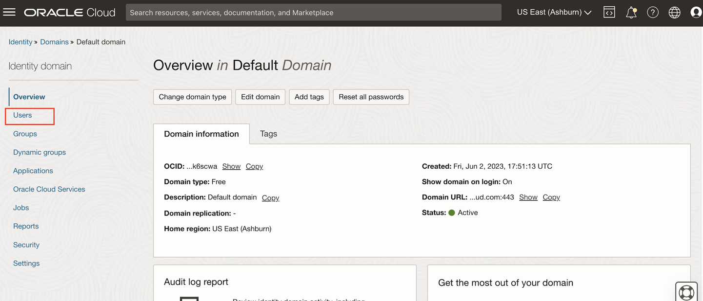
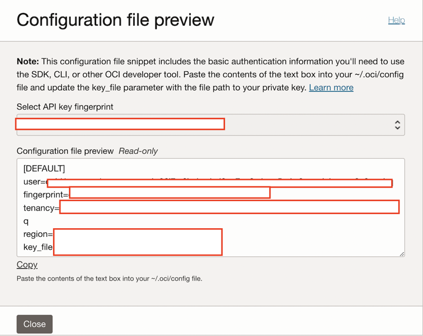
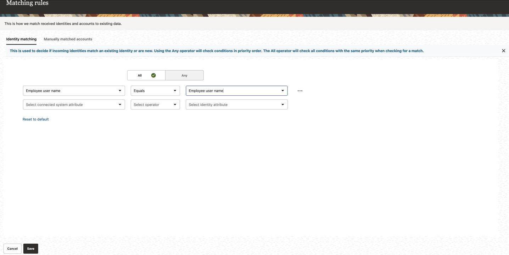

# Integrate Oracle Access Governance with OCI IAM 

## Introduction

As **Access Governance Administrators** they can learn to integrate Oracle Access Governance with OCI IAM. 

* Estimated Time: 10 minutes
* Persona: Access Governance Administrator

### Objectives

In this lab, you will:

* Configure a new OCI IAM Cloud Service Connection in Oracle Access Governance Console


## Task 1: Configure a new OCI IAM Cloud Service Connection in Oracle Access Governance Console


1.  In a browser, navigate to the Oracle Access Governance service home page using the URL specified in *Lab 2: Task 1: Step 4* and log in as a user with the **Access Governance Administrator** application role. 

   

  Enter Oracle Access Governance Campaign Administrator username and password (Pamela Green)

    **Username:**
    ```
    <copy>pamela.green</copy>
    ```

    **Password:**
    
    The password you have set for the user in *Lab 1: Task 2: Step 5*
    

2.  On the Oracle Access Governance service home page, click on the Navigation Menu icon, and select **Service Administration → Orchestrated Systems**

   

3. Select the **Add a orchestrated system** button from the Connected Systems page.

      

4. Select **Integrate with Oracle Cloud Infrastructure** under **Select and configure a new orchestrated system** and Click **Next**

  

6. Enter name  and description of the orchestrated system, and then click **Next.**

  Name: OCI-IAM
  
  Description: OCI-IAM

  

7. To obtain the fingerprint of OCI user (agcs-user). Open a **new private browser window** and login to the OCI console **Default Domain** as the **Domain Administrator** .

  


8. In the OCI console, click the Navigation Menu icon in the top left corner to display the *Navigation menu.* Click *Identity and Security* in the *Navigation menu*. Select *Domains* from the list of products.

    

9. On the Domains page, Click on *Default domain* 
   Ensure the **root compartment** is selected. 

    

10. Select *Users*. Click on *agcs-user*

    
  
  
   Scroll down , click on **API keys**


     

  Click on **Add API key** . Click on **Generate API key pair**. 
  
    
  
  Click on **Download private key** and **Download public key**. 

  
  
  Click on **Add**. 

  Notedown the **Downloaded private key** in a text editor. This is required for the next step. 


  Under **Configuration file preview**, note down the following details which is required for the next step. 

  - User OCID
  - Fingerprint 
  - Tenancy OCID 
  - Region 

  

11. Go back to the browser with Oracle Access Governance and continue to  enter the following details mentioned below: 

  **What is the OCI user's OCID?**: Enter the Oracle Cloud Identifier (OCID) for the OCI user (agcs-user) noted down from the previous step. 

  **What is the OCI user's fingerprint?**: Enter the fingerprint of the public key of the API   Signing Key  noted down from the previous step.

  **What is the OCI user's private SSH key?**: Enter the downloaded private SSH key (.pem file) from previous step for the API Signing Key. 


  **What is the OCI tenancy OCID?**: Enter the OCID for the target tenancy  noted down from the previous step.

  **What is the OCI tenancy's home region?**: Enter the home region for the target OCI tenancy, using the region identifier noted down from the previous step.

  Click on **Add**

  

  Choose the option **Customize before enabling the system for data loads**. Click on **I'm done** 

  

  Select **Matching Rules -> Manage**

  

  Under **All** , select the following condition:

  Select connected system attribute: Employee user name

  Select operator: equals

  Select Identity attribute: Employee user name

  Click **Save**

  

  Navigate back to the orchestrated system **OCI-IAM**. Click on the **Activate** on the top-right corner. 

  To confirm, click on **Activate** .

  


  The system is now **Active**. The **Full Data Load** is automatically run. Note: You can click on **Load data now** to load the data manually. 

  


12. If the connection details are successfully validated, you will see the **Success** status for the **Validate** operation. The Full Data Load operation may take upto a few minutes, depending upon the data available in your OCI tenancy. The incremental data load is run every four hours for this orchestrated system to sync the data.

  


  You may now **proceed to the next lab**. 

## Learn More

* [Oracle Access Governance Create Access Review Campaign](https://docs.oracle.com/en/cloud/paas/access-governance/pdapg/index.html)
* [Oracle Access Governance Product Page](https://www.oracle.com/security/cloud-security/access-governance/)
* [Oracle Access Governance Product tour](https://www.oracle.com/webfolder/s/quicktours/paas/pt-sec-access-governance/index.html)
* [Oracle Access Governance FAQ](https://www.oracle.com/security/cloud-security/access-governance/faq/)

## Acknowledgements
* **Authors** - Anuj Tripathi, Indira Balasundaram, Anbu Anbarasu 
* **Last Updated By/Date** - Anbu Anbarasu, May 2023