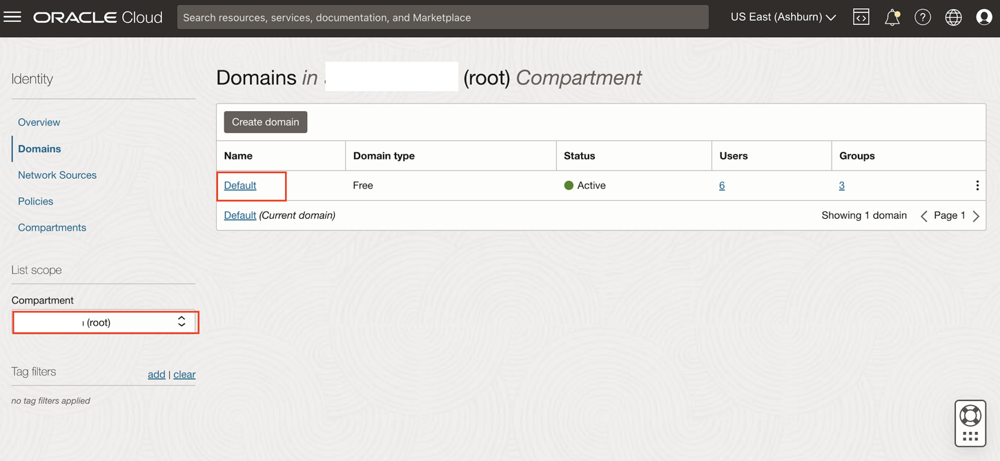
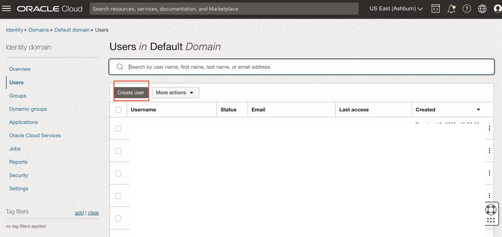
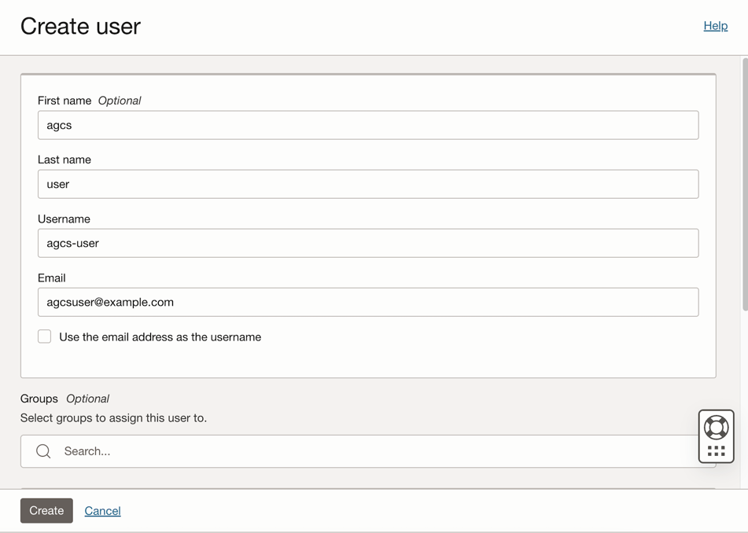
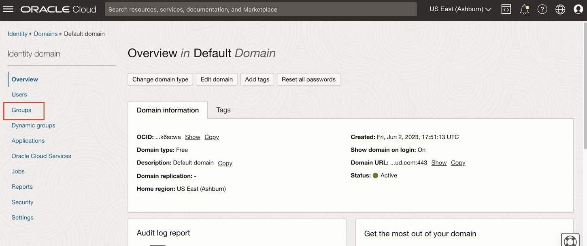
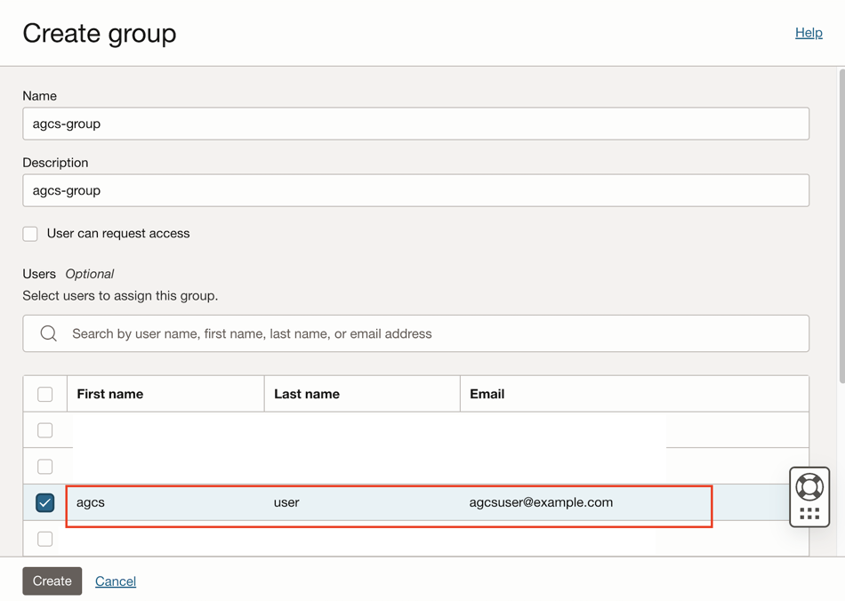

# Create Groups and Policies for Access Governance

## Introduction

Create policies for Access Governance. 

* Estimated Time: 15 minutes
* Persona: Default Domain Administrator


### Objectives

In this lab, you will:
* Create **agcs-user** for Access Governance 
* Setup **groups** for Access Governance 
* Setup **policies** for Access Governance 
* Setup **policy** to allow Oracle Access Governance to connect OCI
* Setup **policy** for Domain Administrator Access 

## Task 1: Create AGCS User

1. Login to the OCI console **Default Domain** as the **Default Domain Administrator** 

1. In the OCI console, click the Navigation Menu icon in the top left corner to display the *Navigation menu.* Click *Identity and Security* in the *Navigation menu*. Select *Domains* from the list of products.

    

2. On the Domains page, Click on *Default domain* . Ensure the **root compartment** is selected. 

    

3. Select *Users*. Click on *Create User*

    

    

    Enter the following details to create the *agcs-user* 

    ```
    First name: agcs
    Last name: user
    Use the email address as the username: Uncheck the checkbox 
    Username: agcs-user
    Email: agcsuser@example.com
    ```
    

    Click on *Create*

    The *agcs-user* has now been created. 

## Task 2: Create AG Group 

1. Login to the OCI console **Default Domain** as the **Default Domain Administrator** 

2. In the OCI console, click the Navigation Menu icon in the top left corner to display the *Navigation menu.* Click *Identity and Security* in the *Navigation menu*. Select *Domains* from the list of products.

    

3. On the Domains page, Click on *Default domain*. Ensure the **root compartment** is selected. Select *Groups*. Click on *Create Group*

    

    

    Enter the following details to create the *agcs-group* and Assign **agcs-user** user to the group
    ```
    Name: agcs-group
    Description: Access governance group to manage users 
    Users: Select the agcs-user 
    ```
    Click *Create*

    

    The *Group* has been created succesfully. 


## Task 3 : Create AG Policies 


1. In the OCI console, click the Navigation Menu icon in the top left corner to display the *Navigation menu.* Click *Identity and Security* in the *Navigation menu*. Select *Policies* from the list of products.

2. On the Policies page, Click on *Create Policy* to create the policy : ag-access-policy in the root compartment. 


    ```
    Name: ag-access-policy
    Description: IAM policy for granting Domain_Administrators access to manage access governance instances
    Compartment: Ensure your  root compartment is selected
    Policy Builder: Select the show manual editor checkbox
    Statement :
    ```
     ```
    <copy>Allow group ag-domain/Domain_Administrators to manage agcs-instance in compartment ag-compartment
    Allow group ag-domain/Domain_Administrators to read objectstorage-namespace in tenancy</copy>
      ```  

    Click *Create*


    On the Policies page, In the root compartment click on Create Policy to create a policy : agcs-policy

    ```
    Name: agcs-policy
    Description: Oracle Access Governance policy 
    Compartment: Ensure your root compartment is selected
    Policy Builder: Select the show manual editor checkbox
    ```
    ```
    <copy>ALLOW GROUP agcs-group to read all-resources IN TENANCY
    ALLOW GROUP agcs-group to manage policies IN TENANCY
    ALLOW GROUP agcs-group to manage domains IN TENANCY
    </copy>
    ```
 
    Click Create


   On the Policies page, In the root compartment click on Create Policy to create the policy : domain-admin-policy


    ```
    Name: domain-admin-policy
    Description: IAM policy (domain-admin-policy) in the COMPARTMENT to give access to the Identity Domain admin for the compartment created
    Compartment: Ensure your root compartment is selected
    Policy Builder: Select the show manual editor checkbox
    Statement :
    ```

    ```
    <copy>Allow group ag-domain/Domain_Administrators to manage all-resources in compartment ag-compartment</copy>
    ```

    Click *Create* 


  You may now **proceed to the next lab**. 

## Learn More

* [Oracle Access Governance Create Access Review Campaign](https://docs.oracle.com/en/cloud/paas/access-governance/pdapg/index.html)
* [Oracle Access Governance Product Page](https://www.oracle.com/security/cloud-security/access-governance/)
* [Oracle Access Governance Product tour](https://www.oracle.com/webfolder/s/quicktours/paas/pt-sec-access-governance/index.html)
* [Oracle Access Governance FAQ](https://www.oracle.com/security/cloud-security/access-governance/faq/)

## Acknowledgments
* **Authors** - Anuj Tripathi, Indira Balasundaram, Anbu Anbarasu 
* **Last Updated By/Date** - Indira Balasundaram , Sept 2024
