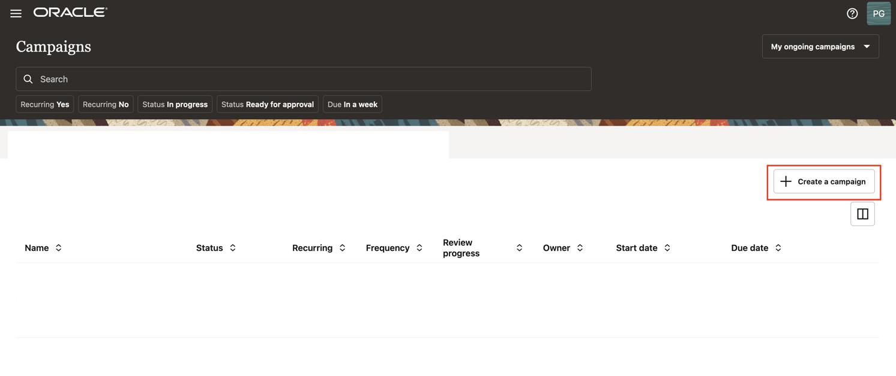

# Perform Group Membership Review Campaigns

## Introduction

Access Governance Administrators (Pamela Green) can create and perform group membership review campaign.

* Estimated Time: 10 minutes
* Persona: Access Governance Administrator

### Objectives

In this lab, you will:
* Create and perform group membership review campaigns for OCI IAM Users. 


## Task 1: Create Group Membership Review Campaign

1.  Scroll down and select the **“Let’s create some work and define a new campaign”** tile. Alternatively, you can select **Navigation Menu -> Access Reviews -> Campaigns.** On the **Campaigns** page, click the **Create a campaign** button.

  


  
  * In the Selection criteria step, select the **Which tenancies?** tile. You will see a list of available cloud tenancies.

  

  * Select an appropriate cloud tenancy. In this tutorial, select your cloud tenancy. A green tick is marked against your selection. 


  * Click on **Refine further**. You can further refine your selection by selecting a specific compartment and a domain, to run domain-specific policy reviews.

    

  * Enter the **compartment** details mentioned below and click on **Apply**

     - compartment: ag-compartment

  

  * Move on to the next step to select identity collections that you want to review. Select **Which identity collections?** tile. You will see a list of available identity collections in the domain that you selected.

  

  * Select the identity collections that you want to review. In this tutorial, select the following identity collections and click **Apply my selections.**

      - Auditors
      - NetworkAdmins
      - SecurityAdmins

    

  * Click on **I'm good, go to workflows** 

  
    

  * Proceed to the **Assign workflow** step. Select the following option:

      - Which approval workflow should be used? : One-level-approval-workflow
  
    Click **Next**

  


  * In the **Add details** step, you can define the frequency (one-time or periodic) at which to run an access review campaign, give a meaningful name to your campaign, add a supporting description, and assign values to additional attributes, such as who owns it and when the campaign should start or end.


  * For this tutorial make the following changes in the **Add details** step:

      **How often do you want this to run?** : One time

      **What do you want to call this campaign?**: Group-Membership-Review-Campaign

      **How do you want to describe this campaign?**: Group-Membership-Review-Campaign

      **Who owns this campaign?**: Me

      **How would you like to schedule your campaign?** : Run now (will start 10 minutes from creation)


  * Click **Next.**

   

  * The **Review and submit** step displays the information you have added in the previous steps. Select **Create** to create the campaign. Your campaign is scheduled and is displayed on the **Campaigns** page. It will run 10 minutes from creation. 


  

  The **Campaign** has been scheduled successfully.

  

  

## Task 2: Perform Group Membership Review Tasks

  In this task, you will review and certify Group Membership review tasks raised by the campaign created in the previous task.


1. From your browser, navigate to the Oracle Access Governance Console using the URL specified in *Lab 2: Task 1: Step 4* 


2. Enter **Oracle Access Governance Campaign Reviewer** username and password (Pamela Green)

    **Username:**
    ```
    <copy>pamela.green</copy>
    ```

    **Password:**
    
    The password you have set for the user in *Lab 1: Task 2: Step 5*


  You will be navigated to the home page of your Oracle Access Governance Console.

  3. On the Oracle Access Governance Console home page, from the navigation menu, select **Access Reviews -> My Access Reviews.** 
 
  

  4. To view review tasks created by your policy review campaign, click the **Access Controls** tab. You will see all policy access review tasks assigned to you as a reviewer. Oracle Access Governance uses in-house analytic-based Intelligence system to provide accept/review recommendations.

  

  5. For this tutorial, let’s check the recommendations given by Oracle Access Governance. 

   - Auditors is marked for Review
   - NetworkAdmins is marked for Review
   - SecurityAdmins is marked to Review

  6. Beside the Access Review task, click on the **Actions** button. 


  7. To make a review decision, you can either revoke all or accept all actionable statements in that policy at once, or make decision individually on each policy statement. For this tutorial, let us validate 3 usecases:

    **Usecase 1:**  Accept all the user identities to accept the Group membership for - **Auditors**

      - Click on the Accept All button. 

      

      - Click on **Apply**

      

      -  Enter justification for why you accept all the named user identities to have access to the Group Membership then click on **Submit** This will trigger the auto-remediation process in the Oracle Access Governance system.

      


    **Usecase 2:**  Revoke 2 out of the 4 named identitied to accept the Group membership for - **NetworkAdmins**

      - Let's revoke the access for identities - **David Brown** and **Jerry Poland**. The remaining 2 users - **John Smith** and **Mark Hernandez** have been accepted to have the Group membership. 

      

      - Click on **Apply**  

       

      - Click **Apply.** The **Confirmation** dialog box is displayed.

        

     - Provide justification and then click **Submit.** The closed loop access remediation will take place automatically.

     **Usecase 3:**  Revoke all the named identitied that have the Group membership for - **SecurityAdmins**

      

      - Click on **Revoke all**

      - Click on **Apply**

       

      - The **Confirmation** dialog box is displayed.

        

     - Provide justification and then click **Submit.** The closed loop access remediation will take place automatically.


   8. Login to the Identity domain: ag-domain OCI console as the Identity Domain Administrator. Naviagte to Identity & Security -> Identity -> Users.

  * Verify the group membership of the Users have been been processed successfully. 


  You may now **proceed to the next lab**. 

## Learn More

* [Oracle Access Governance Create Access Review Campaign](https://docs.oracle.com/en/cloud/paas/access-governance/pdapg/index.html)
* [Oracle Access Governance Product Page](https://www.oracle.com/security/cloud-security/access-governance/)
* [Oracle Access Governance Product tour](https://www.oracle.com/webfolder/s/quicktours/paas/pt-sec-access-governance/index.html)
* [Oracle Access Governance FAQ](https://www.oracle.com/security/cloud-security/access-governance/faq/)

## Acknowledgements
* **Authors** -  Indira Balasundaram, Sept 2024
