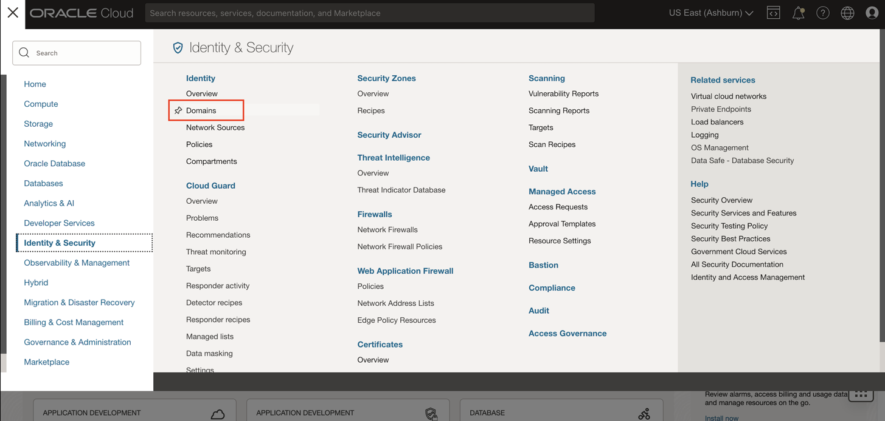
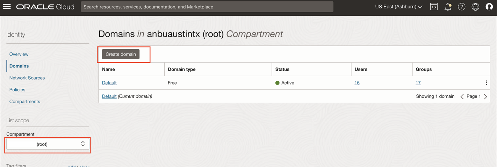
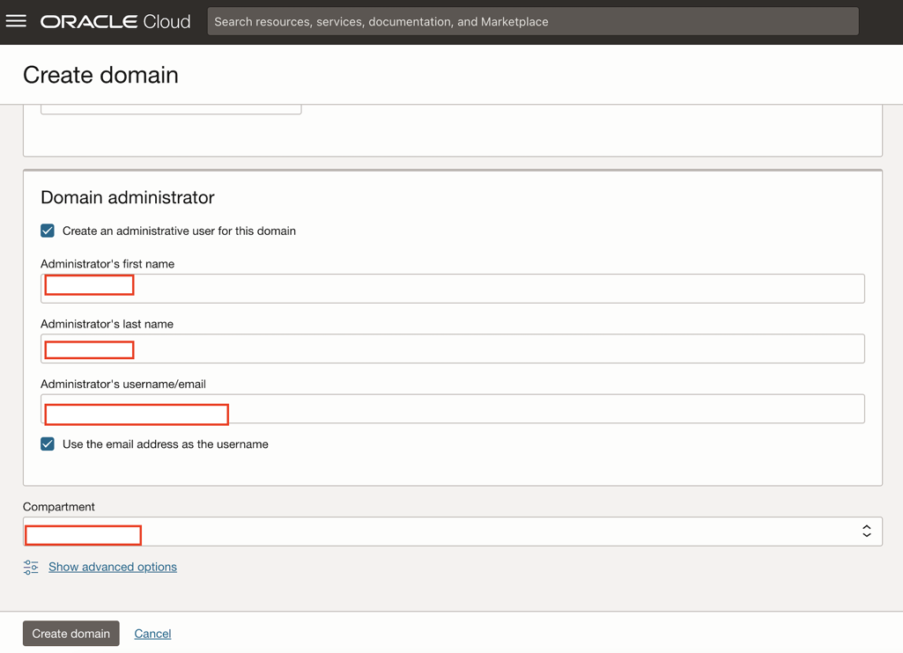
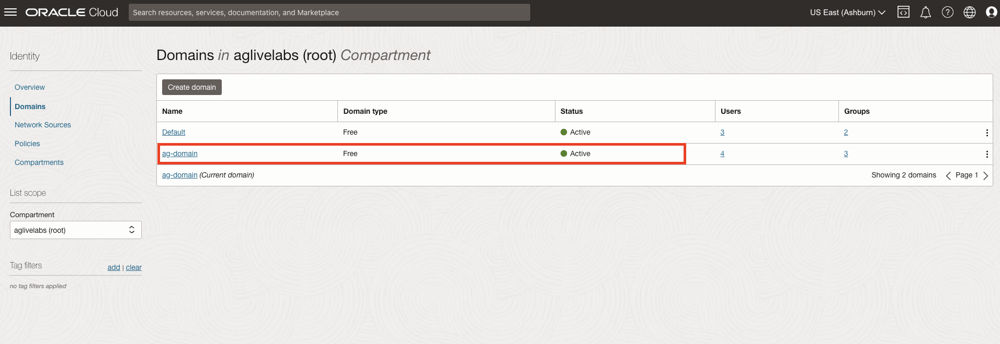
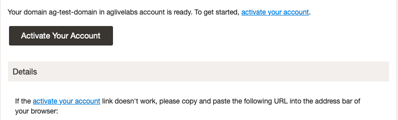
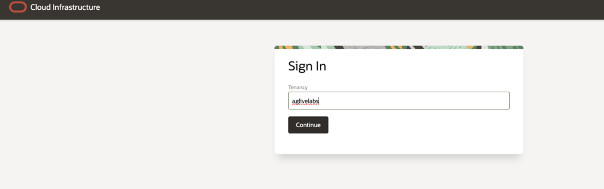
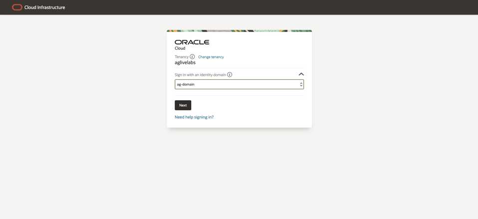
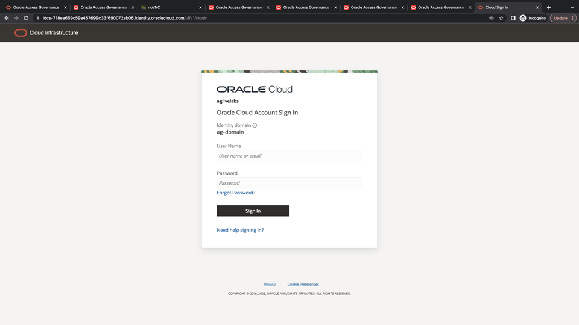
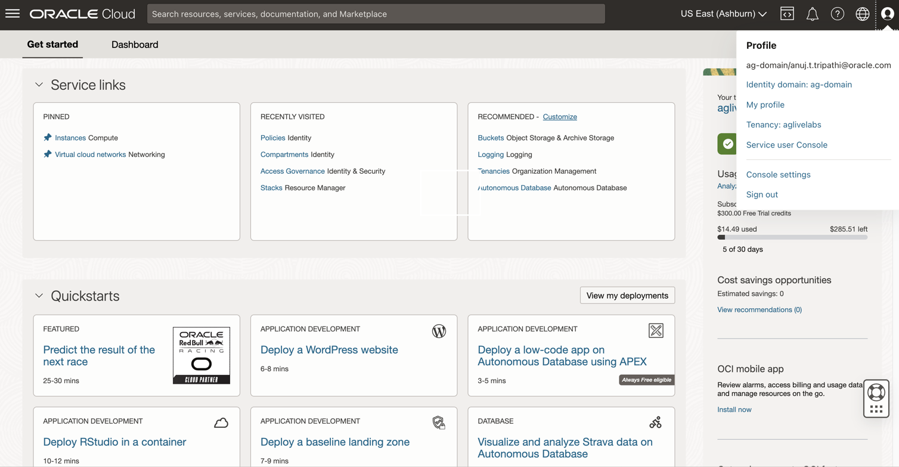

# Creation of Identity Domain

## Introduction

Creation of Identity Domain. 

*Estimated Lab Time*: 15 minutes


### Objectives

In this lab, you will:
 * Create an **Identity Domain**
 * Activate you **Account**
 * Login to Oracle Cloud using **Identity Domain**

### Prerequisites
This lab assumes you have:
- A valid Oracle OCI tenancy, with OCI administrator privileges.


## Task 1: Create Identity Domain 

1. Open up the hamburger menu in the top left corner. Click Identity and Security, and choose Identity > Domains. 

    

2. Select the *root* compartment in which you will create the identity domain. Click *Create Domain*

    

3. Enter the details of the Identity Domain to be created. Click *Create*  
    
    ```
    Display Name: ag-domain
    Description: Oracle Access Governance Identity Domain
    Domaintype: Free
    Domain Administrator: Select the checkbox for Create an administrative user for this domain 
    Administrator first name: Enter administrator  first name 
    Administrator last name: Enter administrator last name 
    Administrator username/email: Enter the administrator email id
    Compartment: Ensure your root compartment is selected
    ```


     

    

     
4. You have now created the Identity Domain. 


     

5. Logout of your Cloud Account by clicking on the *User icon* in the top right corner. Click on *Sign out* option. 

## Task 2: Activate your Account 

1. Go to your Administrator email and click **Activate Your Account**

    

2. Enter the password in the next screen and submit


## Task 3: Login to Oracle Cloud using Identity Domain. 

1. Go to cloud.oracle.com and enter your Tenancy name and click **Continue**

    

2. Under Sign-in with an Identity domain, select the Identity Domain you created in the **Task 1**. Click Next.

    

3. Enter your Cloud Account credentials and click Sign In. Your username is your email address provided in **Task 1: Step 3** The password is what you chose when you reset through Activation mail.

    

5. You are now signed in to Identity Domain. 
    
     


    You may now **proceed to the next lab.**

## Learn More

* [Oracle Access Governance Create Access Review Campaign](https://docs.oracle.com/en/cloud/paas/access-governance/pdapg/index.html)
* [Oracle Access Governance Product Page](https://www.oracle.com/security/cloud-security/access-governance/)
* [Oracle Access Governance Product tour](https://www.oracle.com/webfolder/s/quicktours/paas/pt-sec-access-governance/index.html)
* [Oracle Access Governance FAQ](https://www.oracle.com/security/cloud-security/access-governance/faq/)

## Acknowledgments
* **Authors** - Anuj Tripathi, Indira Balasundaram, Anbu Anbarasu
* **Last Updated By/Date** - Anbu Anbarasu, May 2023