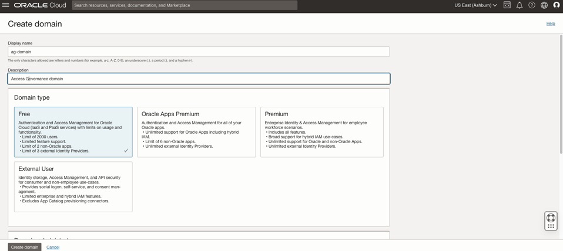

# Creation of Identity Domain and Users in OCI IAM

## Introduction

Creation of Identity Domain. 

*Estimated Lab Time*: 15 minutes


### Objectives

In this lab, you will:
 * Create an **Identity Domain**
 * Create Users in **OCI IAM**

### Prerequisites
This lab assumes you have:
- A valid Oracle OCI tenancy, with OCI administrator privileges.


## Task 1: Create Identity Domain 

1. Open up the hamburger menu in the top left corner. Click Identity and Security, and choose Identity > Domains. 

    

2. Select the *root* compartment in which you will create the identity domain. Click *Create Domain*

    

3. Enter the details of the Identity Domain to be created. Click *Create*  
    
    ```
    Display Name: ag-domain
    Description: Oracle Access Governance Identity Domain
    Domaintype: Free
    Domain Administrator: Select the checkbox for Create an administrative user for this domain 
    Administrator first name: Enter administrator  first name 
    Administrator last name: Enter administrator last name 
    Administrator username/email: Enter the administrator email id
    Compartment: Ensure your root compartment is selected
    ```


     

    

     
4. You have now created the Identity Domain. 


     

5. Logout of your Cloud Account by clicking on the *User icon* in the top right corner. Click on *Sign out* option. 

## Task 2: Activate your Account. - ANBU

1. Go to your email and click **Activate Your Account**

    

2. Enter the password in the next screen and submit


## Task 3: Login to Oracle Cloud using Identity Domain. 

1. Go to cloud.oracle.com and enter your Tenancy name and click **Continue**

    

2. Under Sign-in with an Identity domain, select the Identity Domain you created in the **Task 1**. Click Next.

    

3. Enter your Cloud Account credentials and click Sign In. Your username is your email address provided in **Task 1: Step 3** The password is what you chose when you reset through Activation mail.

    

5. You are now signed in to Identity Domain. 
    
     

## Task 4: Create Users in OCI IAM

Create users in OCI IAM and assign them to Application roles.
ANBU - Step 1 is not necessary as the user is already in the console. - ANBU

1. Launch a browser window. Login to OCI console , identity domain : *ag-domain* using the URL mentioned below. The OCI account sign in page appears. Enter the username and password provided during signup. 
     
    ```
    <copy>https://console.us-ashburn-1.oraclecloud.com/</copy>
    ```
    


2. Click the Navigation Menu icon in the top left corner to display the Navigation menu. Click Identity and Security in the Navigation menu. Select Domains from the list of products.

    


3. On the Domains page, Click on Identity-domain : *ag-domain* you have created. 

    

   Select *Users*. Click on *Create User*

     

ANBU- Uncheck "Use the email address as the username" - ANBU

4. Enter the following details to create 3 users - Pamela Green (Campaign Administrator), Harlan Bullard (Manager), Mark Hernandez (Employee User) in IAM. Be sure to use different email IDs for different users.


    ```
    First Name: Pamela
    Last Name: Green
    Username: pamela.green
    Email: Specify unique email-id to which you will be receiving activation mail for password reset for the user. 
    ```
    

    Click *Create*

    ```
    First Name: Harlan
    Last Name: Bullard
    Username: harlan.bullard
    Email: Specify unique email-id to which you will be receiving activation mail for password reset for the user. 
    ```
    

    Click *Create*

    ```
    First Name: Mark
    Last Name: Hernandez
    Username: mhernandez
    Email: Specify unique email-id to which you will be receiving activation mail for password reset for the user. 
    ```
    

    Click *Create*

4. ANBU - Sign out from the cloud console before performing this step. - ANBU. For each user created, an activation mail will be sent to the email-id provided in the *Task 3: Step 4* . Reset the password for the 3 users using the *Activation mail* recieved for each of them. 
    Reset password to the below mentioned password:

    **Password:**
     ```
    <copy>Oracl@123456</copy>
    ```
    ANBU - Need to log back in as the IDD administrator before performing the next step; Suggest creating a separate Task for the following steps. The following STEPS DONT WORK. a) I don't see default domain for the user I created in the new IDD and b) I don't see AG-service-instance in the Oracle Cloud Services; so skipping this step for now 
    The following step was performed after creating AG SI in Lab 3; This task needs to be moved to Lab 3 after SI is created; Please also change default domain to the domain we created - ANBU
5. Assign Administrator Application Role to User Pamela Green

    * In the OCI console, navigate to Identity -> Domains -> Default Domain -> Oracle Cloud Services -> AG-service-instance -> Application Role. 

    * Notice the *AG Administrator* Role listed. Click on the Downward arrow on the right corner. 

    

    * Click on *Assigned Users -> Manage*. Select *Pamela Green* in *Available Users.* Click on *Assign*

    

    * The user Pamela Green is now visible under *Assigned Users*.

    

    * Pamela Green has been assigned with the *Administrator* application role. You can now close the window.

## ANBU - Added this task here: Task 5: Create AG Policies 


1. In the OCI console, click the Navigation Menu icon in the top left corner to display the *Navigation menu.* Click *Identity and Security* in the *Navigation menu*. Select *Policies* from the list of products.

    

3. On the Policies page, Click on *Create Policy* to create the policy : ag-access-policy


    ```
    Name: ag-access-policy
    Description: IAM policy for granting ag-group access to manage access governance instances
    Compartment: Ensure your root compartment is selected
    Policy Builder: Select the show manual editor checkbox
    Statement 1: Allow group ag-domain/ag-group to manage all-resources in tenancy
    ```

    Click *Create*

    You may now **proceed to the next lab.**

## Learn More

* [Oracle Access Governance Create Access Review Campaign](https://docs.oracle.com/en/cloud/paas/access-governance/pdapg/index.html)
* [Oracle Access Governance Product Page](https://www.oracle.com/security/cloud-security/access-governance/)
* [Oracle Access Governance Product tour](https://www.oracle.com/webfolder/s/quicktours/paas/pt-sec-access-governance/index.html)
* [Oracle Access Governance FAQ](https://www.oracle.com/security/cloud-security/access-governance/faq/)

## Acknowledgments
* **Authors** - Anuj Tripathi, Indira Balasundaram, Anbu Anbarasu
* **Last Updated By/Date** - Anbu Anbarasu, Cloud Platform COE, January 2023