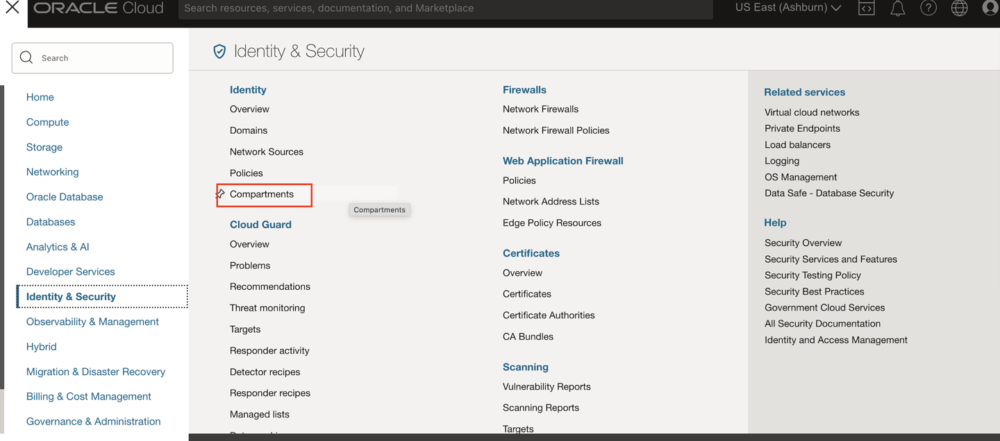
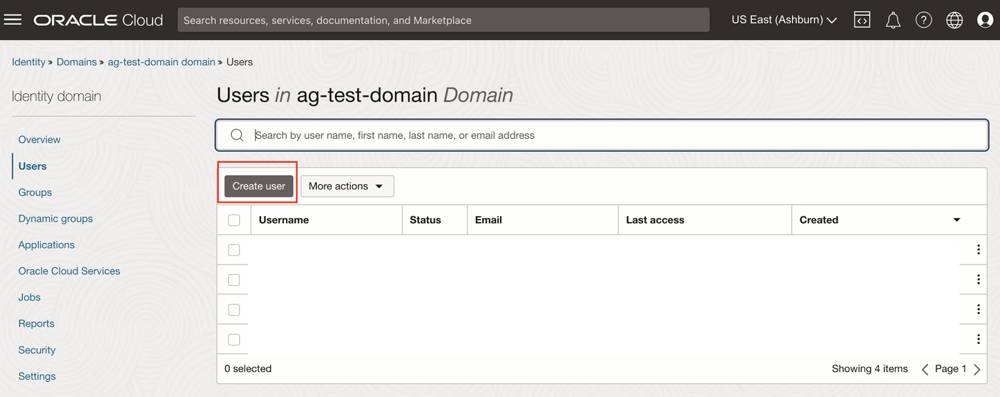
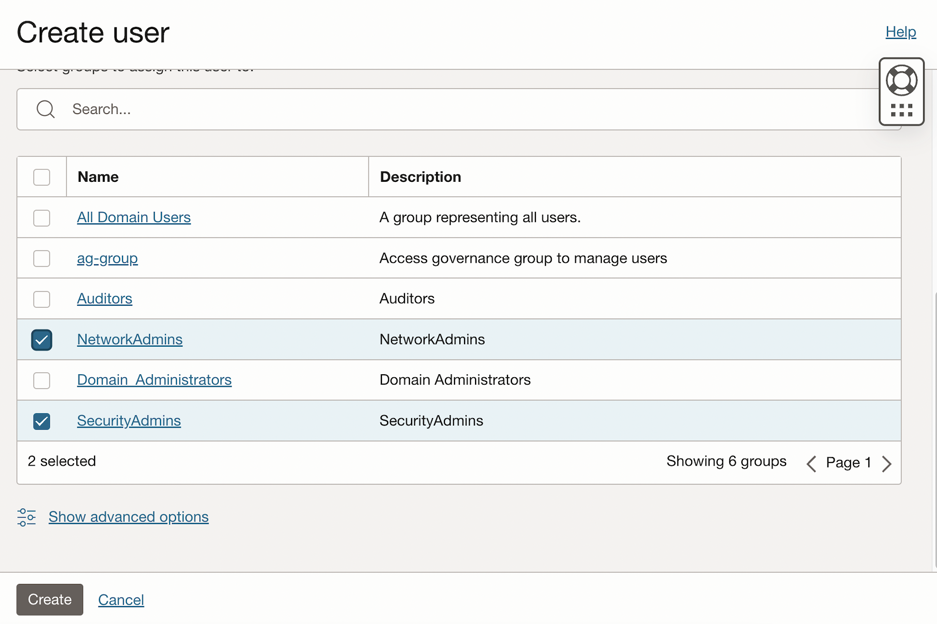
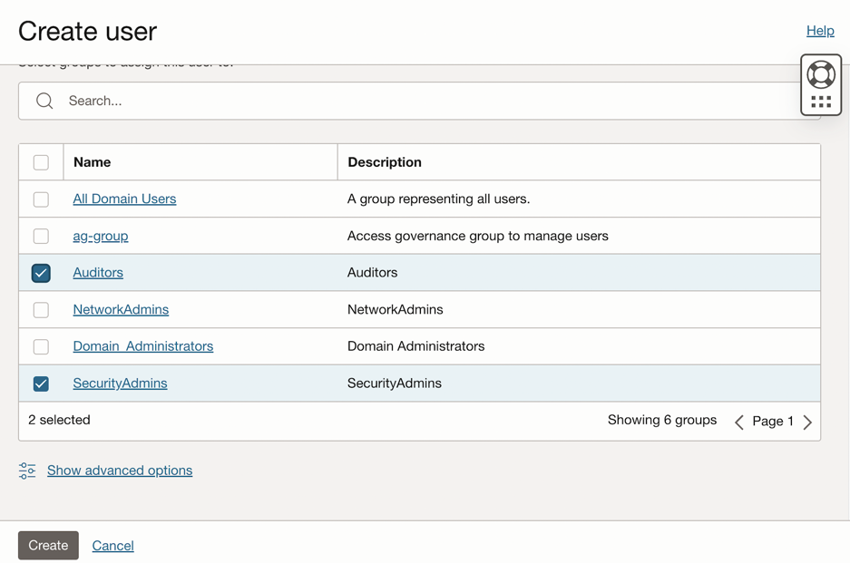

# Create  OCI Policies, Groups and Compartments

## Introduction

As a user with a **Administrator** role in the identity domain, you can create OCI policies, groups and compartments from the **OCI** console.This lab will show you how to set up the OCI policies,groups and compartments needed to run this OCI-IAM Policy reviews. 

 

* Estimated Time: 15 minutes
* Persona: Identity Domain Administrator


### Objectives

In this lab, you will: 
* Create  OCI Policies, Groups and Compartments manually
* We create the following resources in this lab:

| Resource Type           | Resource    | Description |
| :-----------   |   :--------:   |  :--------: |
| Compartment      | Development           | Development   |
|      | Quality-Assurance           | Quality-Assurance   |
|      | Testing             | Testing   |
| Users        | demouser1           | demouser1 belongs to groups - SecurityAdmins   |
|       | demouser2            | demouser2 belongs to groups -  SecurityAdmins and NetworkAdmins  |
|        | demouser3           | demouser3 belongs to groups - SecurityAdmins and Auditors   |
| Groups         | SecurityAdmins           | SecurityAdmins         |
|          | NetworkAdmins             | NetworkAdmins        |
|          | Auditors            | Auditors        | 
| Policies         | tf1-auditors-policy            | Access Policy for Auditors         |
|         |  tf2-network-admins-policy            | Access Policy for Network Administrators        |
|          | tf3-security-admins-policy           | Access Policy for Security Admins         |


## Task 1: Create Compartments

1. Login to the OCI console Identity Domain: ag-domain as the Identity Domain Administrator.

  

2. In the OCI console, click the Navigation Menu icon in the top left corner to display the Navigation menu. Click Identity and Security in the Navigation menu. Select Compartments from the list of products.

  


3. Click on *Create Compartment.* Provide the following details to create the 3 compartments: **Development, Quality-Assurance and Testing**

   

  **Name:** Development

  **Description:** Development

  **Parent Compartment:** Select the root compartment 

  Click on *Create Compartment*

  

  **Name:** Quality-Assurance

  **Description:** Quality-Assurance

  **Parent Compartment:** Select the root compartment 

  Click on *Create Compartment*

  

  **Name:** Testing

  **Description:** Testing

  **Parent Compartment:** Select the root compartment 

  Click on *Create Compartment* 

  

   The *compartments* have been successfully created. 


## Task 2: Create Groups


1. Navigate to Identity -> Domains -> ag-domain -> Groups. 

   

4. Click on *Create Group*. Enter the following details to create 3 groups: **SecurityAdmins, NetworkAdmins and Auditors**

  **Name:** SecurityAdmins

  **Description:** SecurityAdmins

  Click *Create*

  

  **Name:** NetworkAdmins

  **Description:** 	NetworkAdmins

  Click *Create*

  

  **Name:**	Auditors

  **Description:**	Auditors

  Click *Create*

  


   The *groups* have been successfully created.

## Task 3: Create Sample Users


1. Navigate to Identity -> Domains -> ag-domain -> Users 

   

4. Click on *Create User* . Enter the following details to create 3 sample users: **demouser1, demouser2 and demouser3**

  **First Name:** demo

  **Last Name:** user1

  **Username:** demouser1 

  **Email:** demouser1@example.com

  **Groups:** Select the checkbox **SecurityAdmins** 

  Click *Create*

  

  

  **First Name:** demo

  **Last Name:** user2

  **Username:** demouser2

  **Email:** demouser2@example.com

  **Groups:** Select the checkbox **SecurityAdmins** and **NetworkAdmins**

  Click *Create*

  

  


  **First Name:** demo

  **Last Name:** user3

  **Username:** demouser3

  **Email:** demouser3@example.com

  **Groups:** Select the checkbox **SecurityAdmins** and **Auditors**

  Click *Create*

  

  


   The *users* have been successfully created.

## Task 4: Create Policies


1. In the OCI console, click the Navigation Menu icon in the top left corner to display the *Navigation menu.* Click *Identity and Security* in the *Navigation menu*. Select *Policies* from the list of products.

  

2. On the Policies page, Click on *Create Policy* each time to create 3 policies : **auditors-policy, network-admins-policy and security-admins-policy**


    ```
    Name: auditors_policy
    Description: Access Policy for Auditors
    Compartment: Ensure your root compartment is selected
    Policy Builder: Select the show manual editor checkbox

    ```

     ```
    <copy>Allow group Auditors to inspect all-resources in tenancy
    Allow group Auditors to read instances in compartment Quality-Assurance
    Allow group Auditors to read audit-events in compartment Quality-Assurance </copy>
    ```  

    Click *Create*


  

    ```
    Name: network_admins_policy

    Description: Access Policy for Network Administrators

    Compartment: Ensure your root compartment is selected

    Policy Builder: Select the show manual editor checkbox

    ```

      ```
      <copy>Allow group NetworkAdmins to manage virtual-network-family in tenancy	
      Allow group NetworkAdmins to manage load-balancers in compartment Quality-Assurance	
      Allow group NetworkAdmins to manage load-balancers in compartment Development	
      Allow group NetworkAdmins to manage load-balancers in compartment Testing	
      Allow group NetworkAdmins to manage instances in compartment Quality-Assurance	
      Allow group NetworkAdmins to manage instances in compartment Development	
      Allow group NetworkAdmins to manage instances in compartment Testing</copy>
      ```  

    Click *Create*

    


    ```
    Name: security_admins_policy
    Description: Access Policy for Security Admins
    Compartment: Ensure your root compartment is selected
    Policy Builder: Select the show manual editor checkbox

    ```

     ```
    <copy>Allow group SecurityAdmins to manage bastion in compartment Quality-Assurance
    Allow group SecurityAdmins to manage bastion-session in compartment Quality-Assurance
    Allow group SecurityAdmins to read instance-family in compartment Quality-Assurance
    Allow group SecurityAdmins to read instance-agent-plugins in compartment Quality-Assurance
    Allow group SecurityAdmins to inspect work-requests in compartment Quality-Assurance
    Allow group SecurityAdmins to manage bastion in compartment Testing
    Allow group SecurityAdmins to manage bastion-session in compartment Testing
    Allow group SecurityAdmins to manage virtual-network-family in compartment Testing
    Allow group SecurityAdmins to read instance-family in compartment Testing
    Allow group SecurityAdmins to read instance-agent-plugins in compartment Testing
    Allow group SecurityAdmins to inspect work-requests in compartment Testing</copy>
    ```  

    Click *Create*

  

  The *policies* have been successfully created. 

  You may now **proceed to the next lab**. 

## Learn More

* [Oracle Access Governance Create Access Review Campaign](https://docs.oracle.com/en/cloud/paas/access-governance/pdapg/index.html)
* [Oracle Access Governance Product Page](https://www.oracle.com/security/cloud-security/access-governance/)
* [Oracle Access Governance Product tour](https://www.oracle.com/webfolder/s/quicktours/paas/pt-sec-access-governance/index.html)
* [Oracle Access Governance FAQ](https://www.oracle.com/security/cloud-security/access-governance/faq/)

## Acknowledgments
* **Authors** - Anuj Tripathi, Indira Balasundaram, Anbu Anbarasu 
* **Contributors** - Abhishek Juneja 
* **Last Updated By/Date** - Anbu Anbarasu, Cloud Platform COE, January 2023
