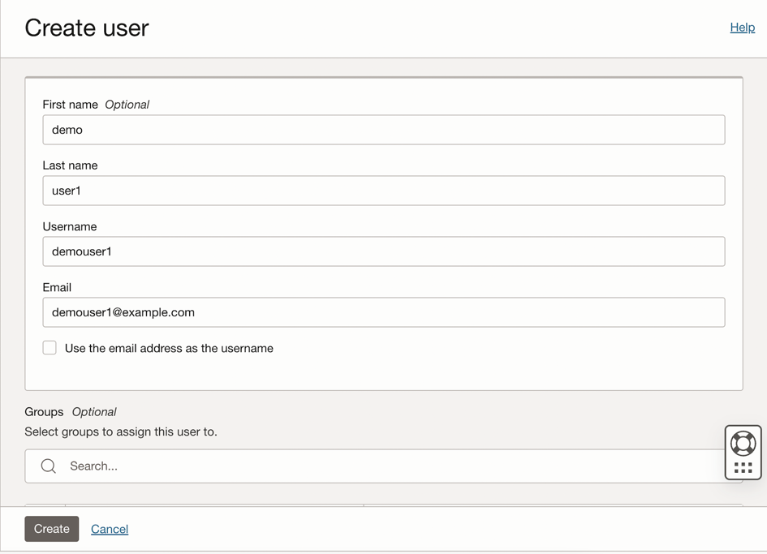
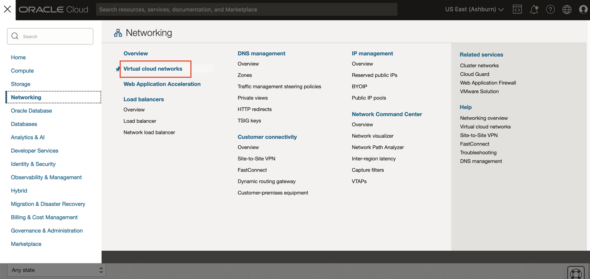
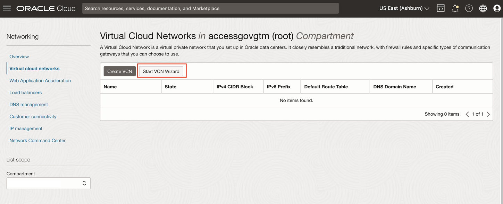
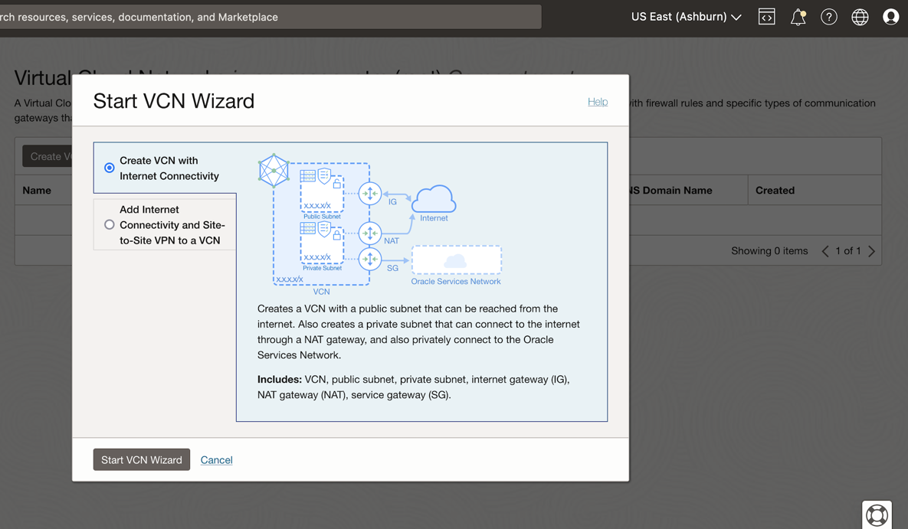
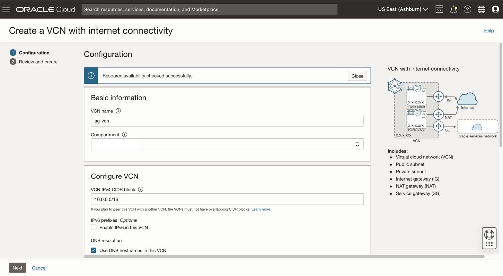
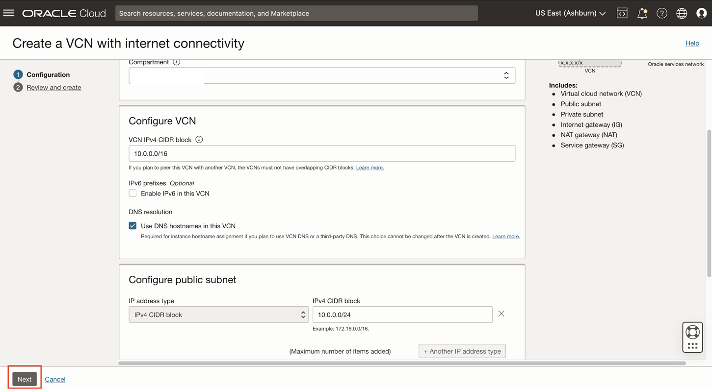
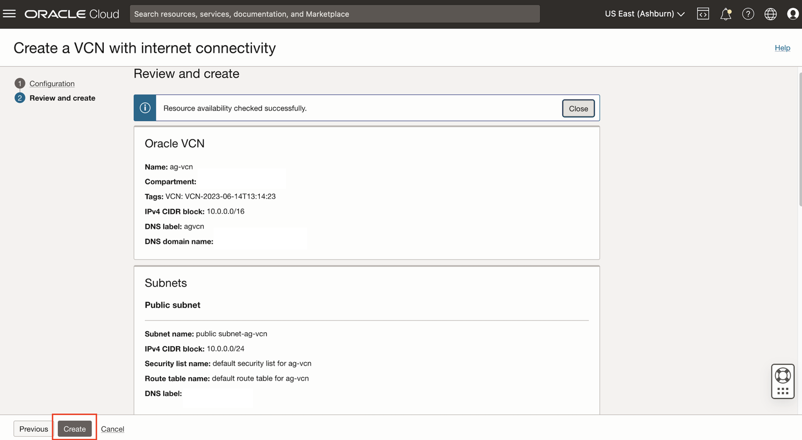
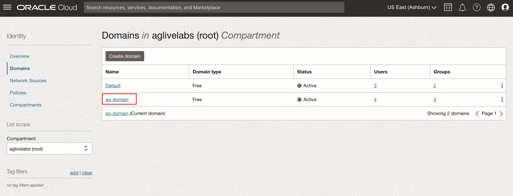
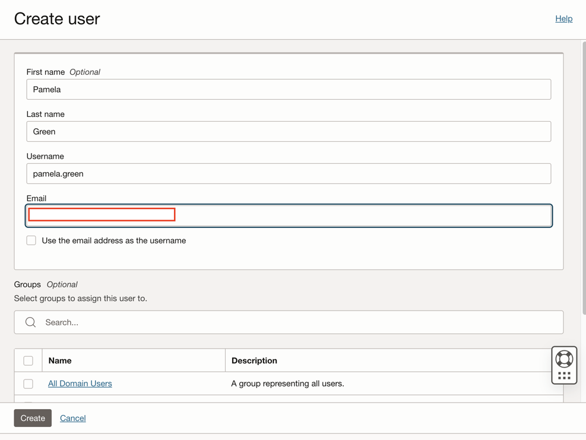

# Create  OCI Policies, VCN, Groups and Compartments

## Introduction

As a user with a **Identity Domain Administrator** role in the identity domain, you can create OCI policies, groups and compartments, oci iam users from the **OCI** console.This lab will show you how to set up the OCI policies,VCN,groups and compartments needed to run this OCI-IAM Policy reviews. 

 

* Estimated Time: 15 minutes
* Persona: Identity Domain Administrator


### Objectives

In this lab, you will: 
* Create  OCI Policies, VCN, Groups and Compartments, OCI IAM Users manually
* Note: All the resources we create in this lab are supposed to be created in the **ag-compartment**
* We create the following resources in this lab:


| Resource Type           | Resource    | Description |
| :-----------   |   :--------:   |  :--------: |
| Compartment      | Development           | Development   |
|      | Quality-Assurance           | Quality-Assurance   |
|      | Testing             | Testing   |
| Users        | demouser1           | demouser1 belongs to groups - SecurityAdmins   |
|       | demouser2            | demouser2 belongs to groups -  SecurityAdmins and NetworkAdmins  |
|        | demouser3           | demouser3 belongs to groups - SecurityAdmins and Auditors   |
| Groups         | SecurityAdmins           | SecurityAdmins         |
|          | NetworkAdmins             | NetworkAdmins        |
|          | Auditors            | Auditors        | 
| Policies         | auditors-policy            | Access Policy for Auditors         |
|         |  network-admins-policy            | Access Policy for Network Administrators        |
|          | security-admins-policy           | Access Policy for Security Admins         |
| Virtual Cloud Network    | ag-vcn           | AG Test Virtual Cloud Network       | 


## Task 1: Create Compartments

1. Login to the OCI console Identity Domain: ag-domain as the **Identity Domain Administrator**

  

2. In the OCI console, click the Navigation Menu icon in the top left corner to display the Navigation menu. Click Identity and Security in the Navigation menu. Select Compartments from the list of products.

  


3. Click on *Create Compartment.* Provide the following details to create the 3 compartments: **Development, Quality-Assurance and Testing**

   

  **Name:** Development

  **Description:** Development

  **Parent Compartment:** Select the **ag-compartment** compartment 

  Click on *Create Compartment*

  

  **Name:** Quality-Assurance

  **Description:** Quality-Assurance

  **Parent Compartment:** Select the **ag-compartment** compartment 

  Click on *Create Compartment*

  

  **Name:** Testing

  **Description:** Testing

  **Parent Compartment:** Select the **ag-compartment** compartment 

  Click on *Create Compartment* 

  

   The *compartments* have been successfully created. 


## Task 2: Create Groups


1. Navigate to Identity -> Domains -> ag-domain -> Groups. 

   

4. Click on *Create Group*. Enter the following details to create 3 groups: **SecurityAdmins, NetworkAdmins and Auditors**

  **Name:** SecurityAdmins

  **Description:** SecurityAdmins

  Click *Create*

  

  **Name:** NetworkAdmins

  **Description:** 	NetworkAdmins

  Click *Create*

  

  **Name:**	Auditors

  **Description:**	Auditors

  Click *Create*

  


   The *groups* have been successfully created.

## Task 3: Create Sample Users


1. Navigate to Identity -> Domains -> ag-domain -> Users 

   

4. Click on *Create User* . Enter the following details to create 3 sample users: **demouser1, demouser2 and demouser3**

  **First Name:** demo

  **Last Name:** user1

  **Username:** demouser1 

  **Email:** demouser1@example.com

  **Groups:** Select the checkbox **SecurityAdmins** 

  Click *Create*

  

  

  **First Name:** demo

  **Last Name:** user2

  **Username:** demouser2

  **Email:** demouser2@example.com

  **Groups:** Select the checkbox **SecurityAdmins** and **NetworkAdmins**

  Click *Create*

  

  


  **First Name:** demo

  **Last Name:** user3

  **Username:** demouser3

  **Email:** demouser3@example.com

  **Groups:** Select the checkbox **SecurityAdmins** and **Auditors**

  Click *Create*

  

  


   The *users* have been successfully created.

## Task 4: Create Policies


1. In the OCI console, click the Navigation Menu icon in the top left corner to display the *Navigation menu.* Click *Identity and Security* in the *Navigation menu*. Select *Policies* from the list of products.

  

2. On the Policies page, Click on *Create Policy* each time to create 3 policies : **auditors-policy, network-admins-policy and security-admins-policy**


    ```
    Name: auditors_policy
    Description: Access Policy for Auditors
    Compartment: Ensure ag-compartment is selected
    Policy Builder: Select the show manual editor checkbox

    ```

     ```
    <copy>Allow group ag-domain/Auditors to read instances in compartment ag-compartment
    Allow group ag-domain/Auditors to read audit-events in compartment ag-compartment
    Allow group ag-domain/Auditors to inspect vaults in compartment ag-compartment
    Allow group ag-domain/Auditors to inspect virtual-network-family in compartment ag-compartment
    Allow group ag-domain/Auditors to inspect keys in compartment ag-compartment
    Allow group ag-domain/Auditors to inspect vaults in compartment ag-compartment
    Allow group ag-domain/Auditors to inspect virtual-network-family in compartment ag-compartment
    Allow group ag-domain/Auditors to inspect keys in compartment Quality-Assurance
    Allow group ag-domain/Auditors to inspect vaults in compartment Development
    Allow group ag-domain/Auditors to inspect virtual-network-family in compartment Testing
    </copy>
      ```  

    Click *Create*


    ```
    Name: network_admins_policy

    Description: Access Policy for Network Administrators

    Compartment: Ensure ag-compartment is selected

    Policy Builder: Select the show manual editor checkbox

    ```

      ```
      <copy>Allow group ag-domain/NetworkAdmins to manage all-resources in compartment ag-compartment</copy>
      ```  

    Click *Create*


    ```
    Name: security_admins_policy
    Description: Access Policy for Security Admins
    Compartment: Ensure ag-compartment is selected
    Policy Builder: Select the show manual editor checkbox

    ```

     ```
    <copy>Allow group ag-domain/SecurityAdmins to manage virtual-network-family in compartment ag-compartment
    Allow group ag-domain/SecurityAdmins to manage vaults in compartment ag-compartment
    Allow group ag-domain/SecurityAdmins to manage secret-family in compartment ag-compartment
    Allow group ag-domain/SecurityAdmins to manage keys in compartment ag-compartment
    Allow group ag-domain/SecurityAdmins to inspect work-requests in compartment Quality-Assurance
    Allow group ag-domain/SecurityAdmins to manage keys in compartment Development
    Allow group ag-domain/SecurityAdmins to manage bastion in compartment Testing	
    </copy>
    ```  

    Click *Create*


  The *policies* have been successfully created. 


## Task 5: Create VCN 


1. Navigate to Networking -> Virtual Cloud Networks

   

2. Ensure the **ag-compartment** is selected. Click on **Start VCN Wizard**

  

3. Check the box **Create VCN with Internet Connectivity**. Click on **Start VCN Wizard** 

  


4. Under Configuration , provide the below details: 


  **VCN name:** ag-vcn 

  **Compartment:** Select the ag-compartment 

    

5. Click on **Next**

   

6. Verify all the details. Click on **Create**

   

    The *VCN* has been successfully created.

## Task 6: Create Users in OCI IAM

1. Click the Navigation Menu icon in the top left corner to display the Navigation menu. Click Identity and Security in the Navigation menu. Select Domains from the list of products.

    


2. On the Domains page, Click on Identity-domain : *ag-domain* you have created. 

    

   Select *Users*. Click on *Create User*

     

3. Uncheck "Use the email address as the username" 

4. Enter the following details to create 3 users - Pamela Green (Campaign Administrator), Harlan Bullard (Manager), Mark Hernandez (Employee User) in IAM. Be sure to use different email IDs for different users.


    ```
    First Name: Pamela
    Last Name: Green
    Username: pamela.green
    Email: Specify unique email-id to which you will be receiving activation mail for password reset for the user. 
    ```
    

    Click *Create*

    ```
    First Name: Harlan
    Last Name: Bullard
    Username: harlan.bullard
    Email: Specify unique email-id to which you will be receiving activation mail for password reset for the user. 
    ```
    

    Click *Create*

    ```
    First Name: Mark
    Last Name: Hernandez
    Username: mhernandez
    Email: Specify unique email-id to which you will be receiving activation mail for password reset for the user. 
    ```
    

    Click *Create*

5. Sign out from the cloud console.

6. For each user created, an activation mail will be sent to the email-id provided in the *Task 3: Step 4* . Reset the password for the 3 users using the *Activation mail* recieved for each of them. 
    Reset password to the below mentioned password:

    **Password:**
     ```
    <copy>Oracl@123456</copy>
    ```

  You may now **proceed to the next lab**. 

## Learn More

* [Oracle Access Governance Create Access Review Campaign](https://docs.oracle.com/en/cloud/paas/access-governance/pdapg/index.html)
* [Oracle Access Governance Product Page](https://www.oracle.com/security/cloud-security/access-governance/)
* [Oracle Access Governance Product tour](https://www.oracle.com/webfolder/s/quicktours/paas/pt-sec-access-governance/index.html)
* [Oracle Access Governance FAQ](https://www.oracle.com/security/cloud-security/access-governance/faq/)

## Acknowledgments
* **Authors** - Anuj Tripathi, Indira Balasundaram, Anbu Anbarasu 
* **Contributors** - Abhishek Juneja 
* **Last Updated By/Date** - Indira Balasundaram , Sept 2024
