# Create Policy Review Campaigns

## Introduction

Access Governance Administrators (Pamela Green) can create policy review campaign.

* Estimated Time: 10 minutes
* Persona: Access Governance Administrator

### Objectives

In this lab, you will:
* Create policy review campaigns for OCI IAM Policies 


## Task 1: Create Approval Workflow


1. From your browser, navigate to the Oracle Access Governance Console using the URL specified in *Lab 2: Task 1: Step 4*


2. Enter **Oracle Access Governance Administrator** username and password (Pamela Green)

    **Username:**
    ```
    <copy>pamela.green</copy>
    ```

    **Password:**
    
    The password you have set for the user in *Lab 1: Task 2: Step 5*


  You will be navigated to the home page of your Oracle Access Governance Console.

3. Navigate to **Access Controls -> Approval Workflow**

  

4. Click on **Create Approval Workflow**

  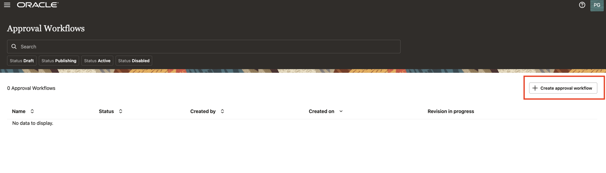

5. Click **Add**

   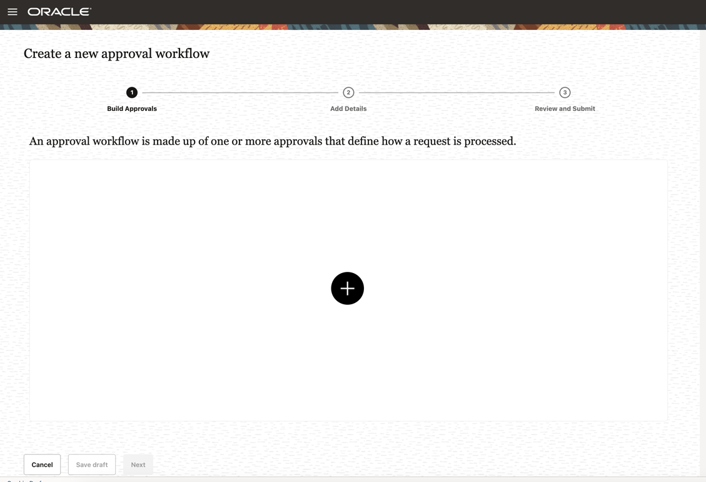
  

6. Under **Add a new approval** 
    - Which type of approval? : select Custom User 
    - Which user? : Pamela Green 
    
   Select **Add**

  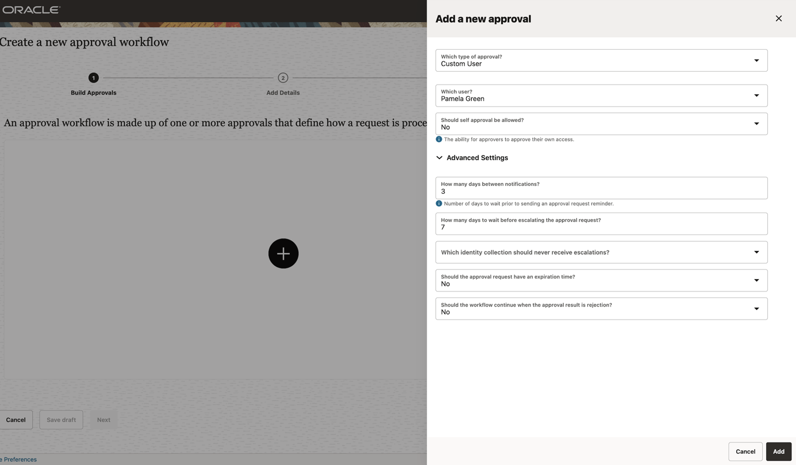

7. Click on **Next**

  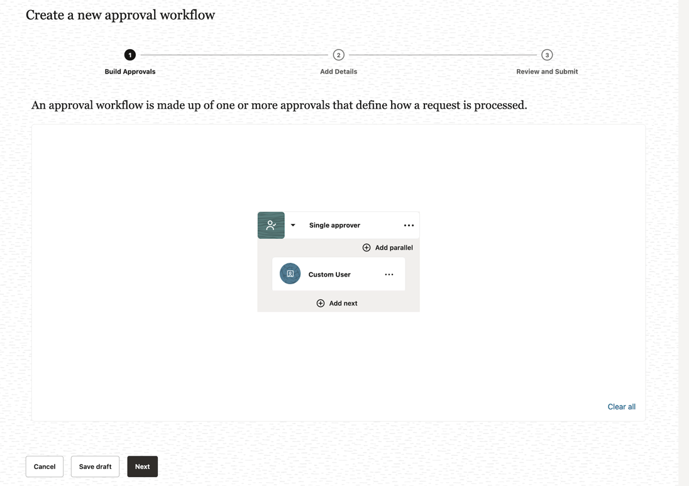

8. Enter the following details:
    - What do you want to call this approval process: **One-level-approval**
    - How do you want to describe this approval process: **One-level-approval**
    
    Click Next

  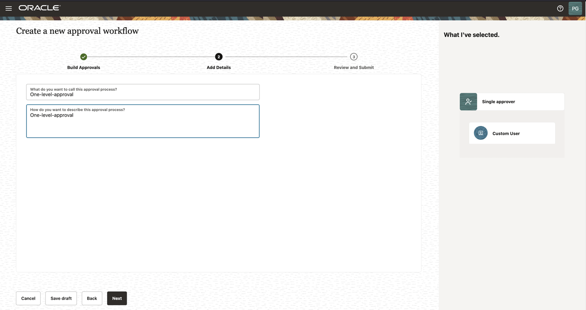

9. Click **Publish** and **Approval Workflow** - **One-level-approval** workflow has been created

  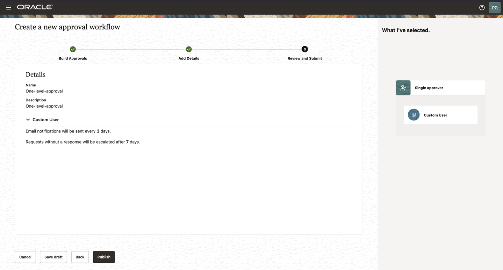
  
   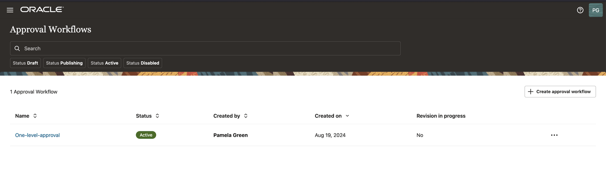

## Task 2: Create a Policy Review Campaign

1.  Scroll down and select the **“Let’s create some work and define a new campaign”** tile. Alternatively, you can select **Navigation Menu -> Access Reviews -> Campaigns.** On the **Campaigns** page, click the **Create a campaign** button.

  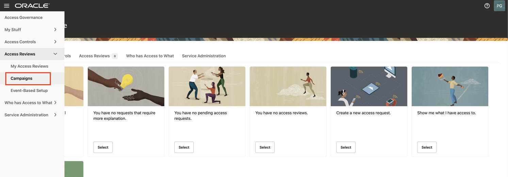

  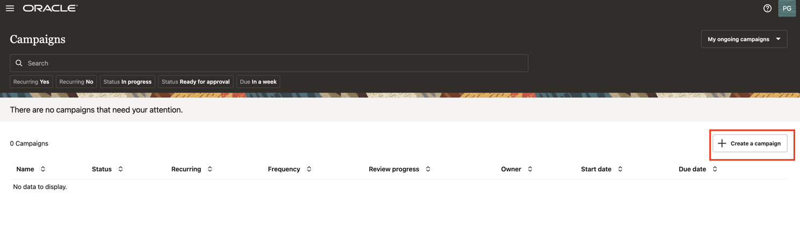

  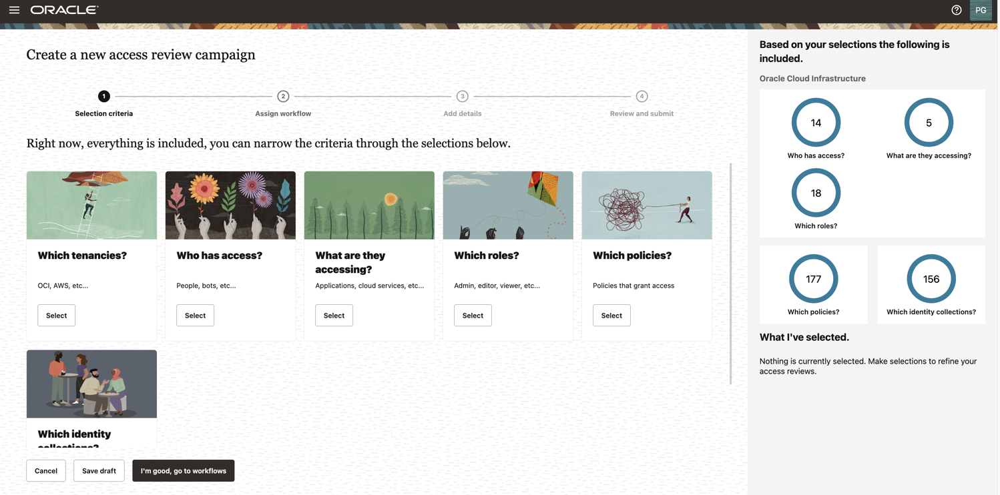

  
  * In the Selection criteria step, select the **Which tenancies?** tile. You will see a list of available cloud tenancies.

  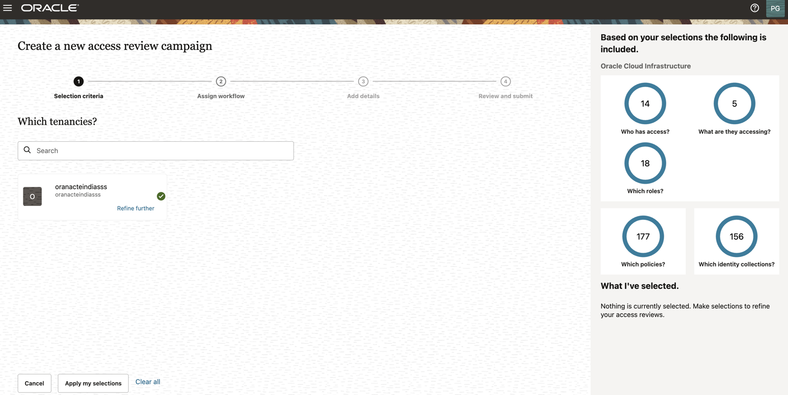

  * Select an appropriate cloud tenancy. In this tutorial, select your cloud tenancy. A green tick is marked against your selection. 


  * Click on **Refine further**. You can further refine your selection by selecting a specific compartment and a domain, to run domain-specific policy reviews.


  * Enter the **compartment** details mentioned below and click on **Apply**

     - compartment: ag-compartment

  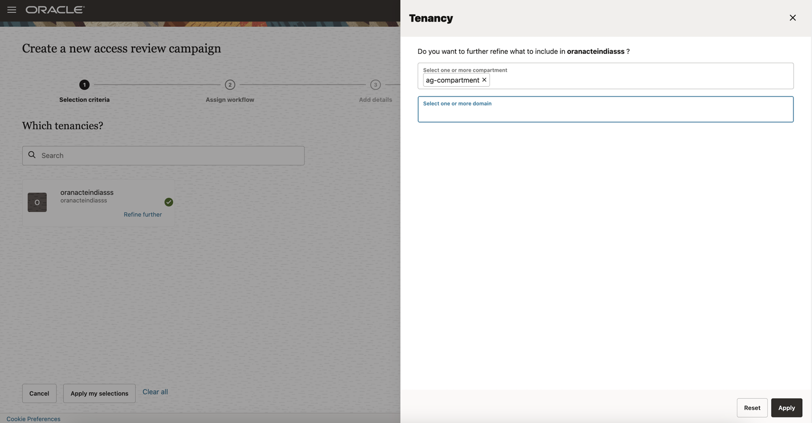

  * Move on to the next step to select policies that you want to review. Select **Which policies?** tile. You will see a list of available policies in the domain that you selected.

  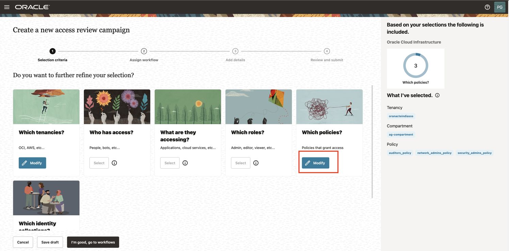

  * Select the policies that you want to review. In this tutorial, select the following policies and click **Apply my selections.**

      - auditors-policy
      - network-admins-policy
      - security-admins-policy

    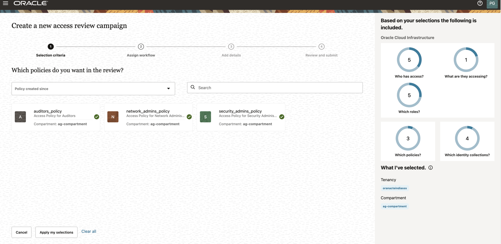
    

  * Proceed to the **Assign workflow** step. Select the following option:

      - Which approval workflow should be used? : One-level-approval-workflow
  
    Click **Next**

  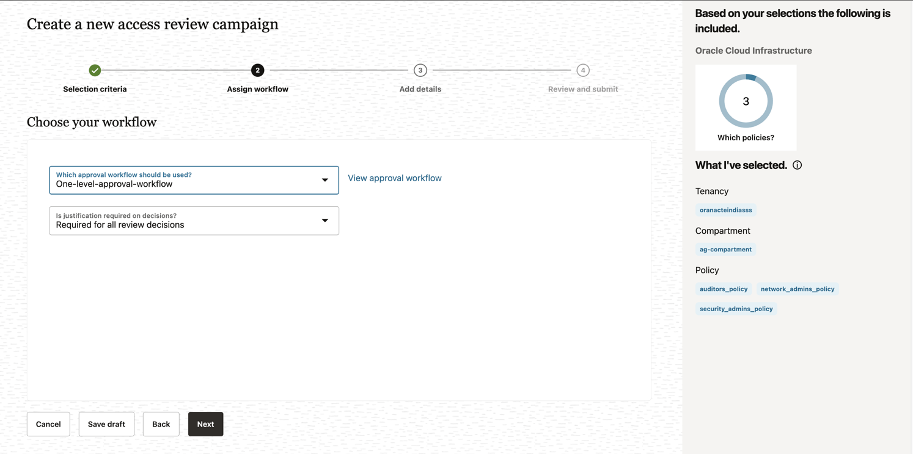


  * In the **Add details** step, you can define the frequency (one-time or periodic) at which to run an access review campaign, give a meaningful name to your campaign, add a supporting description, and assign values to additional attributes, such as who owns it and when the campaign should start or end.


  * For this tutorial make the following changes in the **Add details** step:

      **How often do you want this to run?** : One time

      **What do you want to call this campaign?**: Policy-Review-OCI-IAM

      **How do you want to describe this campaign?**: Policy-Review-OCI-IAM

      **Who owns this campaign?**: Me

      **How would you like to schedule your campaign?** : Run now (will start 10 minutes from creation)


  * Click **Next.**

   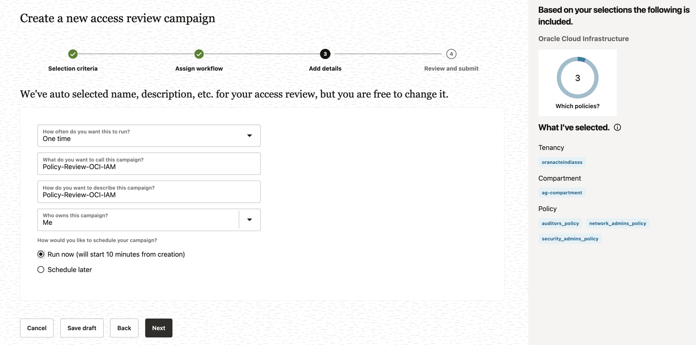

  * The **Review and submit** step displays the information you have added in the previous steps. Select **Create** to create the campaign. Your campaign is scheduled and is displayed on the **Campaigns** page. It will run 10 minutes from creation. 


  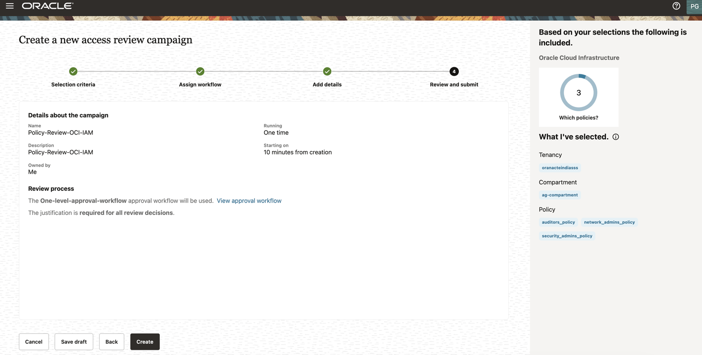

  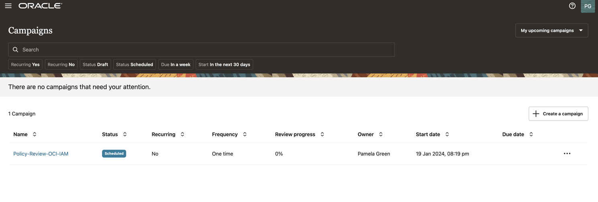


  You may now **proceed to the next lab**. 

## Learn More

* [Oracle Access Governance Create Access Review Campaign](https://docs.oracle.com/en/cloud/paas/access-governance/pdapg/index.html)
* [Oracle Access Governance Product Page](https://www.oracle.com/security/cloud-security/access-governance/)
* [Oracle Access Governance Product tour](https://www.oracle.com/webfolder/s/quicktours/paas/pt-sec-access-governance/index.html)
* [Oracle Access Governance FAQ](https://www.oracle.com/security/cloud-security/access-governance/faq/)

## Acknowledgements
* **Authors** - Anuj Tripathi, Indira Balasundaram, Anbu Anbarasu 
* **Last Updated By/Date** - Indira Balasundaram , Sept 2024
