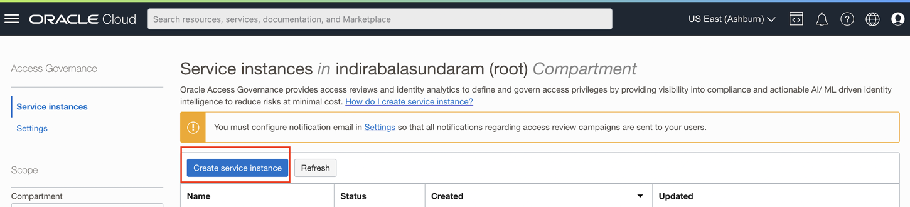
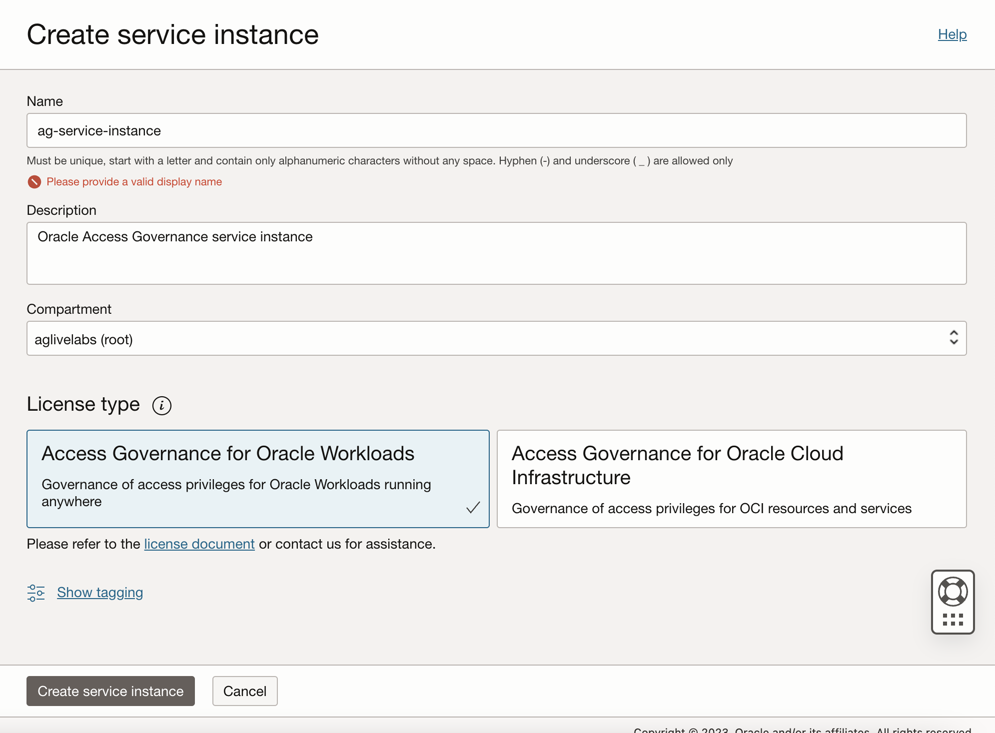
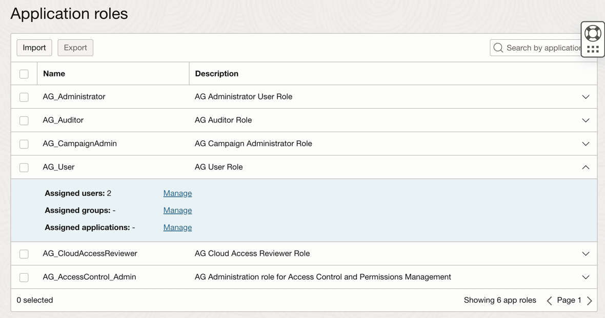
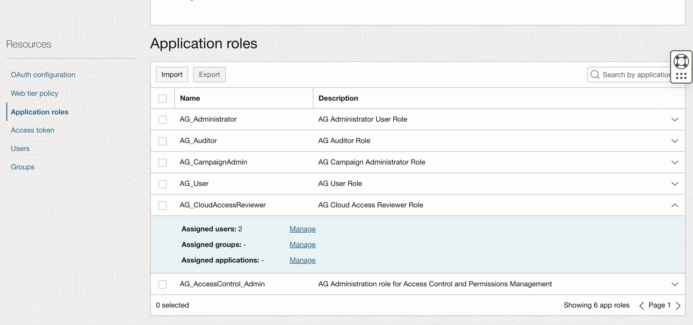
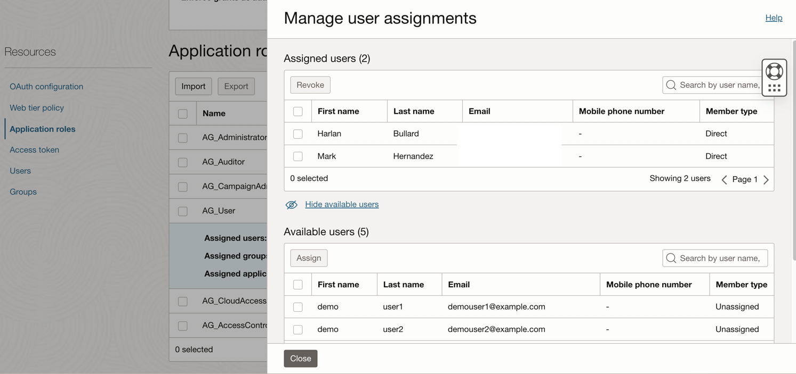
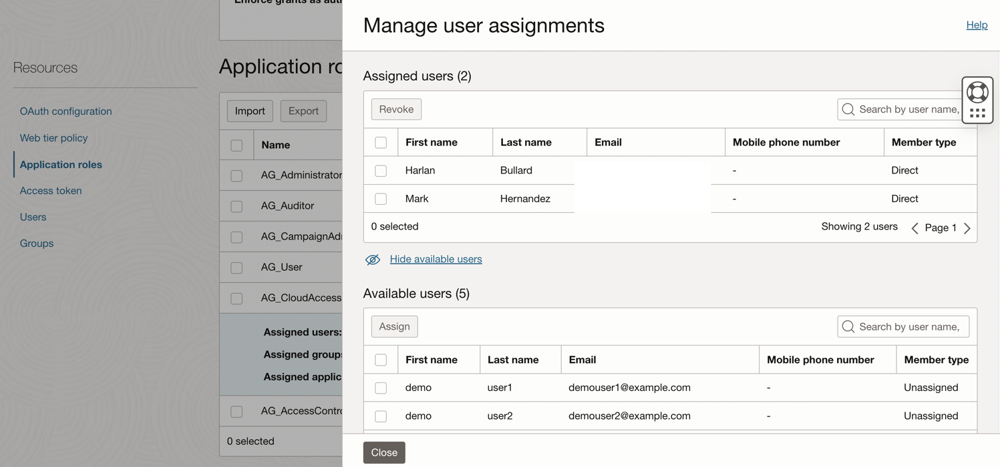

# Setup and configure Oracle Access Governance service instance and Create Users in OCI IAM

## Introduction

In this lab we will setup the OAG service instance and make configurations required to successfully run this workshop.

*Estimated Lab Time*: 30 minutes

Watch the video below for a quick walk-through of the lab.
[Access Governance instance setup](videohub:1_x3fb7d7m)

### Objectives

In this lab, you will:
 * Create AG Service Instance
 * Access the AG console url
 * Create Users in OCI IAM

### Prerequisites
This lab assumes you have:
- A valid Oracle OCI tenancy, with OCI administrator privileges. 
- Choose a region where Access Governance is available. 


## Task 1: Create AG Service instance 

Login to the OCI console using the Identity domain: ag-domain, if not currently not logged in to the Identity domain. 

1. In the OCI console, click the Navigation Menu icon in the top left corner to display the *Navigation menu.* Click *Identity and Security* in the *Navigation menu*. Select *Access Governance* from the list of products. If you don't see the menu option, please check the region selected and make sure that Access Governance is available in that region.

    

2. On the Access Governance page, select *Service Instances.*


    ```
    Name: ag-service-instance
    Description: Oracle Access Governance service instance
    Compartment: Ensure your root compartment is selected
    ```
    
    

3. Select the License type : Access Governance for Oracle Workloads. Click on *Create Service Instance*

    

4. Wait for the service instance to have the *Active* status . Note down this URL as we will be using it in the further labs. 

    

5. Click on the Service Instance to access the URL. 

    

## Task 2: Create Users in OCI IAM

1. Click the Navigation Menu icon in the top left corner to display the Navigation menu. Click Identity and Security in the Navigation menu. Select Domains from the list of products.

    


2. On the Domains page, Click on Identity-domain : *ag-domain* you have created. 

    

   Select *Users*. Click on *Create User*

     

3. Uncheck "Use the email address as the username" 

4. Enter the following details to create 3 users - Pamela Green (Campaign Administrator), Harlan Bullard (Manager), Mark Hernandez (Employee User) in IAM. Be sure to use different email IDs for different users.


    ```
    First Name: Pamela
    Last Name: Green
    Username: pamela.green
    Email: Specify unique email-id to which you will be receiving activation mail for password reset for the user. 
    ```
    

    Click *Create*

    ```
    First Name: Harlan
    Last Name: Bullard
    Username: harlan.bullard
    Email: Specify unique email-id to which you will be receiving activation mail for password reset for the user. 
    ```
    

    Click *Create*

    ```
    First Name: Mark
    Last Name: Hernandez
    Username: mhernandez
    Email: Specify unique email-id to which you will be receiving activation mail for password reset for the user. 
    ```
    

    Click *Create*

5. Sign out from the cloud console.

6. For each user created, an activation mail will be sent to the email-id provided in the *Task 3: Step 4* . Reset the password for the 3 users using the *Activation mail* recieved for each of them. 
    Reset password to the below mentioned password:

    **Password:**
     ```
    <copy>Oracl@123456</copy>
    ```
7. Login to the OCI console Identity Domain: ag-domain as the Identity Domain Administrator. 

    * In the OCI console, navigate to Identity -> Domains ->  ag-domain -> Oracle Cloud Services -> AG-service-instance -> Application Role. 

    * Notice the *AG Administrator* Role and *AG Campaign Administrator* Role listed. Click on the Downward arrow on the right corner for each of them. 

    

    * Click on *Assigned Users -> Manage*. Select *Pamela Green* in *Available Users.* Click on *Assign*

    

    * The user Pamela Green is now visible under *Assigned Users*.

    

    * Pamela Green has been assigned with the *AG Administrator* application role and *AG Campaign Administrator*. You can now close the window.

    * Now, Notice the *AG User* Role and *AG CloudAccessReviewer* Role listed. Click on the Downward arrow on the right corner for each of them. 

      

       

    *  Click on *Assigned Users -> Manage*. Select *Mark Hernandez* and *Harlan Bullard* in *Available Users.* Click on *Assign*

     

     

    * Mark Hernandez and Harlan Bullard have now been assigned with the *AG User* application role and *AG CloudAccessReviewer*. You can now close the window.


    You may now **proceed to the next lab.**

## Learn More

* [Oracle Access Governance Create Access Review Campaign](https://docs.oracle.com/en/cloud/paas/access-governance/pdapg/index.html)
* [Oracle Access Governance Product Page](https://www.oracle.com/security/cloud-security/access-governance/)
* [Oracle Access Governance Product tour](https://www.oracle.com/webfolder/s/quicktours/paas/pt-sec-access-governance/index.html)
* [Oracle Access Governance FAQ](https://www.oracle.com/security/cloud-security/access-governance/faq/)

## Acknowledgments
* **Authors** - Anuj Tripathi, Indira Balasundaram, Anbu Anbarasu 
* **Contributors** - Edward Lu
* **Last Updated By/Date** - Anbu Anbarasu, May 2023