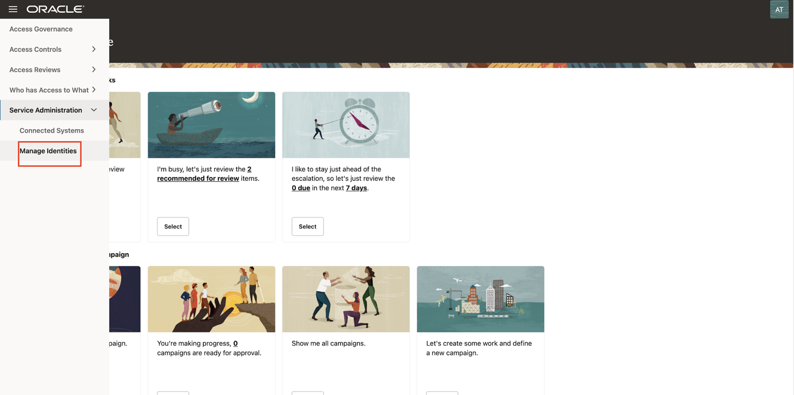
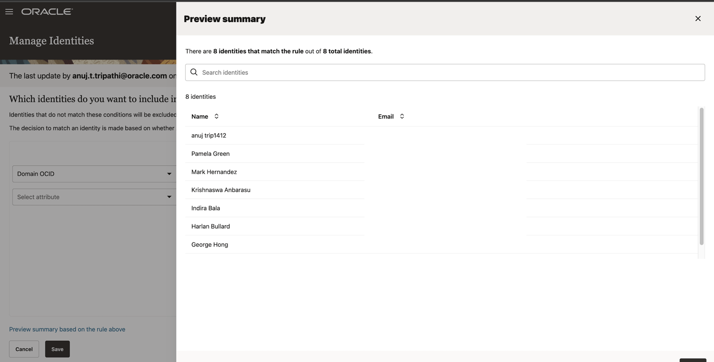

# Mark the Identites

## Introduction

Access Governance Administrators (Pamela Green) will activate the identities.

* Estimated Time: 15 minutes
* Persona: Administrator

### Objectives

In this lab, you will:
* Activate the Identities

## Task 1: Sign in to Oracle Access Governance Console

1. From your browser, go to the Oracle Access Governance Console.

2. Enter Oracle Access Governance Campaign Administrator or Administrator username and password (Pamela Green)

    **Username:**
    ```
    <copy>pamela.green</copy>
    ```

    **Password:**
    ```
    <copy>Oracl@123456</copy>
    ```


  You will be navigated to the home page of your Oracle Access Governance Console.


  

## Task 2: Activate the Identities

In this task, you will select the identities that you want to include in your service.

1. In the Oracle Access Governance Console, navigate to Service Administration -> Manage Identities

  

2. Select **Any** condition match option.

   

3. Select the below options for the condition to match the identities that you want to include. 

      *  Select attribute: Domain OCID 
      * Select operator: Contains 
      * Attribute value: ocid 
    
    Hit **Enter**

      

4. Click on **Preview Summary based on the rule above**. The identities that match the rule will be visible. 

5. Close the pop-up and click on **Save**

  


  You may now **proceed to the next lab**. 

## Learn More

* [Oracle Access Governance Create Access Review Campaign](https://docs.oracle.com/en/cloud/paas/access-governance/pdapg/index.html)
* [Oracle Access Governance Product Page](https://www.oracle.com/security/cloud-security/access-governance/)
* [Oracle Access Governance Product tour](https://www.oracle.com/webfolder/s/quicktours/paas/pt-sec-access-governance/index.html)
* [Oracle Access Governance FAQ](https://www.oracle.com/security/cloud-security/access-governance/faq/)

## Acknowledgments
* **Authors** - Anuj Tripathi, Indira Balasundaram, Anbu Anbarasu 
* **Last Updated By/Date** - Anbu Anbarasu, May 2023
