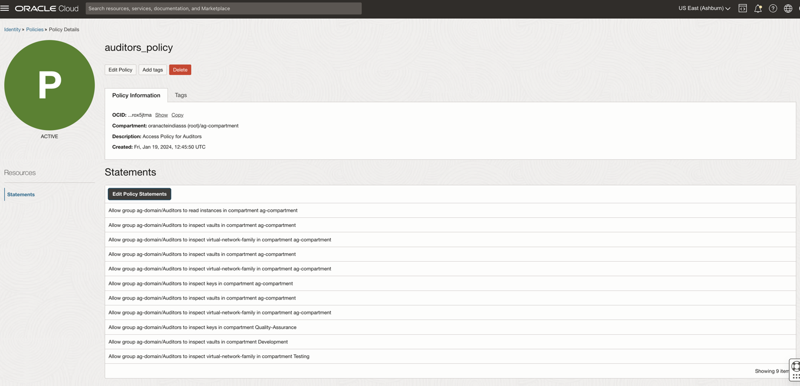

# Perform Policy Review Tasks

## Introduction

Access Governance Campaign Reviewer (Pamela Green) can perform Policy Review tasks. 

* Estimated Time: 5 minutes
* Persona: Campaign Reviewer

### Objectives

In this lab, you will:

* Examine policy review tasks raised by the campaign
* Evaluate policy review tasks assigned to you as a Campaign Reviewer

### Lab Outcome 

In this lab, you will:

* Review the OCI IAM policies and based on the review decision you can either revoke or accept the entire policy or the actionable statements within the policy. 


## Task 1: Perform Policy Review Tasks

  In this task, you will review and certify OCI IAM review tasks raised by the campaign created in the previous task.


1. From your browser, navigate to the Oracle Access Governance Console using the URL specified in *Lab 2: Task 1: Step 4* 


2. Enter **Oracle Access Governance Campaign Reviewer** username and password (Pamela Green)

    **Username:**
    ```
    <copy>pamela.green</copy>
    ```

    **Password:**
    
    The password you have set for the user in *Lab 1: Task 2: Step 5*


  You will be navigated to the home page of your Oracle Access Governance Console.

  3. On the Oracle Access Governance Console home page, from the navigation menu, select **Access Reviews -> My Access Reviews.** 
 
  

  4. To view review tasks created by your policy review campaign, click the **Access Controls** tab. You will see all policy access review tasks assigned to you as a reviewer. Oracle Access Governance uses in-house analytic-based Intelligence system to provide accept/review recommendations.

  

  5. For this tutorial, let’s check the recommendations given by Oracle Access Governance. 

   - network-admins-policy is marked for Review
   - security-admins-policy is marked for Review
   - auditors-policy is marked to Accept


  6. Let’s check out the Insights generated by Oracle Access Governance. For **auditors-policy**, click the corresponding **Actions** links under the **Insights** column.

  


  7. On the **Insights** page, you can view our recommendation for the policy review task. On the left-panel, you can view the policy information. On the right, you can view a complete list of actionable and non actionable policy statements, view policy details to see who and what the policy statement is granting access to, and make appropriate decisions on each statement.


  8. Beside the Policy statement, click on the view button to view the resources associated with the policies. Click on Summmary and Details to view the information. Click Close. 

     

     


  9. To make a review decision, you can either revoke all or accept all actionable statements in that policy at once, or make decision individually on each policy statement. For this tutorial, let us validate 2 usecases:

    **Usecase 1:**  Revoke policy statement from a policy - **auditors-policy**

      - Let’s revoke the policy statement **Allow group Auditors to read audit-events in compartment Quality-Assurance** from the policy  **auditors-policy**. 


      - Click on the cross button under Actions column for the policy statement **Allow group Auditors to read audit-events in compartment Quality-Assurance**

      

      - Click on **Apply**

      

      -  Enter justification for why you revoke the access review items and accept the remaining items then click on **Submit** This will trigger the auto-remediation process in the Oracle Access Governance system.

      


    **Usecase 2:**  Revoke an entire policy - **security-admins-policy** 

      - Let's revoke the entire policy **security-admins-policy** 

      - Click on the Revoke All button. 

       

      - Click **Apply.** The **Confirmation** dialog box is displayed.

        

     - Provide justification and then click **Submit.** The closed loop access remediation will take place automatically.

   10. Login to the Identity domain: ag-domain OCI console as the Identity Domain Administrator. Naviagte to Identity & Security -> Identity -> Policies.

  * Verify the entire policy - **security-admins-policy** has been revoked from the list of policies successfully. 

   Before performing the policy review:

     

 
   
   After performing the policy review: 

      


  * Verify the policy statement - **Allow group Auditors to read audit-events in compartment Quality-Assurance** of the policy -  **auditors-policy** has been revoked successfully. 

  Before performing the policy review:

   
   

  After performing the policy review: 

    


  This concludes the tutorial on create and perform OCI IAM policy reviews. 


  You may now **proceed to the next lab**. 

## Learn More

* [Oracle Access Governance Create Access Review Campaign](https://docs.oracle.com/en/cloud/paas/access-governance/pdapg/index.html)
* [Oracle Access Governance Product Page](https://www.oracle.com/security/cloud-security/access-governance/)
* [Oracle Access Governance Product tour](https://www.oracle.com/webfolder/s/quicktours/paas/pt-sec-access-governance/index.html)
* [Oracle Access Governance FAQ](https://www.oracle.com/security/cloud-security/access-governance/faq/)

## Acknowledgements
* **Authors** - Anuj Tripathi, Indira Balasundaram, Anbu Anbarasu 
* **Last Updated By/Date** - Indira Balasundaram , Sept 2024
