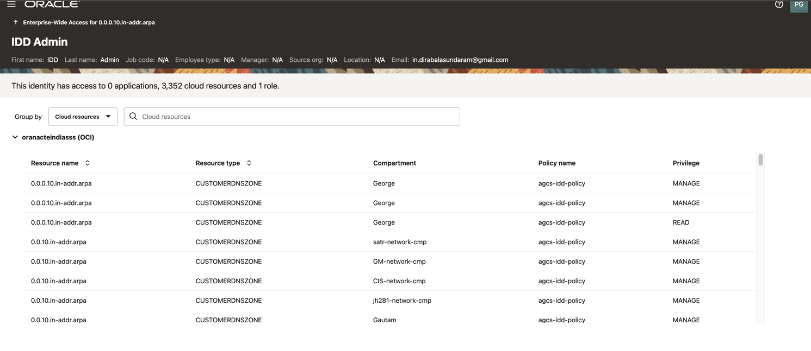

# Review Who Has Access To What

## Introduction

Access Governance Administrator (Pamela Green) can view who has access to what. 

* Estimated Time: 5 minutes
* Persona: Access Governance Administrator

### Objectives

In this lab, you will:

* Explore **My Access**
* Explore **Enterprise Wide Access**


## Task 1: Review Who Has Access to What - MyAccess

  In this task, you will review **Who has Access to What - MyAccess**


1. From your browser, navigate to the Oracle Access Governance Console from the OCI Cloud Console using the URL specified in *Lab 2: Task 1: Step 4* 


2. Enter **Oracle Access Governance Administrator** username and password (Pamela Green)

    **Username:**
    ```
    <copy>pamela.green</copy>
    ```

    **Password:**
    ```
    The password you have set for the user
    ```

     

     
  You will be navigated to the home page of your Oracle Access Governance Console.

  3. On the Oracle Access Governance Console home page, from the navigation menu, select **My Stuff -> My Access** 

    


  4. Click on **Group by** to view the **Roles, Cloud Resources, Application** the user **Pamela Green** has access to. 

  

  Click on the role further , to view the application details. 

  


## Task 2: Review Who Has Access to What -  Enterprise Wide Access

  1. On the Oracle Access Governance Console home page, from the navigation menu, select **Who has Access to What -> Enterprise Wide Access** 


  


  2. You can view the all the **Resources** present and the **Identities** that have access to those resources. 

  3. Click on the right corner dropdown to sort the resources by - resource name or resource type. Beside the Resource, click on the **Show me the identities that have access** to view the user identities that have access to the particular resources.  


   


  5. To review all of the **user identity access**. Click on **Show me all of the user's accessess**
     


      


  You may now **proceed to the next lab**. 

## Learn More

* [Oracle Access Governance Create Access Review Campaign](https://docs.oracle.com/en/cloud/paas/access-governance/pdapg/index.html)
* [Oracle Access Governance Product Page](https://www.oracle.com/security/cloud-security/access-governance/)
* [Oracle Access Governance Product tour](https://www.oracle.com/webfolder/s/quicktours/paas/pt-sec-access-governance/index.html)
* [Oracle Access Governance FAQ](https://www.oracle.com/security/cloud-security/access-governance/faq/)

## Acknowledgments
* **Authors** - Anuj Tripathi, Indira Balasundaram, Anbu Anbarasu 
* **Last Updated By/Date** - Anbu Anbarasu, May 2023
