# Configure Access Guardrails

## Introduction

In this lab we will create access guardrail

*Estimated Time*: 15 minutes

### Objectives

In this lab, you will:

* Create an Access Guardrail
* Associate Access Bundle with Access Guardrail

### Prerequisites

This lab assumes you have:

A valid Oracle OCI tenancy, with OCI administrator privileges.

## Task 1: Define Access Guardrail

  1. On the Access Governance console home page, click the Access Controls tab. Then, click Select on the Access Guardrails. 

     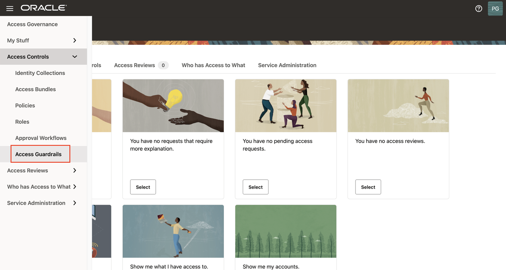

  2. Click on **Create an access guardrail** 

     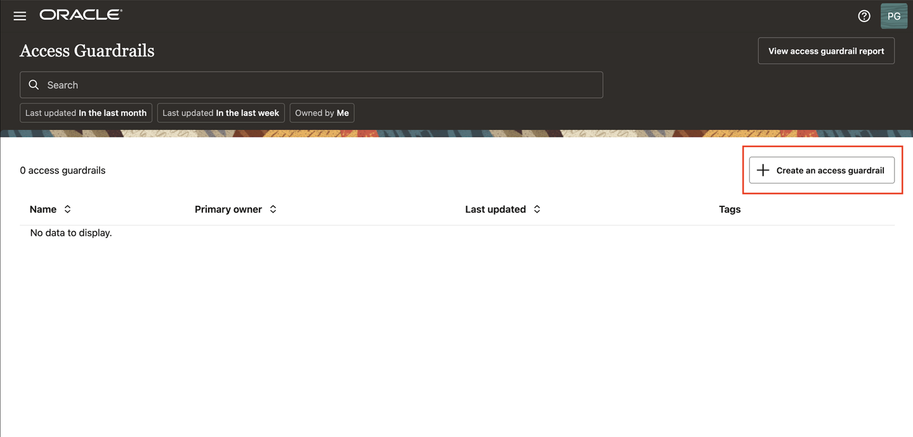

  3. Under **Add details** , provide the following details:

      **Name:** Security-admin-access-guardrail

      **Description:** Security-admin-access-guardrail

      **When do you want to enforce the access guardrails:** New access requests and existing access

     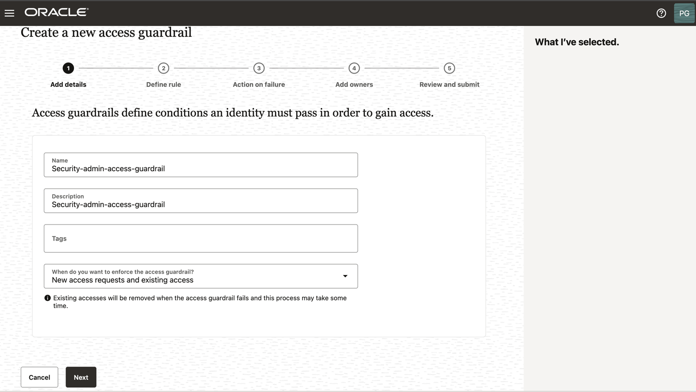

     Click **Next**

  4. Under **Add the access guardrail ruleset** , click on **Add condition** and enter the below details: 
   
     **What type of condition?** Identity must not have a permission

     **Which system?** OCI-IAM

     **Which domain?** ag-domain

     **Which granted permission type?** Group 

     **Which permissions?** Security Admins

    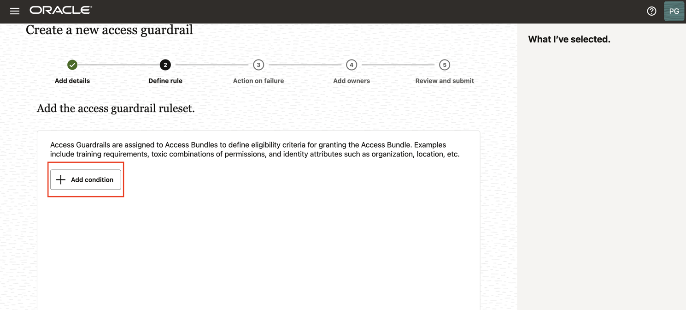

    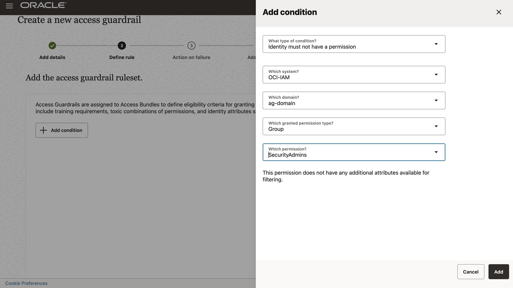

     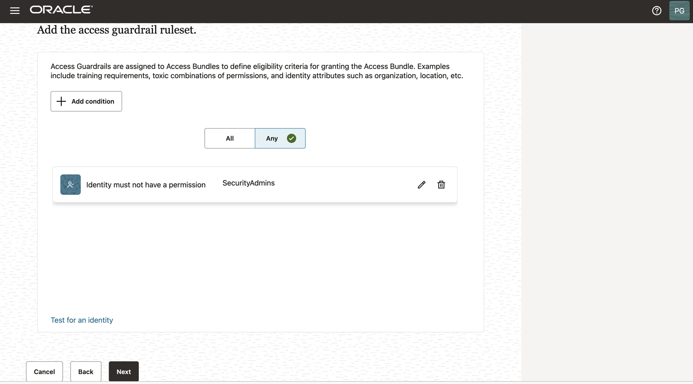

    Click on **Next**

  5. Under Select what should happen if the access guardrail fails: 

      **What should happen when the accessguardrails fails?** High Risk - Block the access immediately

     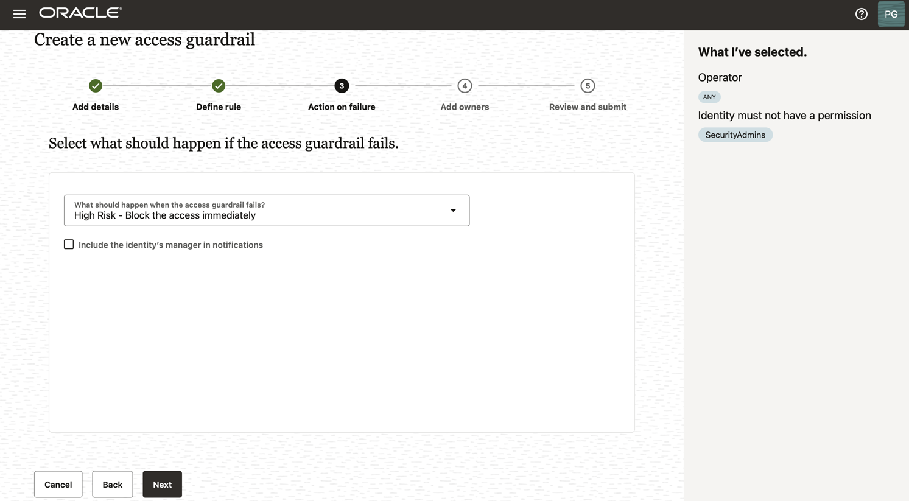

     Click **Next**

  6. Select the primary owner as **Pamela Green** and Click **Next**

       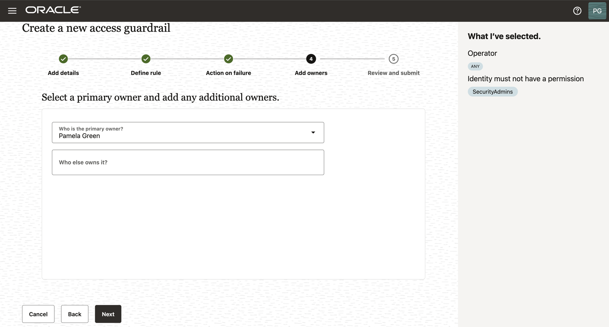

  7. Click on **Create**. 

    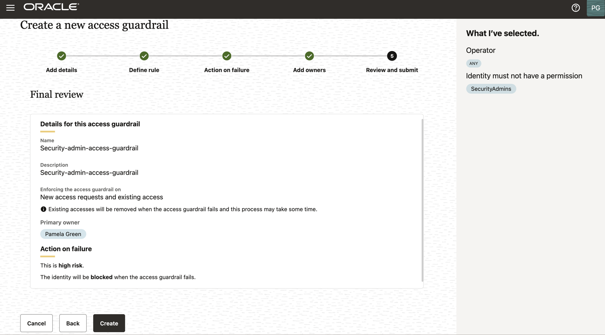

    The Access Guardrail has been created successfully. 

## Task 2: Associate Access bundle with Access Guardrail

1. Navigate to Access Controls -> Access Bundles. 

     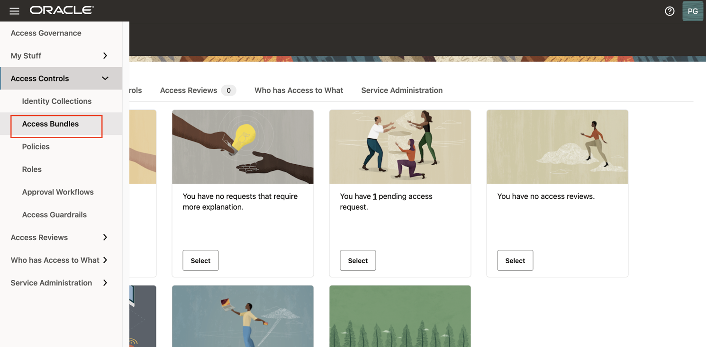

2. Select the **Network Admin Access Bundle**. Under **Actions** , click on **Edit**

    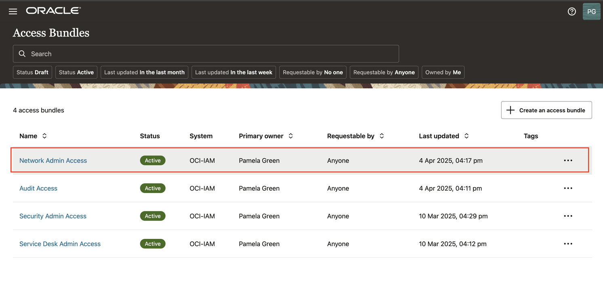

    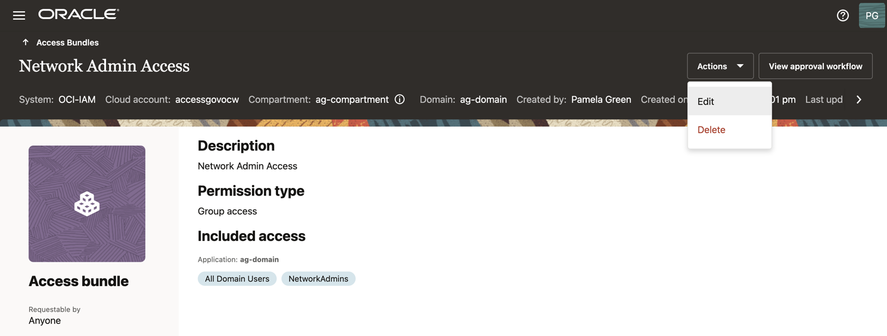
   
3. Under **Select an accesss guardrail to allow access**, choose the **Security-admin-access-guardrail. 

   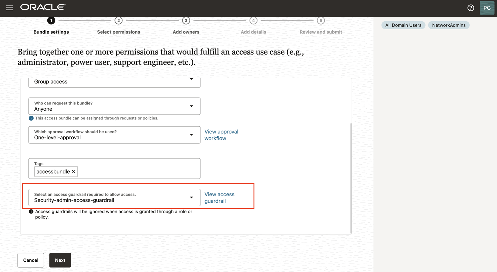

4. Click on **Next** until you reach the **Final review** stage. Here you can view the Access guardrail details by clicking on **View access guardrail**. 

   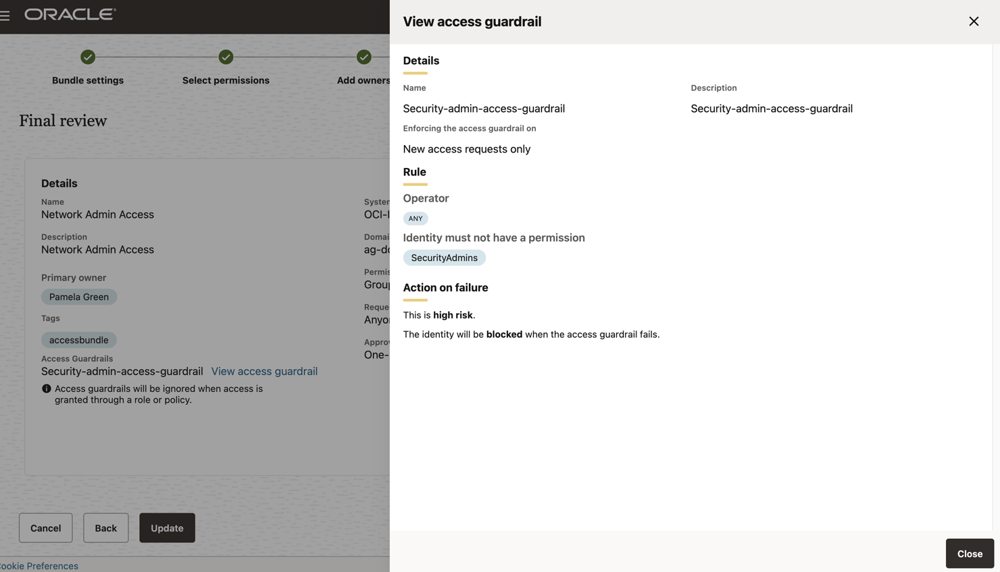

   Click on **Update**. 

   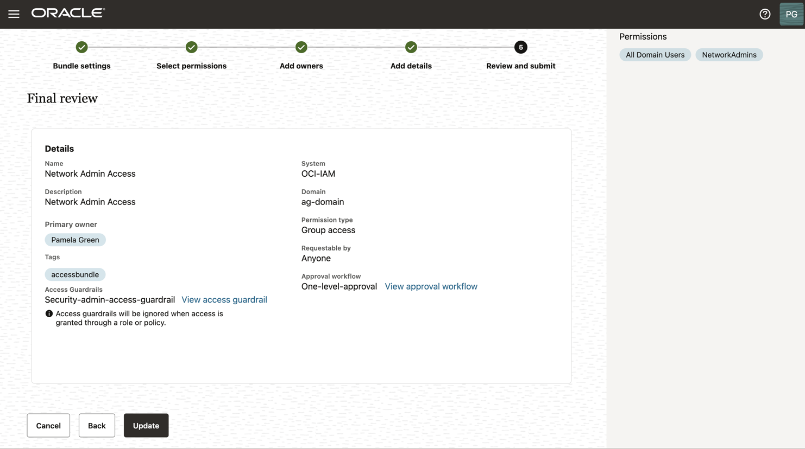

   Now we have successfully configured, the Access Bundle **Network Admin Access Bundle** with **NetworkAdmins** permission to block access if the user already has **SecurityAdmins** permission, as defined by the **Security-admin-access-guardrail** Guardrail which checked for **SecurityAdmins** permission.

   You may now **proceed to the next lab.**

## Learn More

* [Oracle Access Governance](https://www.oracle.com/security/cloud-security/access-governance/)
* [Oracle Access Governance Documentation](https://www.oracle.com/security/cloud-security/access-governance/#documentation)
* [Oracle Access Governance Product Demo](https://www.oracle.com/security/cloud-security/access-governance/?ytid=GJEPEJlQOmQ)
* [Oracle Access Governance FAQ](https://www.oracle.com/security/cloud-security/access-governance/faq/)

## Acknowledgements

* **Authors** - Indiradarshni Balasundaram
* **Contributors** - Anbu Anbarasu, Anuj Tripathi 
* **Last Updated By/Date** - Indiradarshni Balasundaram , April 2025
