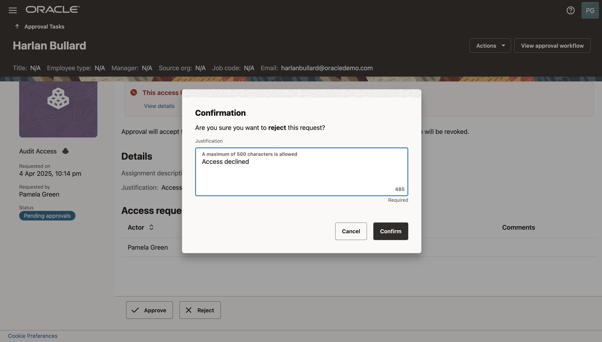

# Configure Access Guardrails

## Introduction

In this lab we will create access guardrail

*Estimated Time*: 15 minutes

### Objectives

In this lab, you will:

* Create an Access Guardrail
* Associate Access Bundle with Access Guardrail

### Prerequisites

This lab assumes you have:

A valid Oracle OCI tenancy, with OCI administrator privileges.

## Task 1: Define Access Guardrail

  1. On the Access Governance console home page, click the Access Controls tab. Then, click Select on the Access Guardrails. 

     

  2. Click on **Create an access guardrail** 

     

  3. Under **Add details** , provide the following details:

      **Name:** Security-admin-access-guardrail

      **Description:** Security-admin-access-guardrail

      **When do you want to enforce the access guardrails:** New access requests and existing access

     

     Click **Next**

  4. Under **Add the access guardrail ruleset** , click on **Add condition** and enter the below details: 
   
     **What type of condition?** Identity must not have a permission

     **Which system?** OCI-IAM

     **Which domain?** ag-domain

     **Which granted permission type?** Group 

     **Which permissions?** Security Admins

    

    

     

    Click on **Next**

  5. Under Select what should happen if the access guardrail fails: 

      **What should happen when the accessguardrails fails?** Low Risk 

      **How many days ?** 7

     

     Click **Next**

  6. Select the primary owner as **Pamela Green** and Click **Next**

       

  7. Click on **Create**. 

    

    The Access Guardrail has been created successfully. 

## Task 2: Associate Access bundle with Access Guardrail

1. Navigate to Access Controls -> Access Bundles. 

     

2. Select the **Audit Access Bundle**. Under **Actions** , click on **Edit**

    

    
   
3. Under **Select an accesss guardrail to allow access**, choose the **Security-admin-access-guardrail**

4. Click on **Next** until you reach the **Final review** stage. Here you can view the Access guardrail details by clicking on **View access guardrail**. 

   Click on **Update**. 

   

## Task 3: Create and Approve Access Requests

1. Navigate to MyStuff -> Request Access

     

2. Under **Select the type of access you want to reques**, select **Request access bundle**.

    

3. Under **Is this request for you?**, click on **No** and select the user **Harlan Bullard**. Click **Next**

   

4. Select the **Audit Access** access bundle and click on **Next**.

    

5. Provide **Justification** and Click on **Submit request**. The request has been submitted. 

   

   

6. Navigate to MyStuff -> Approvals

   

7. Click on the request to view the request details. Under **Insights** click on **View details** to view the violation details. 

   

   

   

8. Click on **Reject** to reject the request. Provide the **Justification** and click on **Confirm**.  

   

   

   You may now **proceed to the next lab.**

## Learn More

* [Oracle Access Governance](https://www.oracle.com/security/cloud-security/access-governance/)
* [Oracle Access Governance Documentation](https://www.oracle.com/security/cloud-security/access-governance/#documentation)
* [Oracle Access Governance Product Demo](https://www.oracle.com/security/cloud-security/access-governance/?ytid=GJEPEJlQOmQ)
* [Oracle Access Governance FAQ](https://www.oracle.com/security/cloud-security/access-governance/faq/)

## Acknowledgements

* **Authors** - Indiradarshni Balasundaram
* **Contributors** - Anbu Anbarasu, Anuj Tripathi 
* **Last Updated By/Date** - Indiradarshni Balasundaram , April 2025
