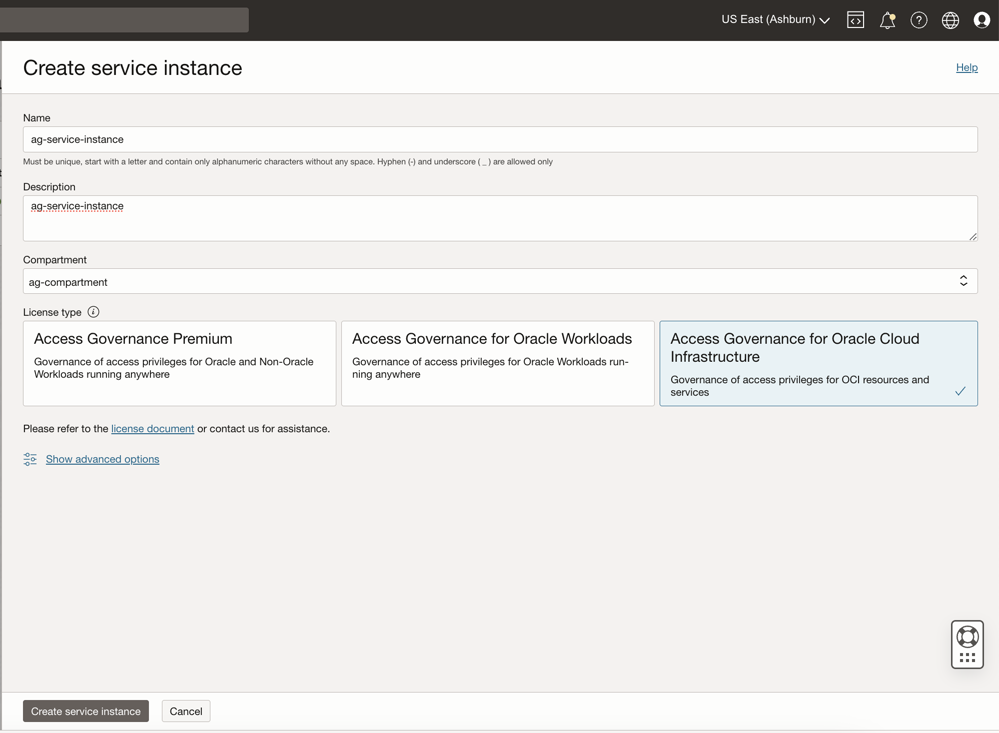
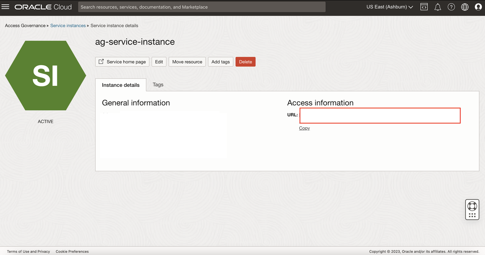
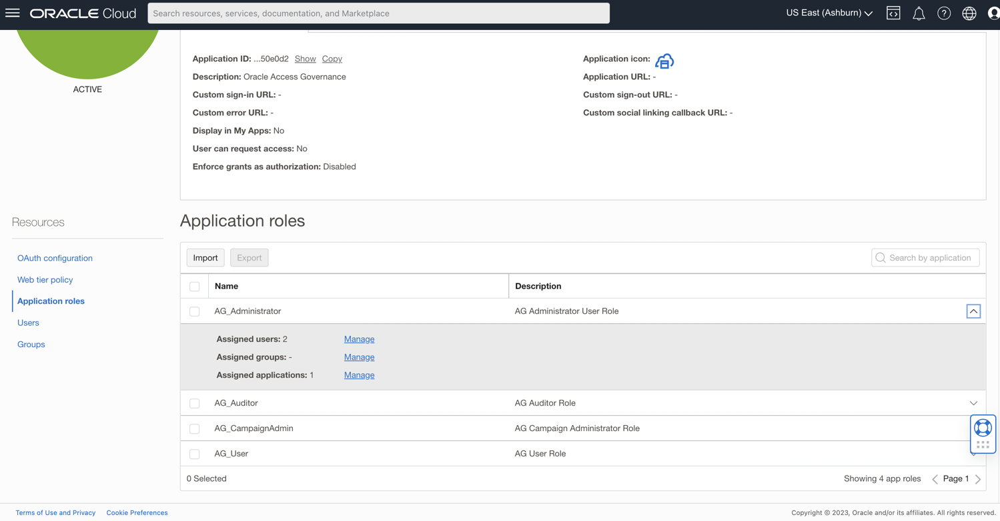
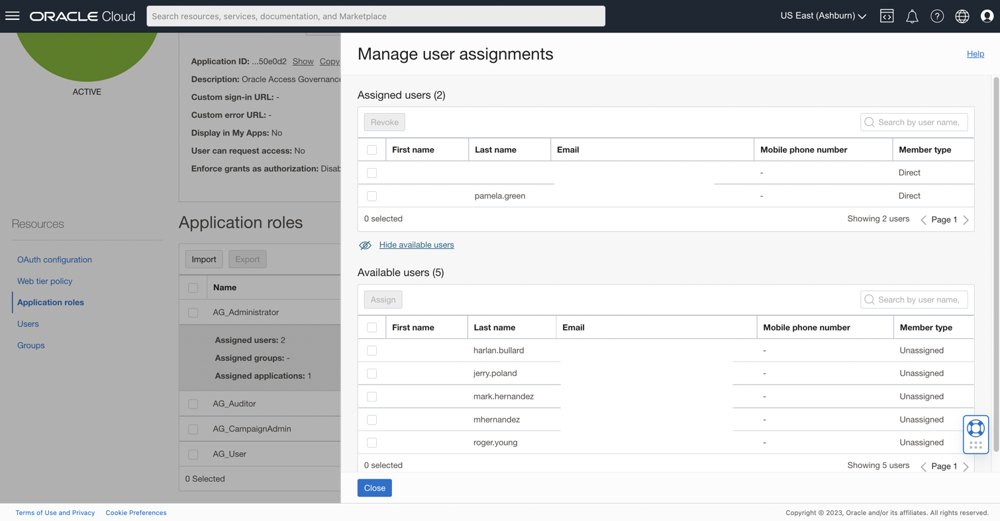

# Setup and configure Oracle Access Governance service instance

## Introduction

In this lab we will setup the OAG service instance and make configurations required to successfully run this workshop 

*Estimated Lab Time*: 5 minutes

*Persona*: Identity Domain Administrator


### Objectives

In this lab, you will:
 * Create AG Service Instance
 * Access the AG console url
 * Assign AG Roles to Users in OCI IAM

### Prerequisites
This lab assumes you have:
- A valid Oracle OCI tenancy, with OCI administrator privileges. 


## Task 1: Create AG Service instance 

Login to the OCI console using the Identity domain: ag-domain as the **Identity Domain Administrator** which is **idd-admin** as per our lab , if not currently not logged in to the Identity domain. 

1. In the OCI console, click the Navigation Menu icon in the top left corner to display the *Navigation menu.* Click *Identity and Security* in the *Navigation menu*. Select *Access Governance* from the list of products.

    

2. On the Access Governance page, select *Service Instances.*


    ```
    Name: ag-service-instance
    Description: Oracle Access Governance service instance
    Compartment: Ensure your ag-compartment is selected
    ```
    
    

3. Select the License type : Access Governance for Oracle Cloud Infrastructure. Click on *Create Service Instance*

    

4. Wait for the service instance to have the *Active* status . Note this *URL* which we will use to access the *Service Instance* in the further labs. 

    

5. Click on the Service Instance to validate if you are able to access the URL. Once you see this page, close the browser window. 

    


## Task 2: Assign AG Roles to Users in OCI IAM


1. Login to the OCI console Identity Domain: ag-domain as the Identity Domain Administrator. 

    * In the OCI console, navigate to Identity -> Domains ->  ag-domain -> Oracle Cloud Services -> AG-service-instance -> Application Role. 

    * Notice the *AG Administrator* Role and *AG Campaign Administrator* Role listed. Click on the Downward arrow on the right corner to assign Pamela to these roles. 

    

    * Click on *Assigned Users -> Manage*. Select *Pamela Green* in *Available Users.* Click on *Assign*

    

    * The user Pamela Green is now visible under *Assigned Users*.

    

    * Pamela Green has been assigned with the *AG Administrator* application role and *AG Campaign Administrator*. You can now close the window.


    You may now **proceed to the next lab.**

## Learn More

* [Create Oracle Access Governance Service Instance](https://docs.oracle.com/en/cloud/paas/access-governance/cagsi/)
* [Oracle Access Governance](https://www.oracle.com/security/cloud-security/access-governance/)
* [Oracle Access Governance Documentation](https://www.oracle.com/security/cloud-security/access-governance/#documentation)
* [Oracle Access Governance Product Demo](https://www.oracle.com/security/cloud-security/access-governance/?ytid=GJEPEJlQOmQ)
* [Oracle Access Governance FAQ](https://www.oracle.com/security/cloud-security/access-governance/faq/)


## Acknowledgments

* **Authors** - Indiradarshni Balasundaram
* **Contributors** - Anbu Anbarasu, Anuj Tripathi 
* **Last Updated By/Date** - Indiradarshni Balasundaram , April 2025