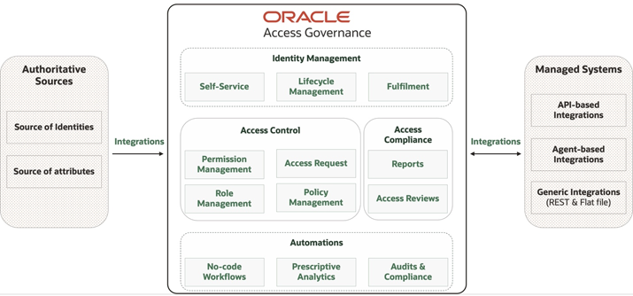

# Introduction

## About this Workshop

Oracle Access Governance is a cloud native identity governance and administration (IGA) service that provides customers with a simple, easy-to-understand view of what resources individuals can access, whether they should have that access, and how they’re using their access entitlements. 
Businesses are challenged every day to enforce appropriate, just-in-time user access rights to manage control of their information and address regulatory compliance requirements regarding least-privilege access. By providing immediate and prescriptive guidance about the types of access users should have, Oracle Access Governance makes it easier for administrators to provision new users and deprovision departing users quickly. In addition, machine learning intelligence in Oracle Access Governance can monitor all types of access to identify anomalous behavior patterns and automate remediation actions as required. 

Oracle Access Governance supports continuous compliance with proper access management and constantly evaluates and reports risks, allowing organizations to avoid big, manual, periodic reviews and significantly reducing the cost and effort of audit responses. Events and access at risk are reviewed regularly, and reviews are informed by built-in intelligence. Oracle Access Governance continuously adds support for orchestrated systems, providing strong insights into access controls across new applications that may span cloud and on-premises environments.
The graphic below shows the high-level functional architecture of Oracle Access Governance.

  

Oracle Access Governance is a comprehensive governance solution that supports various provisioning methods, including access requests and approvals, role-based access control (RBAC), attribute-based access control (ABAC), and policy-based access control (PBAC). The service features a conversation-style user experience, offering deep visibility into access permissions across the entire enterprise. It facilitates dynamic, periodic, and automated event-based micro certifications, such as an access review triggered by a job code or manager change. Additionally, it enables near real-time access reviews, providing detailed recommendations with options for reviewers to accept or review an entitlement based on the identified level of risk.

This workshop walks you through the steps to setup OCI integration and perform group and application role provisioning in OCI. You will also explore the Who Has Access To What functionality through the enterprise-wide browser. In this workshop, as an application owner, you will create several Access Governance objects including Identity Collections, Approval workflows, Access Bundles, Roles, and Policies. The workshop walks you through the steps involved in requesting, approving, and getting the groups and roles provisioned in OCI.

*Estimated Time:* 3 hours

### Objectives

In this workshop, you will learn how to:
- Setup and configure Oracle Access Governance service instance
- Install and configure Oracle Access Governance agents for the Oracle Identity Governance and the Oracle Database
- Perform data load and activate users in Access Governance
- Define Access Control components including Identity Collections, Access Bundles, Policies, and Approval Workflows
- Review “Who Has Access To What” using enterprise-wide browser
- Create Access Review Campaign and perform access reviews for the target database system

### Prerequisites

This lab assumes you have:
- Familiarity with OCI

## Learn More

* [Oracle Access Governance](https://www.oracle.com/security/cloud-security/access-governance/)
* [Oracle Access Governance Documentation](https://www.oracle.com/security/cloud-security/access-governance/#documentation)
* [Oracle Access Governance Product Demo](https://www.oracle.com/security/cloud-security/access-governance/?ytid=GJEPEJlQOmQ)
* [Oracle Access Governance FAQ](https://www.oracle.com/security/cloud-security/access-governance/faq/)

## Acknowledgments

* **Authors** - Indiradarshni Balasundaram
* **Contributors** - Anbu Anbarasu, Anuj Tripathi 
* **Last Updated By/Date** - Indiradarshni Balasundaram , April 2025
