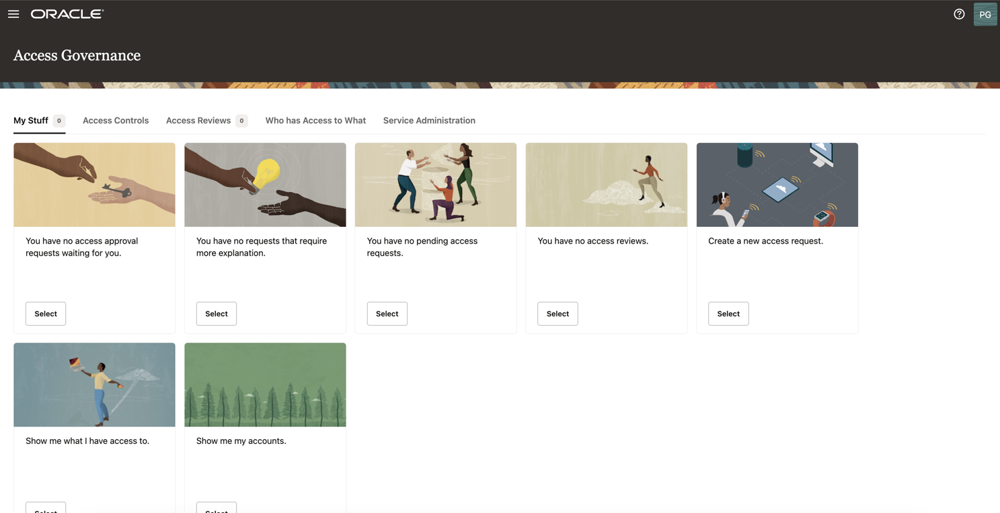
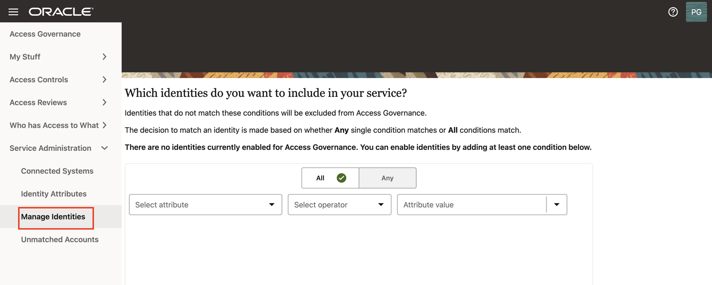
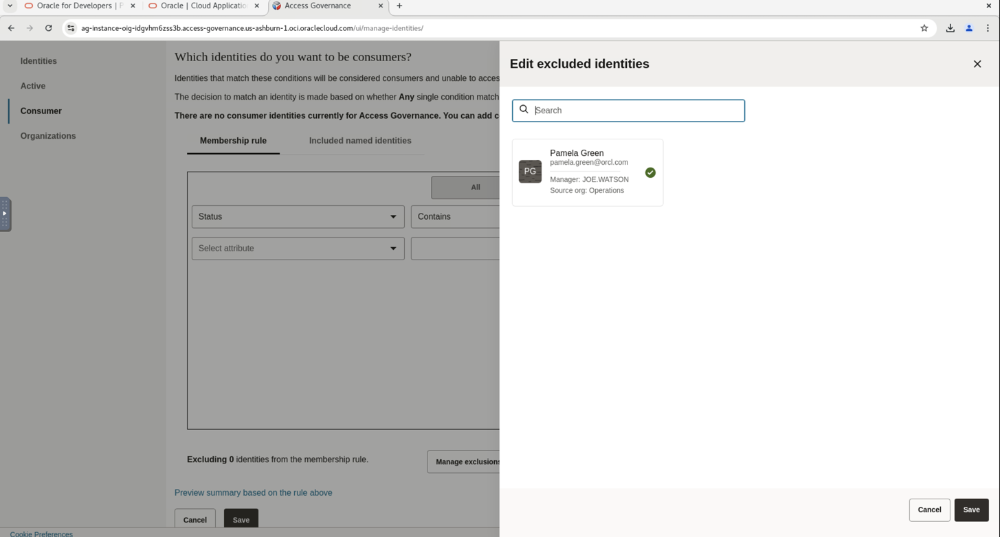
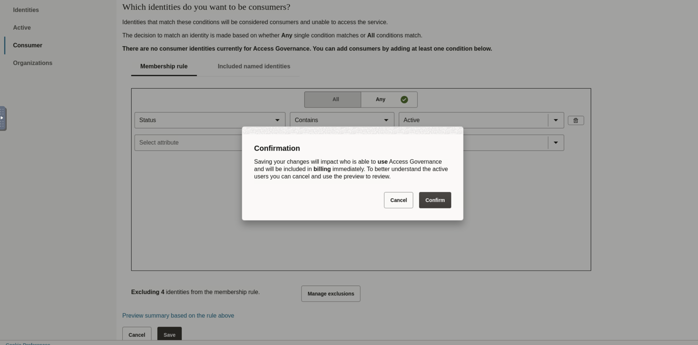

# Mark the Identites

## Introduction

Access Governance Administrators (Pamela Green) will activate the identities.

* Estimated Time: 5 minutes
* Persona: Access Governance Administrator 

### Objectives

In this lab, you will:
* Activate the Identities

## Task 1: Sign in to Oracle Access Governance Console

1. From your browser, navigate to the Oracle Access Governance Console using the URL specified in *Lab 2: Task 1:Step 4* 

2. Enter **Oracle Access Governance Administrator** username and password (Pamela Green)

    **Username:**
    ```
    <copy>pamela.green</copy>
    ```

    **Password:**
  
    The password you have set for the user in *Lab 1: Task 2: Step 5*
    


  You will be navigated to the home page of your Oracle Access Governance Console.


  

## Task 2: Activate the Identities

In this task, you will select the identities that you want to include in your service.

1. In the Oracle Access Governance Console, navigate to Service Administration -> Manage Identities -> Active

  

2. Select **Any** condition match option.

   

3. Select the below options for the condition to match the **Test Users** that you want to include. 

      *  Select attribute: Location
      * Select operator: Equals 
      * Attribute value: NR

   Hit **Enter**
    

4. Click on **Preview Summary based on the rule above**. The identities that match the rule will be visible. 

5. Close the pop-up and click on **Save**

## Task 3: Assign the Selected Users as Consumer Users

In this task, you will assign the users Pamela Green as Workforce users and the remaining users as Consumer users.  

1. Navigate to Service Administration -> Manage Identities -> Consumer

2. Select **Any** condition match option. Select the below options for the condition to match the identities that you want to include.

      * Select attribute: Location
      * Select operator: Equals 
      * Attribute value: NR


       Hit **Enter**

3. Click on **Manage Exclusions**. Under **Edit excluded identities** , select user **Pamela Green** and click on **Save**.

  


4. Now you can see the user identity - Pamela Green have been excluded from the membership rule. 

  Click on **Save** and **Confirm**. 

  

  Now the user *Pamela Green* has been marked as the Workforce user and the remaining users have been marked as Consumer users. 

5. You can verify the user type under **Identities** tab. 


  You may now **proceed to the next lab**.


## Learn More

* [Oracle Access Governance](https://www.oracle.com/security/cloud-security/access-governance/)
* [Oracle Access Governance Documentation](https://www.oracle.com/security/cloud-security/access-governance/#documentation)
* [Oracle Access Governance Product Demo](https://www.oracle.com/security/cloud-security/access-governance/?ytid=GJEPEJlQOmQ)
* [Oracle Access Governance FAQ](https://www.oracle.com/security/cloud-security/access-governance/faq/)

## Acknowledgements

* **Authors** - Indiradarshni Balasundaram
* **Contributors** - Anbu Anbarasu, Anuj Tripathi 
* **Last Updated By/Date** - Indiradarshni Balasundaram , April 2025
