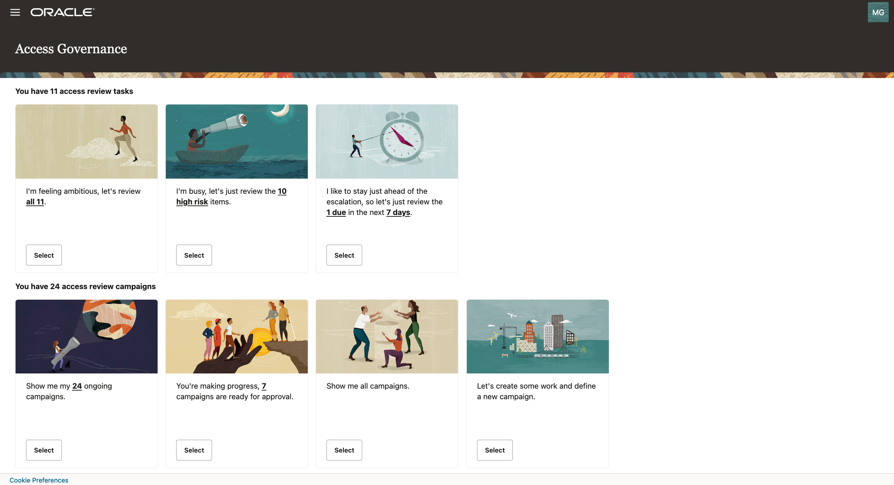

# Create Access Review campaign – Self and User Manager review

## Introduction

As a user with the Administrator or Campaign Administrator application role, you can create access review campaigns from the Oracle Access Governance Console. You can define selection criteria for access reviews based on users (who has access), applications (what are they accessing), permissions (which permissions), and roles (which roles).

Estimated Time: -- minutes

### Objectives

*List objectives for this lab using the format below*

In this lab, you will:
* Create access review campaign for self and user manager review
* Define reviewers workflow
* Run now or schedule acess review campaign

## Task 1: Open Oracle Access Governance main dashboard

(optional) Step 1 opening paragraph.

1. Open Chrome browser and go to https://accessgov-si-yzukikevdw6w.access-governance.us-ashburn-1.oci.oraclecloud.com/ui/
2. Ensure you have accessgov_iam domain selected.
3. Login Access Governance URL campaign administrator with user and password provided by Hands-on Lab instructors.
	
4. You should see the Oracle Access Governance main dashboard.
  
5. Scroll to the bottom and select "Let's create some work and define a new campaign".
  
6. You may select any one of the 4 dimensions Users, Applications, Permission and Roles. For this use-case, you can select Users or Who has access tile first. 
7. You may select users by organization, location or job code. For this use-case, you can select Sales organization. Select Apply my selections.
8. You may select any one of the remaining 3 dimensions Applications, Permission, and Roles. For this use-case, you can select Applications or What are they accessing tile.
9. You may select Applications by name. For this use-case, you can select Corporate SSO and Corporate ERP applications Select Apply my selections.
10. In pie-charts on right-top corner, you can review the scope of Selected Users, Applications, Permissions and Roles In What I’ve selected selection, review the selections made by you. For this use-case, you can select I’m good, go to workflows.
11. Review the auto-selected workflow and Reviewers; You can change those, if required. For this use-case, you may select Not to change workflow and reviewers. Select Next.
12. You may provide campaign name and description. For this use-case, select Run now to schedule the campaign.
13. You may review the selected campaign criteria, workflow, reviewers, schedule. For this use-case, select Create to create and schedule the campaign.
14. Newly created campaign is scheduled in My upcoming campaigns section.

## Learn More

*(optional - include links to docs, white papers, blogs, etc)*

* [URL text 1](http://docs.oracle.com)
* [URL text 2](http://docs.oracle.com)

## Acknowledgements
* **Author** - <Name, Title, Group>
* **Contributors** -  <Name, Group> -- optional
* **Last Updated By/Date** - <Name, Month Year>
