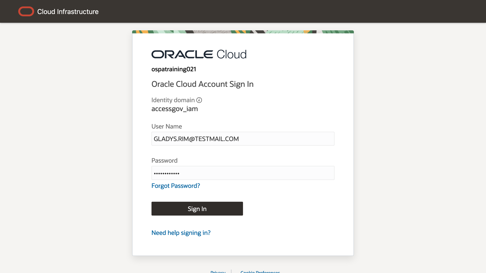
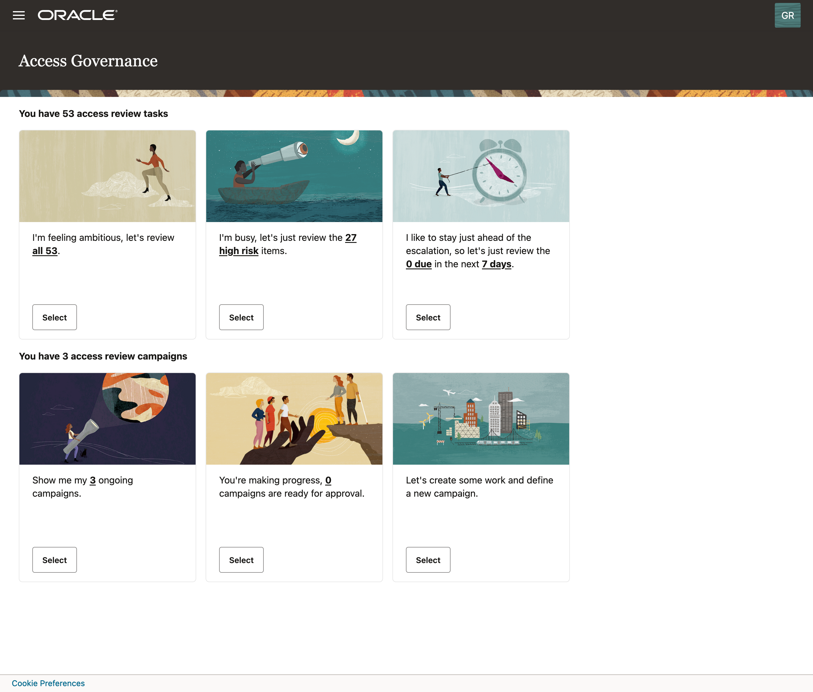
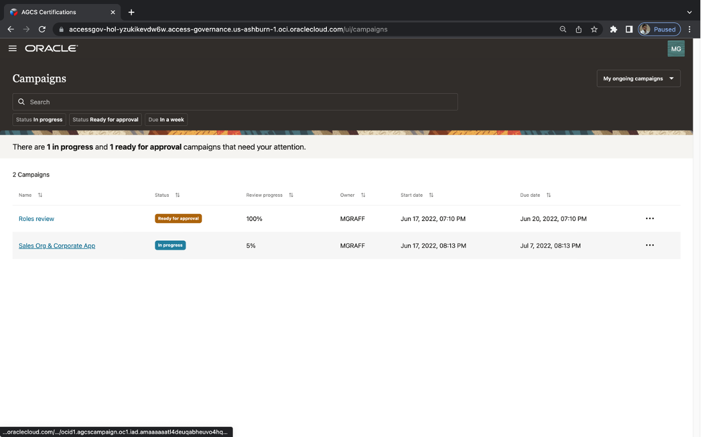
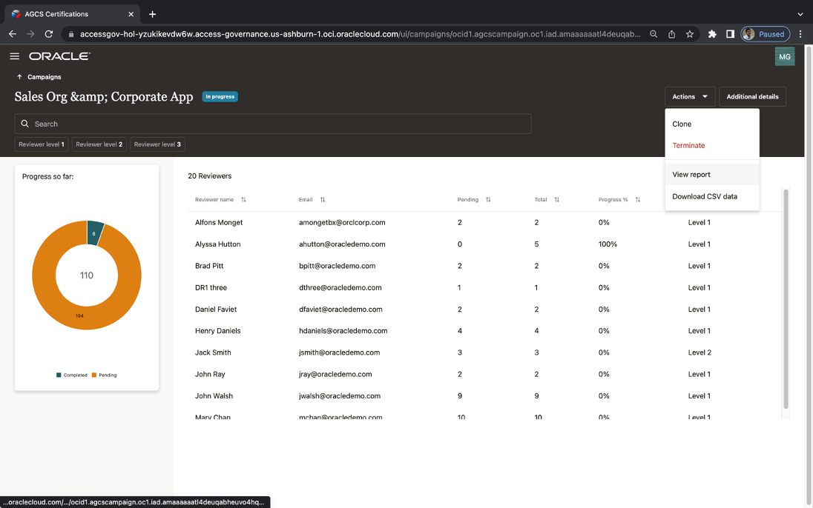
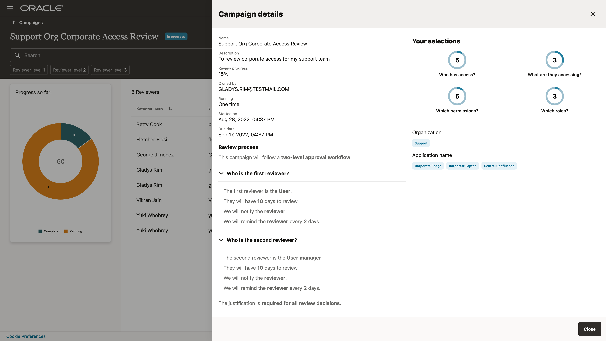
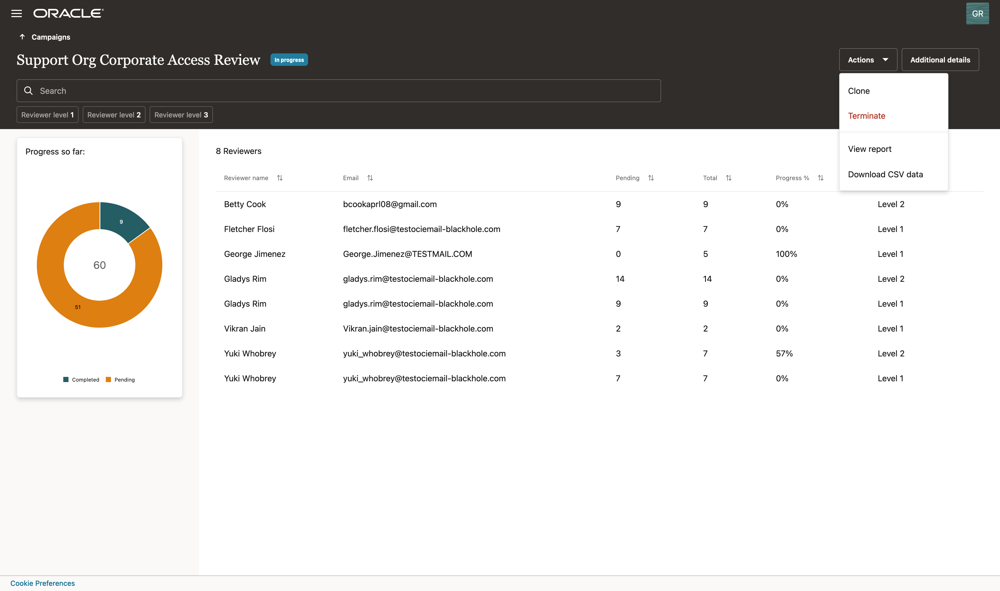
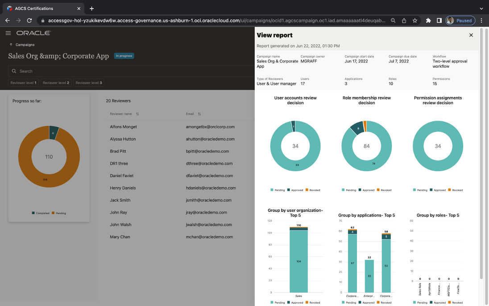
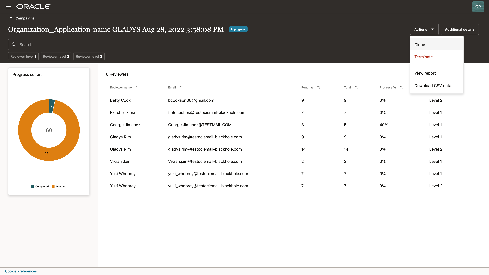
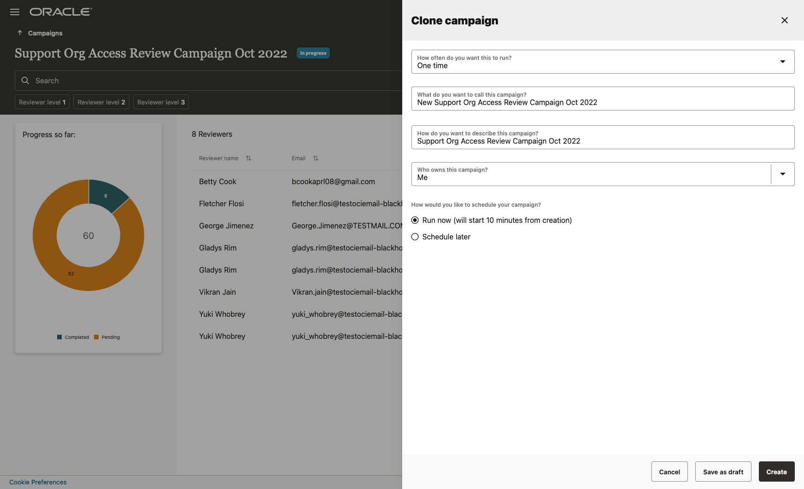

# Manage access review campaign (Campaign Owner)

## Introduction

Users with the Administrator or Campaign Administrator role and campaign owners can monitor and manage access review campaigns using the Oracle Access Governance Console.

Estimated Time: 10 minutes

### Objectives

In this lab, you will:
* View list of certification campaigns you own or created
* View the progress of certification campaigns made by reviewers with analytics insights

## Task 1: Login Oracle Access Governance as Campaign Administrator

1. Open Chrome browser and go to Oracle Access Governance URL based on your group assignment. 
- [Oracle Access Governance LiveLabs Group 1](https://accessgov-eap1-yzukikevdw6w.access-governance.us-ashburn-1.oci.oraclecloud.com/ui/)
- [Oracle Access Governance LiveLabs Group 2](https://accessgov-outreach02-yzukikevdw6w.access-governance.us-ashburn-1.oci.oraclecloud.com/ui/)
- [Oracle Access Governance LiveLabs Group 3](https://accessgov-outreach03-yzukikevdw6w.access-governance.us-ashburn-1.oci.oraclecloud.com/ui/)
- [Oracle Access Governance LiveLabs Group 4](https://accessgov-outreach04-yzukikevdw6w.access-governance.us-ashburn-1.oci.oraclecloud.com/ui/)
2. Ensure you have **accessgov_iam** identity domain selected.
3. Login Oracle Access Governance as **campaign administrator** with username and password provided by Hands-on Lab instructors.
	
4. You should see the Oracle Access Governance main dashboard.
  

## Task 2: Manage and Monitor Ongoing Certification Campaigns

1. Access Review Campaigns are organized by **Upcoming Campaigns**, **On-going Campaigns**, and **Previous Campaigns**. Click on **Select** button of tile **Show me my ongoing campaigns**.
  
2. You will see a list of **in progress** campaigns you own or created. Select the campaign you created in this lab.
  
3. You can have an insight on the progress made by reviewers. View how many **reviewers** are assigned to this campaign. For each reviewer, how many review items they got assigned, and what are percentage progress they made.
  
3. Click on button **Additional Details** to see more details for the selected campaign.
  
4. Click on drop-down menu of **Actions**, Select **View report** to view a report showing the progress details of the selected campaign. 
  
5. You can review out-of-the-box analytics and reports on campaign progress. You can also download the report as PDF file. 
  
6. Click **Close** and go back to campaign detail screen, click on **Actions** drop-down menu. You have the option to **Terminate** the current campaign. You also have the option to **Clone** the current campaign. 
  
7. Click on **Clone** and enter new name for the campaign. Select **Run now**. Then click on **Create**. You have now created a new campaign by cloning an existing campaign. 
  
5. During this lab, you have leverage the analytics features delivered by **Oracle Access Governance** to have insights on campaigns progress status. You also learn how to quickly create a new campaign by cloning an existing campaign. 
6. You may now **proceed to the next lab**. 

## Learn More

* [Oracle Access Governance Manage Access Review Campaign](https://docs.oracle.com/en/cloud/paas/access-governance/kfdck/index.html)
* [Oracle Access Governance Product Page](https://www.oracle.com/security/cloud-security/access-governance/)
* [Oracle Access Governance Product tour](https://www.oracle.com/webfolder/s/quicktours/paas/pt-sec-access-governance/index.html)
* [Oracle Access Governance FAQ](https://www.oracle.com/security/cloud-security/access-governance/faq/)

## Acknowledgements
* **Author** - Edward Lu, Abhishek Juneja, Oracle IAM Product Management
* **Last Updated By/Date** - Edward Lu, Abhishek Juneja, Oracle IAM Product Management, August 2022
