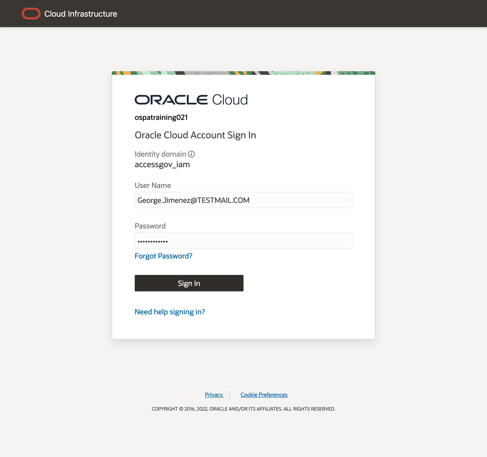
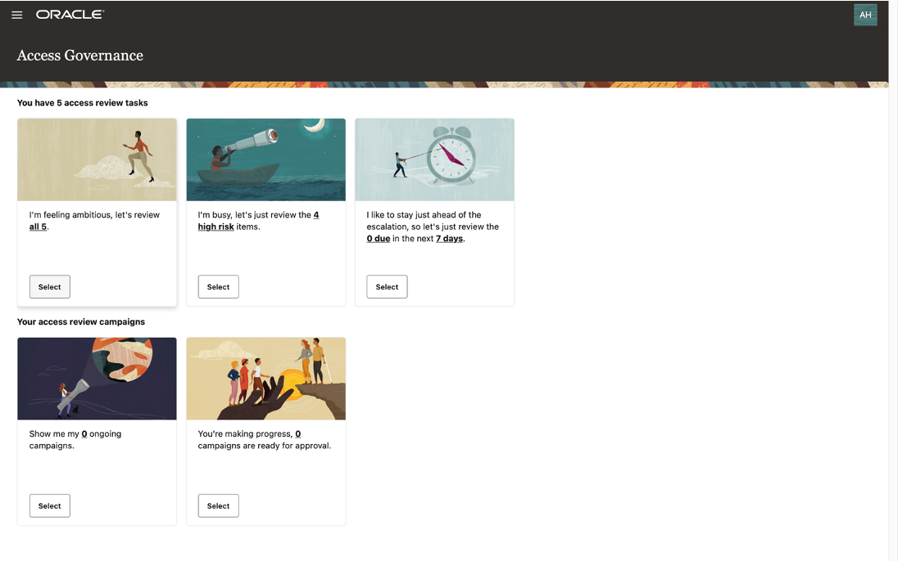
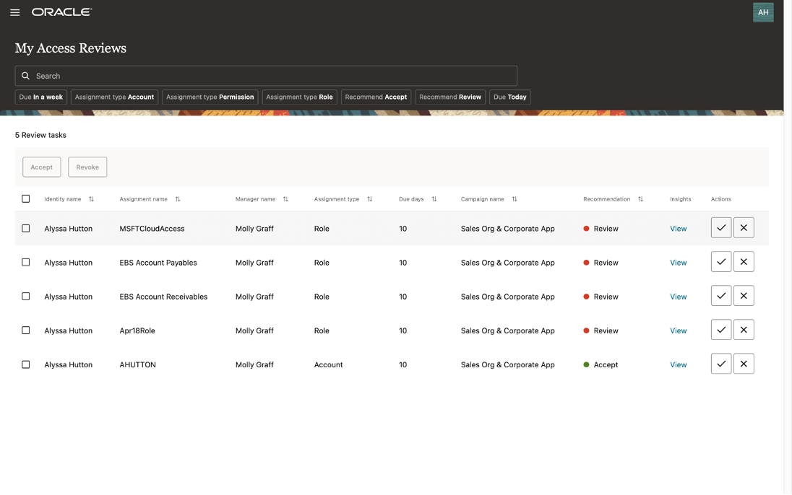
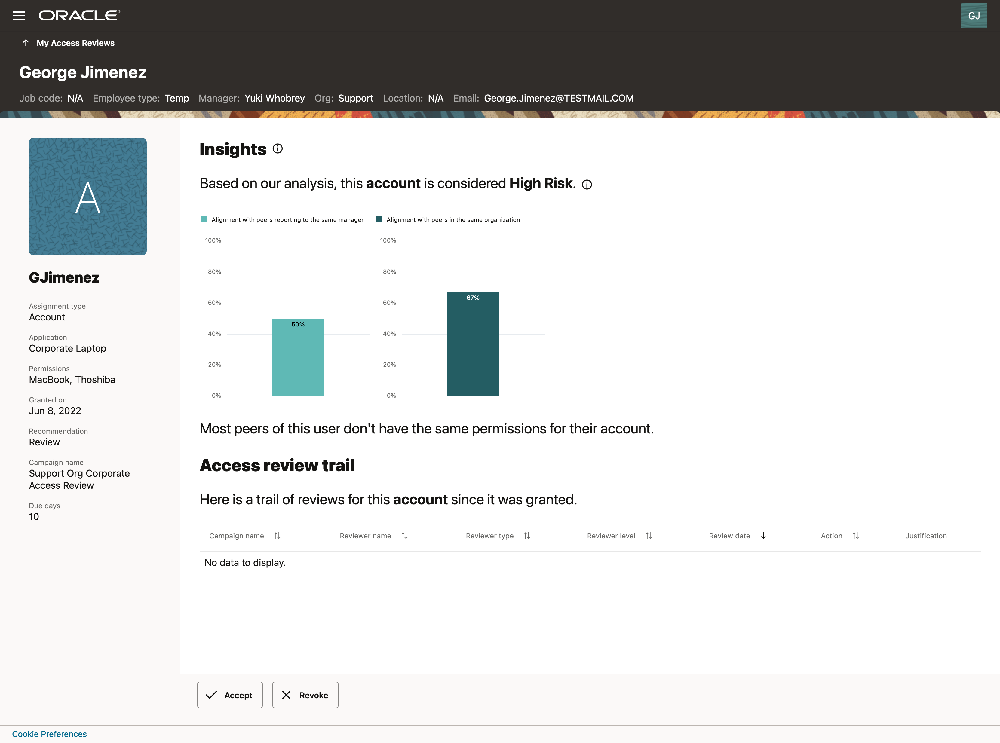
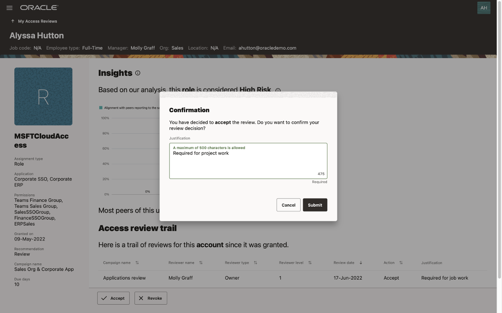
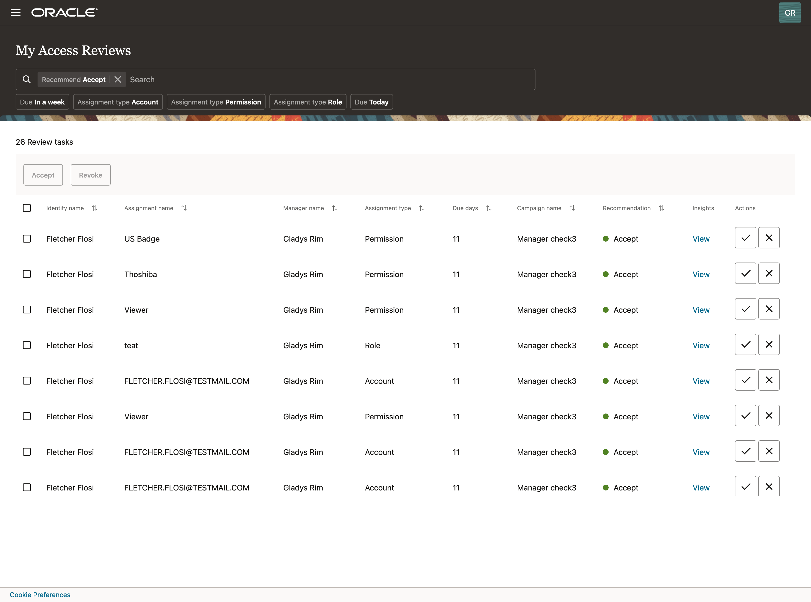
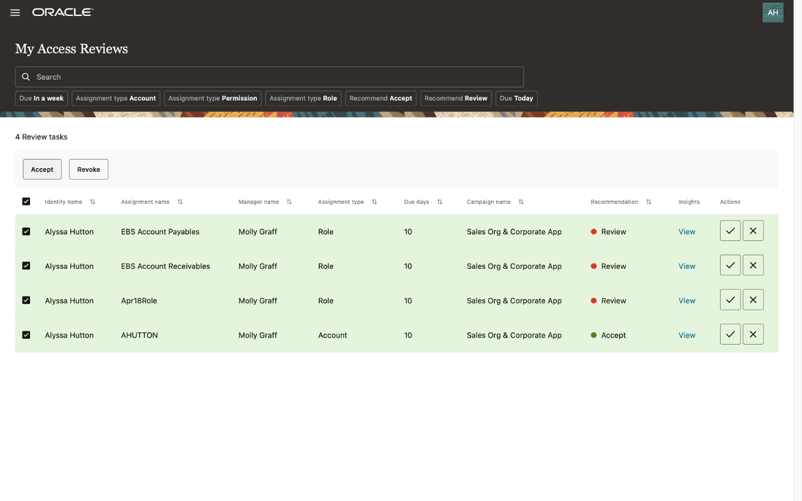
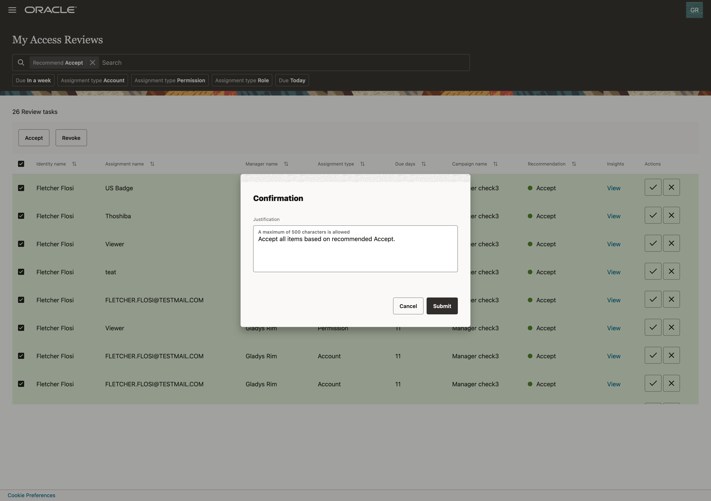
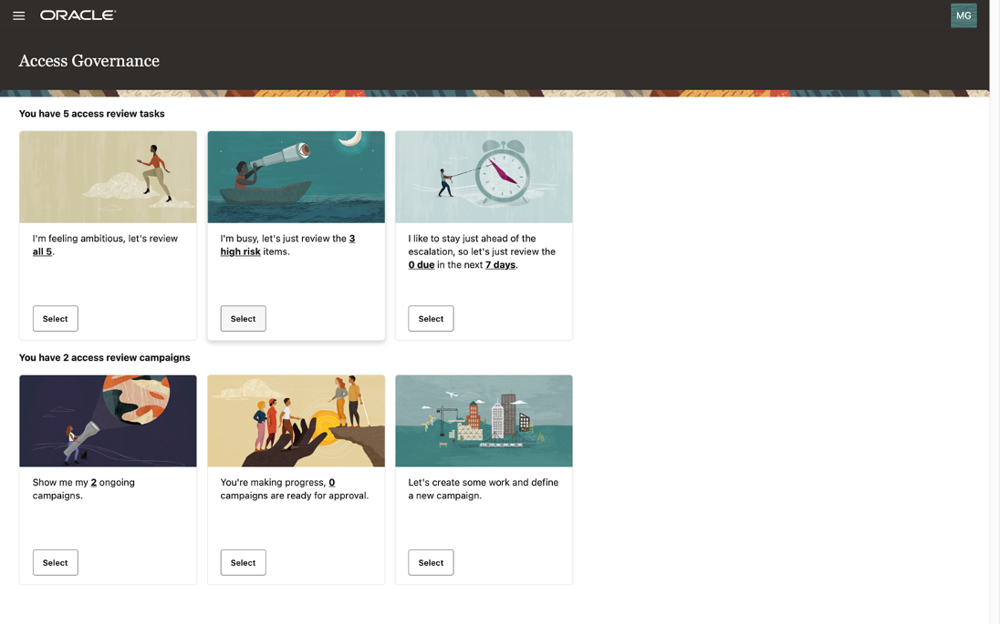

# Perform access review task

## Introduction

Access reviews can be carried out from the Oracle Access Governance Console by users with the following roles, which are based on data attributes derived from the connected system:

* **User** (review access assigned to me/self)
* **Manager** (review access assigned to users in my team)
* **Owner** (review access assigned to users over resources I own)

Based on the workflow setup in the first lab **Create Access Review Campaign**, Oracle Access Governance distributes access reviews to corresponding reviewers across the selected organization. In this lab, they will be first-level reviewer **employee** and second-level reviewer **user manager**. By leveraging the **prescriptive analytics** and **risk factor** embedded in access review, employees and user managers can make informed decisions about access entitlements. Users can also bulk approve low-risk items based on **AI/ML recommendations** from the system. 
* Estimated Time: 20 minutes
* Persona: Employee and User Manager

### Objectives

In this lab, you will:
* Review access review task assigned to me from the certification campaign as an employee user
* Review access review task assigned to me from the certification campaign as a user manager

## Task 1: Login Oracle Access Governance as Employee User

1. Open Chrome browser and go to Oracle Access Governance URL based on your group assignment. 
    - [Oracle Access Governance LiveLabs Group 1](https://accessgov-ocw-01-yzukikevdw6w.access-governance.us-ashburn-1.oci.oraclecloud.com/ui/)
    - [Oracle Access Governance LiveLabs Group 2](https://accessgov-ocw-002-yzukikevdw6w.access-governance.us-ashburn-1.oci.oraclecloud.com/ui/)
    - [Oracle Access Governance LiveLabs Group 3](https://accessgov-ocw-03-yzukikevdw6w.access-governance.us-ashburn-1.oci.oraclecloud.com/ui/)
    - [Oracle Access Governance LiveLabs Group 4](https://accessgov-ocw04-yzukikevdw6w.access-governance.us-ashburn-1.oci.oraclecloud.com/ui/)
2. If you are still login as a user from the previous lab, please make sure you log out and log in again. Ensure you have **accessgov_iam** identity domain selected.
3. Login to Oracle Access Governance as **employee user** with a username and password provided by Hands-on Lab instructors. **Please note username on LiveLabs step screenshot might be different from the username you received.**
	
4. You should see the **Oracle Access Governance** main dashboard. **Please note data on Oracle Access Governance main dashboard in your assigned system might be different from LiveLabs step screenshot.**
  

## Task 2: Perform access review task (Employee User Review)

1. Select one of the Access Reviews Tasks tiles. For this lab, click on **Select** button of tile **I'm feeling ambitious, let's review all...**
  
2. You will see a list of access review tasks assigned to you from the access review campaigns scheduled from the first lab. In case **campaign** from the first lab has not been started yet, you can also pick a **review task** with your assigned **manager user** name in this lab. For review tasks:
    - Check review task information such as **Assignment name**, **Manager name**, **Assignment type**, and **Due days** for which the task is raised
    - Filter the review tasks list by selecting **Recommend Accept** or **Recommend Review**. Based on **Prescriptive Analytics** powered by ML algorithm, **Oracle Access Governance** recommends action for each review item based on calculated risk scores and analytics. 
    - You may choose to accept the review item by clicking on **Accept** in **Actions** column.
    - In case you want to view the analytic insights, especially for item flagged as **Recommend Review**, you may click on **View** in **Insights** column to review a task
  
Insights include:
    - AI/ ML driven insights with alignment score. For example, notice the text **Most peers of this user don't have the same permissions for their accounts.**, which is the result based on **AI/ML peer group analysis** conducted by **Oracle Access Governance**. 
    - Description of the review task
    - Access review trail
    - Recent changes in user’s profile
  
3. Decide (Accept or Revoke): Review all insights and select to **accept** or **revoke** this access privilege. In this lab, you may pick one access review with **Recommend Review**, view the detail and **accept** it. **Accept** the review task item will trigger the **current review task** assigned to the second-level reviewer, which is **user manager** in the next task. On the contrary, **revoke** access by **employee user** will not trigger next level access review by **manager user**.  
  
4. Bulk action based on recommendation: You may also select multiple review tasks and decide to accept or revoke those privileges. For example, selecting filter **Recommend Accept** will return a list of access review items recommended by **Oracle Access Governance** for **accept** based on **prescriptive analytics**. 
  
5. Bulk selection: select all **Recommend Accept** items, then click on **Accept** button.
  
5. Bulk action with justification: Provide justification for **accept** then click on **Submit**.
  

## Task 3: Login Oracle Access Governance as User Manager

1. Open Chrome browser and go to Oracle Access Governance URL based on your group assignment. 
    - [Oracle Access Governance LiveLabs Group 1](https://accessgov-ocw-01-yzukikevdw6w.access-governance.us-ashburn-1.oci.oraclecloud.com/ui/)
    - [Oracle Access Governance LiveLabs Group 2](https://accessgov-ocw-002-yzukikevdw6w.access-governance.us-ashburn-1.oci.oraclecloud.com/ui/)
    - [Oracle Access Governance LiveLabs Group 3](https://accessgov-ocw-03-yzukikevdw6w.access-governance.us-ashburn-1.oci.oraclecloud.com/ui/)
    - [Oracle Access Governance LiveLabs Group 4](https://accessgov-ocw04-yzukikevdw6w.access-governance.us-ashburn-1.oci.oraclecloud.com/ui/)
2. If you are still login as a user from the previous lab, please make sure you log out and log in again. Ensure you have **accessgov_iam** identity domain selected.
3. Login to Oracle Access Governance as **manager user** with a username and password provided by Hands-on Lab instructors. **Please note username on LiveLabs step screenshot might be different from the username you received.**
	
4. You should see the **Oracle Access Governance** main dashboard. **Please note data on Oracle Access Governance main dashboard in your assigned system might be different from LiveLabs step screenshot.**
  

## Task 4: Perform access review task (User Manager Review)

1. In this lab, the user manager is the second-level reviewer. As user manager, you see the access review items accepted by your employee users in the previous task. Click **Select** button for the tile **I am busy, let's just review...** to review **high risk** items.
  
2. You will see a list of access review tasks assigned to you from access review campaigns or from your employee's access review results which you are the second-level reviewer as manager. For review tasks:
    - Check review task information such as **Assignment name**, **Manager name**, **Assignment type**, and **Due days** for which the task is raised
    - Filter the review tasks list by selecting **Recommend Accept** or **Recommend Review**. Based on **Prescriptive Analytics** powered by **AI/ML algorithm**, **Oracle Access Governance** recommends action for each review item based on calculated risk scores and analytics. 
    - You may choose to accept the review item by clicking on **Accept** in **Actions** column.
    - In case you want to view the analytic insights, especially for item flagged as **Recommend Review**, you may click on **View** in **Insights** column to review a task
  
Insights include:
    - AI/ ML driven insights with alignment score. For example, notice the text **Most peers of this user don't have the same permissions for their accounts.**, which is the result based on **ML peer group analysis** conducted by **Oracle Access Governance**. 
    - Description of the review task
    - Access review trail
    - Recent changes in user’s profile
  
3. Decide (Accept or Revoke): Review all insights and select to **accept** or **revoke** this access privilege. In this lab, you may pick one access review with **Recommend Review**, view the detail, and revoke it. 
4. During this lab, you have navigated **Oracle Access Governance** console to **select access review tasks** assigned to you as **employee** or **manager user**, view **prescriptive analytics** and **recommendation** proposed by **Oracle Access Governance**, make informed decisions based on **peer group analysis** and **risk analysis**. 
5. You may now **proceed to the next lab**. 

## Learn More

* [Oracle Access Governance Perform Access Review Campaign](https://docs.oracle.com/en/cloud/paas/access-governance/aarrs/index.html)
* [Oracle Access Governance Product Page](https://www.oracle.com/security/cloud-security/access-governance/)
* [Oracle Access Governance Product tour](https://www.oracle.com/webfolder/s/quicktours/paas/pt-sec-access-governance/index.html)
* [Oracle Access Governance FAQ](https://www.oracle.com/security/cloud-security/access-governance/faq/)

## Acknowledgements
* **Author** - Edward Lu, Abhishek Juneja, Oracle IAM Product Management
* **Last Updated By/Date** - Edward Lu, Abhishek Juneja, Oracle IAM Product Management, August 2022

