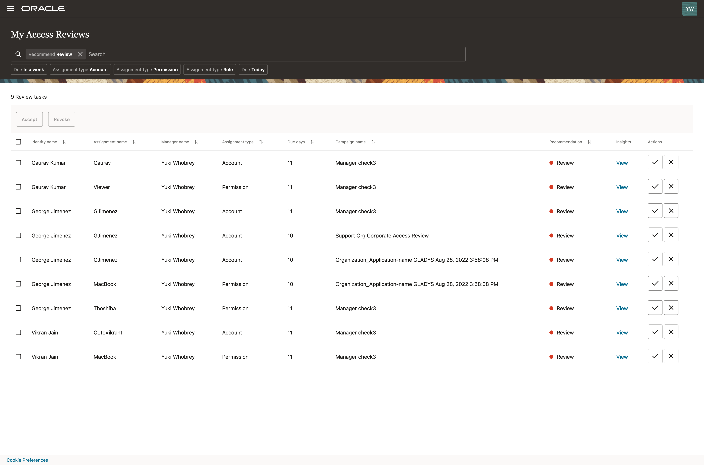
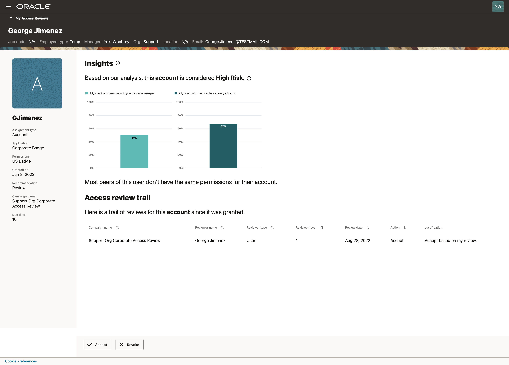

# Perform access review task

## Introduction

Access reviews can be carried out from the Oracle Access Governance Console by users with the following roles, which are based on data attributes derived from the connected system:

* User (review access assigned to me/self)
* Manager (review access assigned to users in my team)
* Owner (review access assigned to users over resources I own)

Estimated Time: 20 minutes

### Objectives

In this lab, you will:
* Review access assigned to me from certification campaign from user reviewer point of view
* Review access assigned to me from certification campaign from user manager reviewer point of view

## Task 1: Login Oracle Access Governance as Employee User

1. Open Chrome browser and go to https://accessgov-si-yzukikevdw6w.access-governance.us-ashburn-1.oci.oraclecloud.com/ui/
2. Ensure you have accessgov_iam domain selected.
3. Login Access Governance URL as employee reviewer user and password provided by Hands-on Lab instructors.
	
4. You should see the Oracle Access Governance main dashboard.
  

## Task 2: Perform access review task (User Review)

1. Select Access Reviews Tasks tile.
  
2. For review tasks:
- Check the assignment or access privilege for which it is raised
- Check ‘Recommendation’ table
- You may select to View Insights for a review task
  
Insights include:
- AI/ ML driven insights with alignment score
- Description of review task
- Access review trail
- Recent changes in user’s profile
  
3. Decide (Accept or Revoke): Review all insights and select to accept or revoke this access privilege.
  
4. Bulk action: You may also select multiple review tasks and decide to accept or revoke those privileges.
  
5. Bulk action with justification: Provide justification for bulk action.
  

## Task 3: Login Oracle Access Governance as User Manager

1. Open Chrome browser and go to https://accessgov-si-yzukikevdw6w.access-governance.us-ashburn-1.oci.oraclecloud.com/ui/
2. Ensure you have accessgov_iam domain selected.
3. Login Access Governance URL as user manager and password provided by Hands-on Lab instructors.
	
4. You should see the Oracle Access Governance main dashboard.
  

## Task 4: Perform access review task (User Manager Review)

1. Select to review High-risk tasks.
  
2. You can see access reviews for which recommendation is Review Select View to look into Insights.
  
3. You can review the decision made by last review (Alyssa Hutton) for this access review. You can select to Accept/Revoke this access privilege.
  
4. During this lab, you have navigated **Oracle Access Governance** console to **perform access review tasks**.
5. You may now **proceed to the next lab**. 

## Learn More

* [Oracle Access Governance Perform Access Review Campaign](https://docs.oracle.com/en/cloud/paas/access-governance/aarrs/index.html)
* [Oracle Access Governance Product Page](https://www.oracle.com/security/cloud-security/access-governance/)
* [Oracle Access Governance Product tour](https://www.oracle.com/webfolder/s/quicktours/paas/pt-sec-access-governance/index.html)
* [Oracle Access Governance FAQ](https://www.oracle.com/security/cloud-security/access-governance/faq/)

## Acknowledgements
* **Author** - Edward Lu, Abhishek Juneja, Oracle IAM Product Management
* **Last Updated By/Date** - Edward Lu, Abhishek Juneja, Oracle IAM Product Management, August 2022

