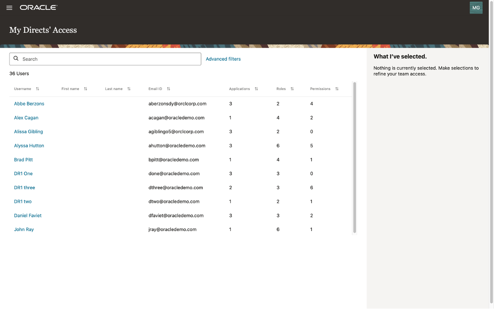
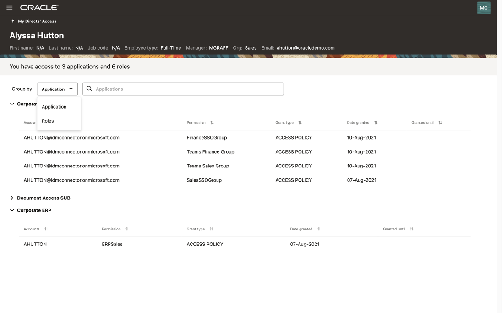
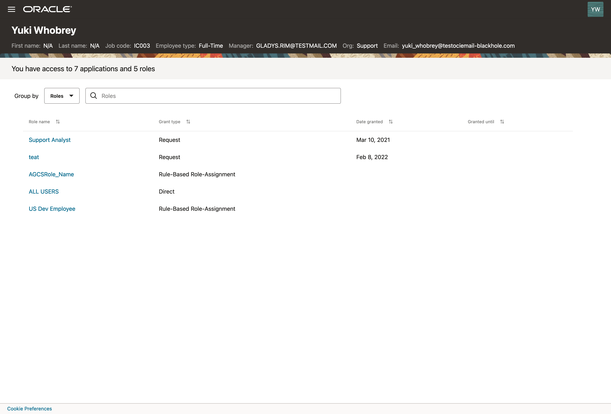
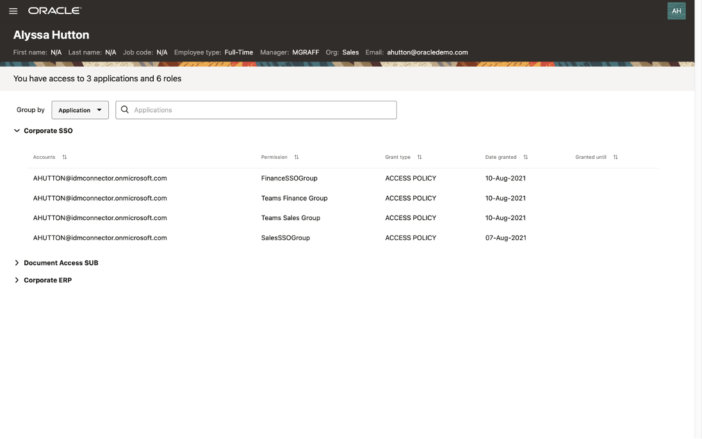

# Check Who has Access to What for Myself or My Direct Reports

## Introduction

Users can check what access they have or what access their direct reports have. **Managers** can view details of the **applications**, **permissions**, and **roles** assigned to their direct reports. **Employee Users** can view details of the **applications**, **permissions**, and **roles** assigned to themselves.

* Estimated Time: 15 minutes
* Persona: User Manager

Watch the video below for a quick walk-through of the lab.
[Review Who has Access to What](videohub:1_fb9lydfl)

### Objectives

In this lab, you will:
* View details of the **applications**, **permissions**, and **roles** assigned to my direct reports
* View details of the **applications**, **permissions**, and **roles** assigned to me

## Task 1: Login Oracle Access Governance as User Manager

1. Since the user from the previous lab **Create Access Review Campaign** is also a user manager, you can remain in **Oracle Access Governance** to perform this lab without logout and logging in again. Otherwise, please perform steps 2-4 below. 
2. Open Chrome browser and go to **Oracle Access Governance** URL based on your **group** assignment. 
    - [Oracle Access Governance LiveLabs Group 1](https://accessgov-ocw-01-yzukikevdw6w.access-governance.us-ashburn-1.oci.oraclecloud.com/ui/)
    - [Oracle Access Governance LiveLabs Group 2](https://accessgov-ocw-002-yzukikevdw6w.access-governance.us-ashburn-1.oci.oraclecloud.com/ui/)
    - [Oracle Access Governance LiveLabs Group 3](https://accessgov-ocw-03-yzukikevdw6w.access-governance.us-ashburn-1.oci.oraclecloud.com/ui/)
    - [Oracle Access Governance LiveLabs Group 4](https://accessgov-ocw04-yzukikevdw6w.access-governance.us-ashburn-1.oci.oraclecloud.com/ui/)
3. Ensure you have **accessgov_iam** identity domain selected.
4. Log in to **Oracle Access Governance** as **user manager** with a username and password provided by LiveLabs instruction. **Please note username on LiveLabs step screenshot might be different from the username you received.**
	
5. You should see the **Oracle Access Governance** main dashboard. **Please note data on Oracle Access Governance main dashboard in your assigned system might be different from LiveLabs step screenshot.** 
  

## Task 2: Review My Direct Report's Access

1. Click on the **Oracle Access Governance** menu, go to **Who has access to what**, then select **My Direct’s Access**.
  
2. You will see a list of users reporting to the current user manager. You may select one user. For example, Select **George Jimenez** as an example in the below screen. **Please note employee users in your assigned system might be different from LiveLabs step screenshot.** 
  
3. A list of applications to which **George Jimenez** has access is listed. You can select each application and review the privileges assigned to the user in the selected application. For each **application** your employee has, review **Accounts**, **Permission**, **Grant type**, **Date granted**, **Granted until** etc. 
  
4. Select **Roles** from **Group by** drop-down menu to see the list of roles assigned to a user.
  
5. Review **Roles** assigned to users and the detail for each role. 
  

## Task 3: Review my access

1. Click on the **Oracle Access Governance** menu, go to **Who has access to what**, then select **My Access**.
  
2. You can review a list of **applications** to which the signed-in user has access. You can select each application and review the privileges assigned to the user.
  
3. Select **Roles** from **Group by** drop-down menu to see a list of roles assigned to the user. You can also click on each **Role** to view details.
  
4. During this lab, you have navigated the **Oracle Access Governance** console as a user manager to list your direct report employees and your own access privileges. This is a security good practice and part of the employees' **Due Care / Due Diligence**.
5. You may now **proceed to the next lab**. 

## Learn More

* [Oracle Access Governance Who Has Access To What](https://docs.oracle.com/en/cloud/paas/access-governance/yhaty/index.html)
* [Oracle Access Governance Product Page](https://www.oracle.com/security/cloud-security/access-governance/)
* [Oracle Access Governance Product tour](https://www.oracle.com/webfolder/s/quicktours/paas/pt-sec-access-governance/index.html)
* [Oracle Access Governance FAQ](https://www.oracle.com/security/cloud-security/access-governance/faq/)

## Acknowledgments
* **Author** - Edward Lu, Abhishek Juneja, Oracle IAM Product Management; Ruben Alejandro Casas, Oracle Security Cloud Platform Enablement 
* **Last Updated By/Date** - Edward Lu, Oracle IAM Product Management, October 2022
