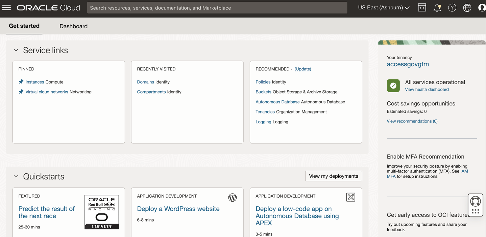
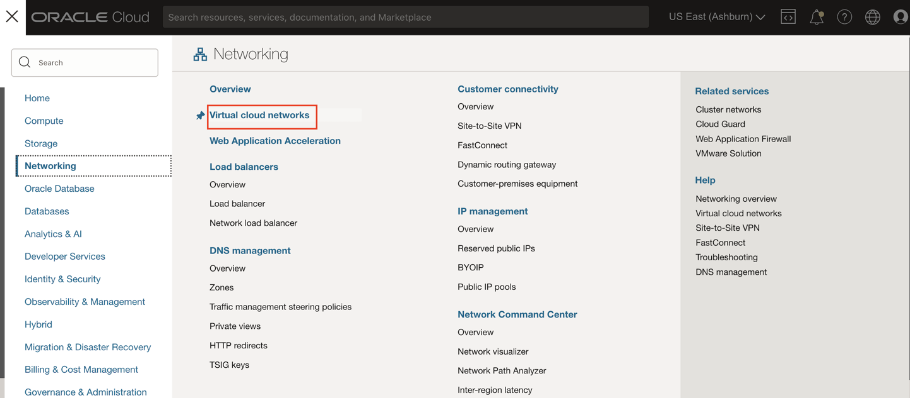
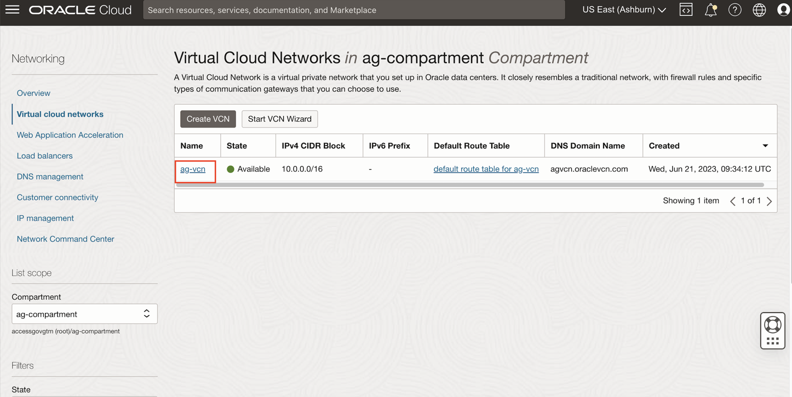
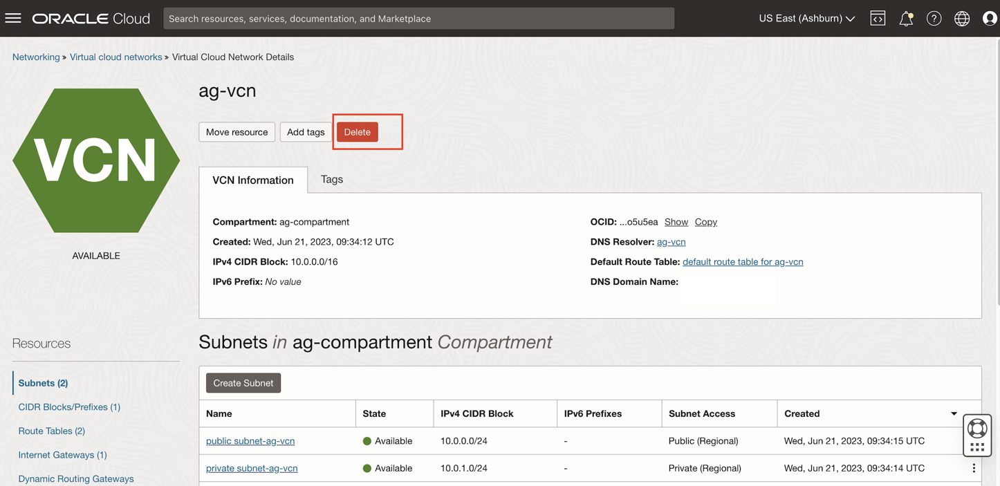
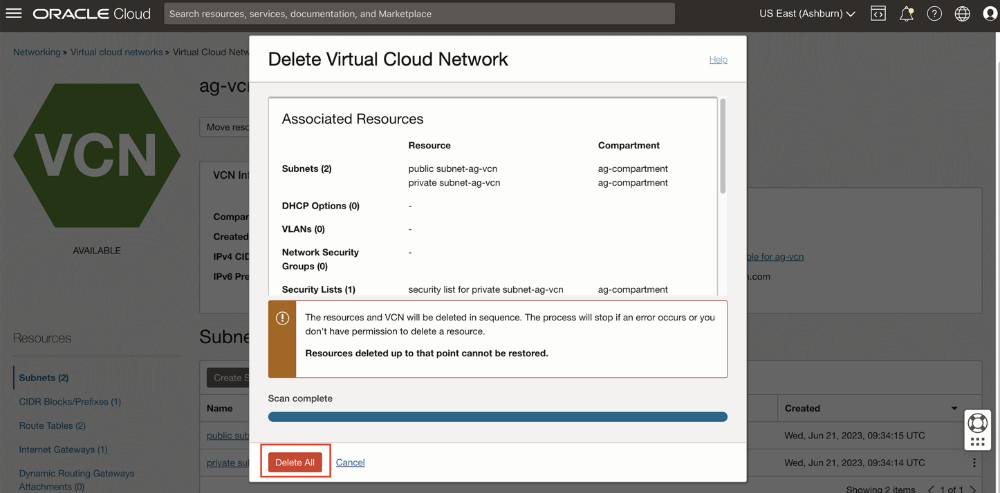

# Access Governance Virtual Cloud Network cleanup 

## Introduction

Upon completing your labs, we recommend that you perform a cleanup to dispose the Access Governance Virtual Cloud Network (ag-vcn). This lab will guide you to properly destroy the resource.

*Estimated Lab Time*: 10 minutes

### Objectives

In this lab, you will:
 * Destroy the Access Governance virtual cloud network (ag-vcn)

### Prerequisites
This lab assumes you have:

   * An Oracle Cloud account
   * You have completed:
       - Lab: Prepare Setup
       - Lab: Environment Setup

## Task 1: Destroy the Access Governance virtual cloud network 

1. Log in to Oracle Cloud

   

2. Click the Navigation Menu icon in the top left corner to display the Navigation menu. Click Networking in the Navigation menu. Select Virtual Cloud Networks from the list of products.

   
    

    
3. On the Virtual Cloud Networks page, Click on the Virtual Cloud Network  **ag-vcn** you created for this lab. 
 

     

4. Click on *Delete*. Prompt appears, confirm the *Scan* option. 

     

5. Once the scan is complete, Click on *Delete All*. Now the Access Governance Virtual Cloud Networks (ag-vcn) and its associated resources have been successfully deleted. 

     

    You may now **proceed to the next lab.**

## Learn More

* [Oracle Access Governance Create Access Review Campaign](https://docs.oracle.com/en/cloud/paas/access-governance/pdapg/index.html)
* [Oracle Access Governance Product Page](https://www.oracle.com/security/cloud-security/access-governance/)
* [Oracle Access Governance Product tour](https://www.oracle.com/webfolder/s/quicktours/paas/pt-sec-access-governance/index.html)
* [Oracle Access Governance FAQ](https://www.oracle.com/security/cloud-security/access-governance/faq/)

## Acknowledgments
* **Authors** - Anuj Tripathi, Indira Balasundaram, Anbu Anbarasu 
* **Last Updated By/Date** - Anbu Anbarasu, Cloud Platform COE, January 2023