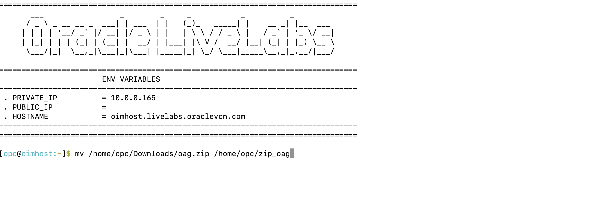
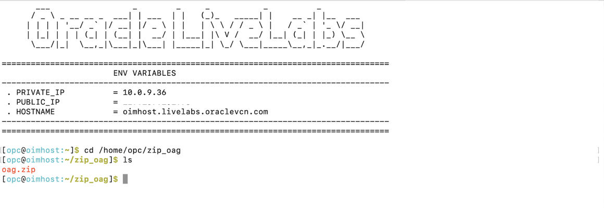
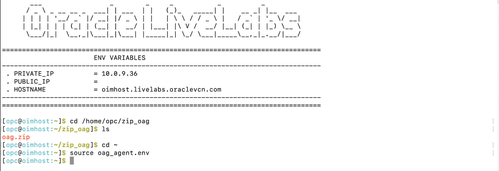
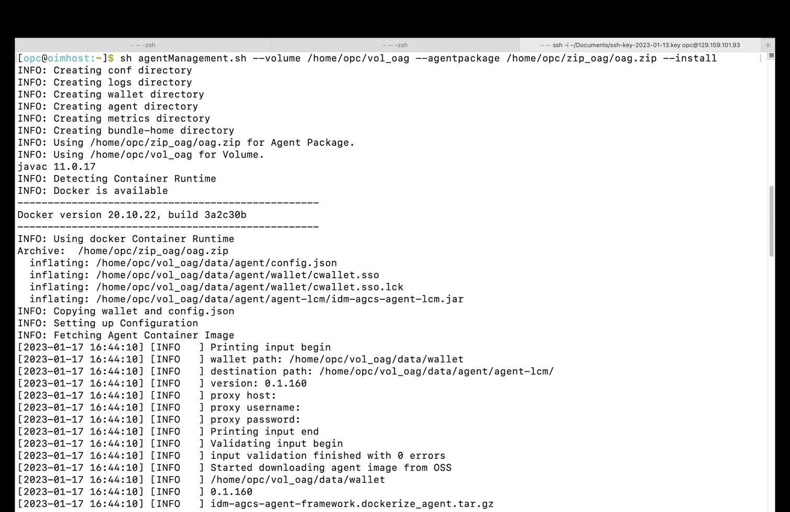
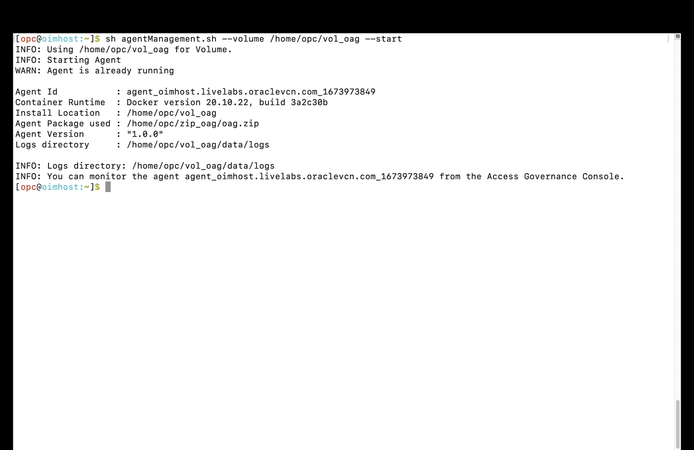
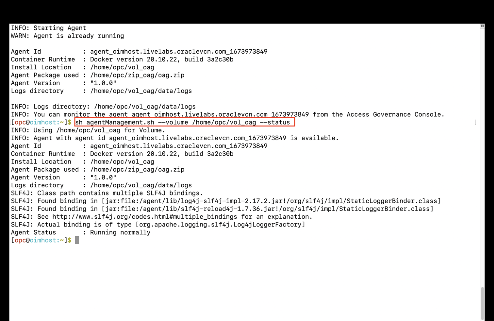

# Install and configure Oracle Access Governance agent

## Introduction

OAG Agent will be installed and configured. 

*Estimated Lab Time*: 15 minutes

Watch the video below for a quick walk-through of the lab.
[Oracle Access Governance Agent install](videohub:1_u4xrvpak)

### Objectives

In this lab, you will:
 * Install and Configure **OAG Agent.**

### Prerequisites
This lab assumes you have:
- A valid Oracle OCI tenancy, with OCI administrator privileges.


## Task 1: Install OAG Agent on the Compute Instance and Configure

1. Open the terminal session.

     

2. Move the downloaded zip file (oag.zip) present in the /home/opc/Downloads folder to /home/opc/zip_oag folder.
    
    ```
    <copy>mv /home/opc/Downloads/oag.zip /home/opc/zip_oag</copy>
    ```
     

    Verify the Agent zip (oag.zip) is present inside folder zip_oag.
    ```
    <copy>cd /home/opc/zip_oag</copy>
    <copy>ls</copy>
    ```
     

     

    
3. Setting the Environment variables using the below command:

    ```
    <copy>cd ~</copy>
    <copy>source oag_agent.env</copy>
    ```
     
 

4. Install the agent

    ```
    <copy>sh agentManagement.sh --volume /home/opc/vol_oag --agentpackage /home/opc/zip_oag/oag.zip --install</copy>
    ```
     

5. Start the agent
     ```
    <copy>sh agentManagement.sh --volume /home/opc/vol_oag --start</copy>
    ```
     

6. Verify the agent

     ```
    <copy>sh agentManagement.sh --volume /home/opc/vol_oag --status</copy>
    ```
     


    You may now **proceed to the next lab.**

## Learn More

* [Oracle Access Governance Create Access Review Campaign](https://docs.oracle.com/en/cloud/paas/access-governance/pdapg/index.html)
* [Oracle Access Governance Product Page](https://www.oracle.com/security/cloud-security/access-governance/)
* [Oracle Access Governance Product tour](https://www.oracle.com/webfolder/s/quicktours/paas/pt-sec-access-governance/index.html)
* [Oracle Access Governance FAQ](https://www.oracle.com/security/cloud-security/access-governance/faq/)

## Acknowledgments
* **Author** - Anuj Tripathi, Indira Balasundaram, Anbu Anbarasu
* **Contributors** - Edward Lu 
* **Last Updated By/Date** - Anbu Anbarasu, Cloud Platform COE, January 2023