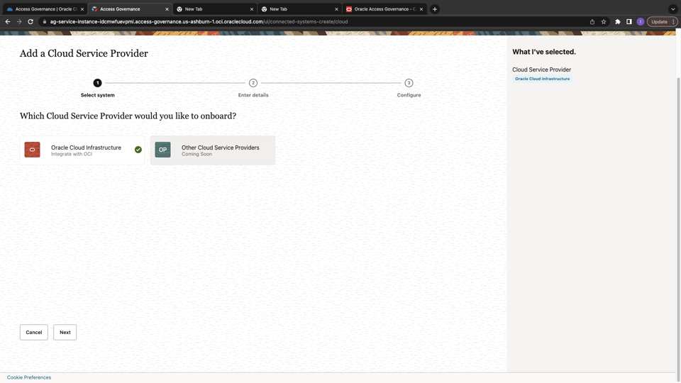

# Integrate Oracle Access Governance with OCI IAM 

## Introduction

As **Access Governance Administrators** they can learn to integrate Oracle Access Governance with OCI IAM. 

* Estimated Time: 15 minutes
* Persona: Access Governance Administrator

### Objectives

In this lab, you will:

* Configure a new OCI IAM Cloud Service Connection in Oracle Access Governance Console


## Task 1: Configure a new OCI IAM Cloud Service Connection in Oracle Access Governance Console


1.  In a browser, navigate to the Oracle Access Governance service home page using the URL noted down in *Lab 4: Task 1* and log in as a user with the **Access Governance Administrator** application role. 

  Enter Oracle Access Governance Campaign Administrator username and password (Pamela Green)

    **Username:**
    ```
    <copy>pamela.green</copy>
    ```

    **Password:**
    ```
    <copy>Oracl@123456</copy>
    ```

2.  On the Oracle Access Governance service home page, click on the Navigation Menu icon, and select **Service Administration → Connected Systems**

3. Select the **Add a connected system** button from the Connected Systems page.

      

4.  Select the **Would you like to connect to a cloud service provider?** tile by clicking the Add button.
 
  

    

5. In the **Select system** step, select the **Oracle Cloud Infrastructure** tile and then click **Next.**

  

6. Enter name  and description of the connected system, and then click **Next.**

  Name: OCI-IAM
  
  Description: OCI-IAM

  


  


7. To obtain the fingerprint of OCI user (Pamela Green). Login to the OCI console as user **Pamela Green** using the credentials mentioned below. 

  **Username:**
    ```
    <copy>pamela.green</copy>
    ```

    **Password:**
    ```
    <copy>Oracl@123456</copy>
    ```

   Navigate to  user profile on the top right corner and click on **My Profile**.
   
    
  
  
   Scroll down , click on **API keys**


     

  Click on **Add API key** . Click on **Generate API key pair**. 
  
    
  
  Click on **Download private key** and **Download public key**. 

  
  
  Click on **Add**. 

  Notedown the **Downloaded private key** in a text editor. This is required for the next step. 


  Under **Configuration file preview**, note down the following details which is required for the next step. 

  - User OCID
  - Fingerprint 
  - Tenancy OCID 
  - Region 

  


7. Enter the following details mentioned below: 

  **What is the OCI user's OCID?**: Enter the Oracle Cloud Identifier (OCID) for the OCI user (Pamela Green) noted down from the previous step. 

  **What is the OCI user's fingerprint?**: Enter the fingerprint of the public key of the API   Signing Key  noted down from the previous step.

  **What is the OCI user's private SSH key?**: Enter the downloaded private SSH key (.pem file) from previous step for the API Signing Key. 


  **What is the OCI tenancy OCID?**: Enter the OCID for the target tenancy  noted down from the previous step.

  **What is the OCI tenancy's home region?**: Enter the home region for the target OCI tenancy, using the region identifier noted down from the previous step.

  


8. Click **Add.** Click on Manage to see the status. If the connection details are successfully validated, you will see the **Success** status for the **Validate** operation. The Full Data Load operation may take upto a few minutes, depending upon the data available in your OCI tenancy. The incremental data load is run every four hours for this connected system to sync the data.

  


  You may now **proceed to the next lab**. 

## Learn More

* [Oracle Access Governance Create Access Review Campaign](https://docs.oracle.com/en/cloud/paas/access-governance/pdapg/index.html)
* [Oracle Access Governance Product Page](https://www.oracle.com/security/cloud-security/access-governance/)
* [Oracle Access Governance Product tour](https://www.oracle.com/webfolder/s/quicktours/paas/pt-sec-access-governance/index.html)
* [Oracle Access Governance FAQ](https://www.oracle.com/security/cloud-security/access-governance/faq/)

## Acknowledgments
* **Authors** - Anuj Tripathi, Indira Balasundaram, Anbu Anbarasu 
* **Last Updated By/Date** - Anbu Anbarasu, May 2023