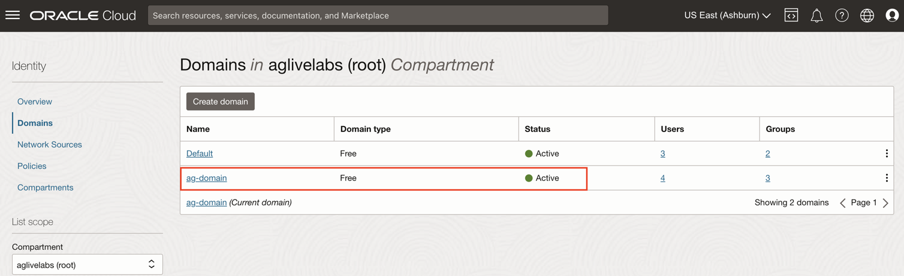
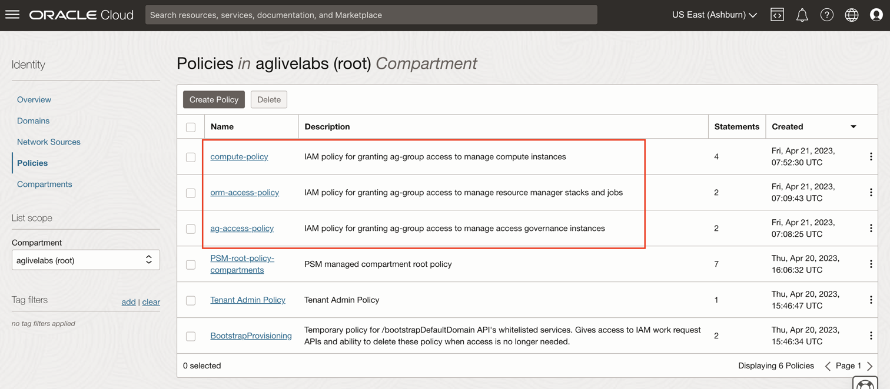

# Create Groups and Policies for Access Governance

## Introduction

Create groups and policies for Access Governance. 

* Estimated Time: 15 minutes
* Persona: Identity Domain Administrator

Watch the video below for a quick walk-through of the lab.
[Create Access Review Campaign](videohub:1_9s3mt0qx)

### Objectives

In this lab, you will:
* Create **groups** for Access Governance
* Create **policies** for Access Governance


## Task 1: Create AG Group 

1. Login to the OCI console Identity Domain: ag-domain as the Identity Domain Administrator. 

1. In the OCI console, click the Navigation Menu icon in the top left corner to display the *Navigation menu.* Click *Identity and Security* in the *Navigation menu*. Select *Domains* from the list of products.

    

2. On the Domains page, Click on *ag-domain* which is the identity domain you have created. Select *Groups*. Click on *Create Group*

    

    

    Enter the following details to create the *ag-group* and Assign the **Identity Domain Administrator** user to the group
    ```
    Name: ag-group
    Description: Access governance group to manage users 
    Users: Select the Identity Domain Administrator user from the list of users. 
    ```
    Click *Create*

    

    The *Group* has been created succesfully. 


## Task 2: Create AG Policies 


1. In the OCI console, click the Navigation Menu icon in the top left corner to display the *Navigation menu.* Click *Identity and Security* in the *Navigation menu*. Select *Policies* from the list of products.

    

3. On the Policies page, Click on *Create Policy* to create policy : ag-access-policy


    ```
    Name: ag-access-policy
    Description: IAM policy for granting ag-group access to manage access governance instances
    Compartment: Ensure your root compartment is selected
    Policy Builder: Select the show manual editor checkbox
    Statement 1: Allow group ag-domain/ag-group to manage all-resources in tenancy
    ```

    Click *Create*


    

     The *Policy* have been created successfully.

  You may now **proceed to the next lab**. 

## Learn More

* [Oracle Access Governance Create Access Review Campaign](https://docs.oracle.com/en/cloud/paas/access-governance/pdapg/index.html)
* [Oracle Access Governance Product Page](https://www.oracle.com/security/cloud-security/access-governance/)
* [Oracle Access Governance Product tour](https://www.oracle.com/webfolder/s/quicktours/paas/pt-sec-access-governance/index.html)
* [Oracle Access Governance FAQ](https://www.oracle.com/security/cloud-security/access-governance/faq/)

## Acknowledgments
* **Authors** - Anuj Tripathi, Indira Balasundaram, Anbu Anbarasu 
* **Contributors** - Edward Lu 
* **Last Updated By/Date** - Anbu Anbarasu, Cloud Platform COE, January 2023
