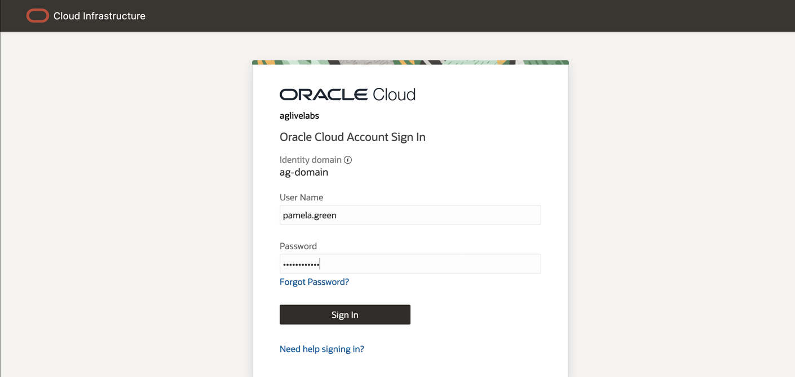
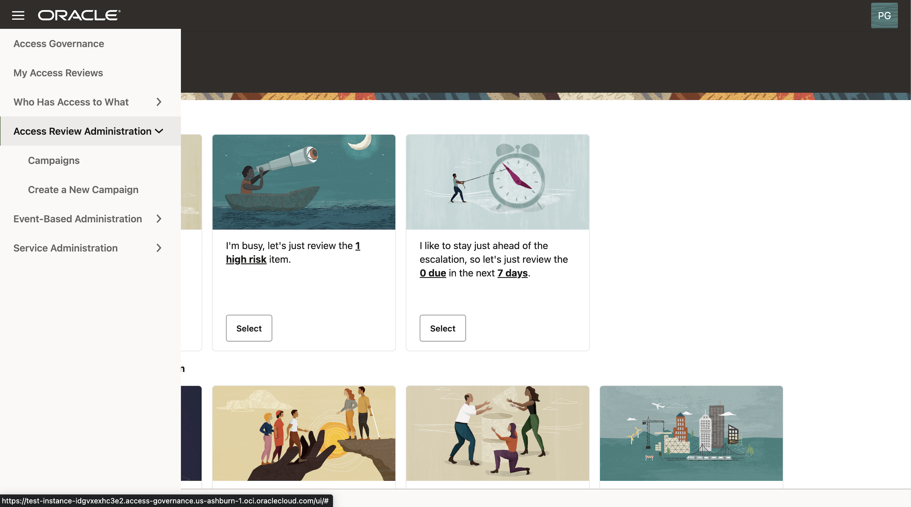
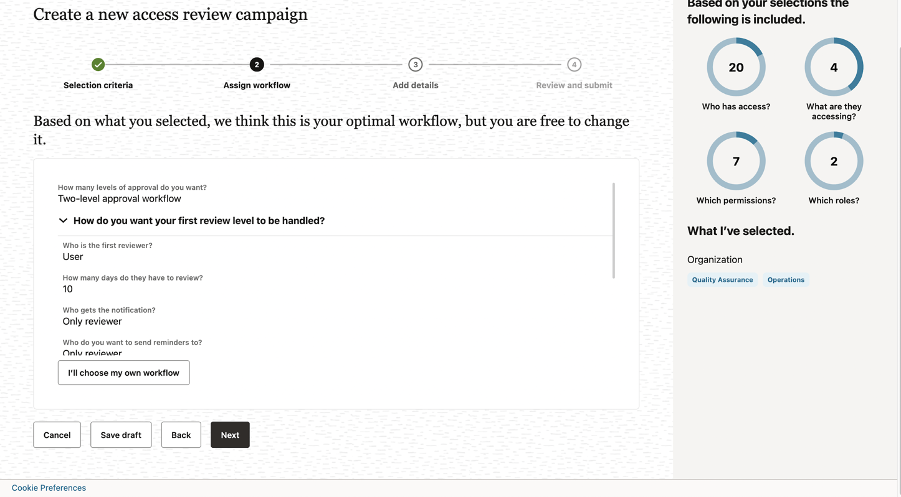
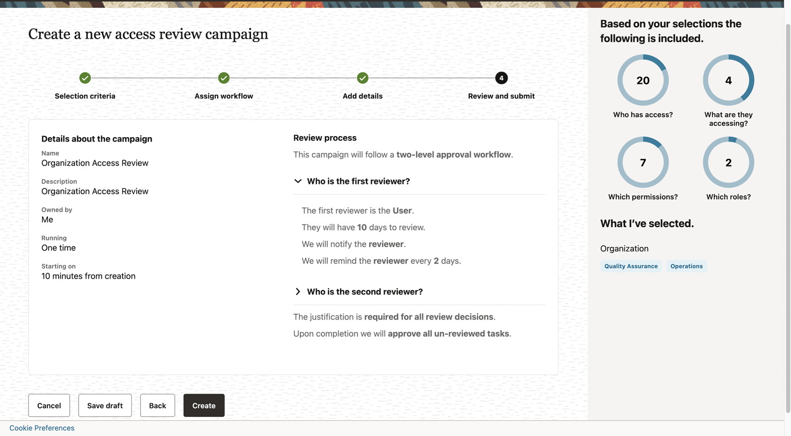
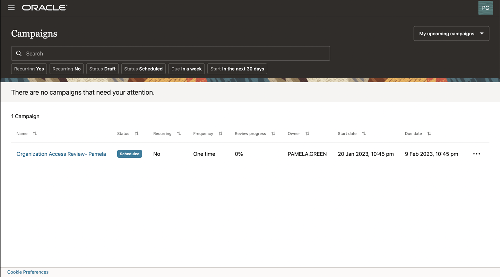

# Create access review campaign – self and user manager review

## Introduction

As a user with a **campaign administrator** role, you can create access review campaigns from the **Oracle Access Governance** console. You can define selection criteria for access reviews based on **users** (who has access), **applications** (what are they accessing), **permissions** (which permissions), and **roles** (which roles).

* Estimated Time: 15 minutes
* Persona: Campaign Administrator

Watch the video below for a quick walk-through of the lab.
[Create Access Review Campaign](videohub:1_p2m93d2k)

### Objectives

In this lab, you will:
* Create **access review campaign** for self and user manager review
* Define **reviewers' workflow**
* Run now or schedule an **access review campaign**


## Task 1: Login Oracle Access Governance as Access Review Campaign Administrator

1. Ensure you have **default** identity domain selected.
2. Log in to **Oracle Access Governance** as a **Campaign Administrator - Pamela Green** with the username and password mentioned below.

  **Username:**
    ```
    <copy>pamela.green</copy>
    ```

  **Password:**
    ```
    <copy>Oracl@123456</copy>
    ```

   

4. You should see the **Oracle Access Governance** main dashboard. **Please note data on Oracle Access Governance main dashboard in your assigned system might be different from LiveLabs step screenshot.** 
  

## Task 2: Create Access Review Campaign as Campaign Administrator  
1. Scroll to the bottom and select **Let's create some work and define a new campaign** or from the drop-down menu and select **Create a New Campaign**.
  
2. You may select any one of the 4 dimensions **Who has access?** (Users), **What are they accessing** (Applications), **Which permissions** (Permission), and **Which Roles** (Roles). For this lab, you can select **Who has access?** (Users) tile first. 
  
3. You may select users by **organization**, **job code**, or **location**. For this lab, you should select the **organization - Quality Assurance and Operations** your users are under review based on the lab assignment.After that, click on **Apply my selections**, which will bring you back to **Create a new access review campaign** wizard. 
  
  
4. In the pie charts on the top right corner, you can review the scope of selected **Users**, **Applications**, **Permissions**, and **Roles** in **What I’ve selected** selection, review the selections made by you. For this lab, you can click on the button **I’m good, go to workflows**.
  
5. Review the auto-selected workflow and reviewers. You can change those if required. For example, clicking on **I'll choose my own workflow** will open up **configure workflow** menu. For this lab, you may not need to change workflow and reviewers. Accept the default and click on **Next**. With this setup, access reviews go to **employee user** first, after the employee self review, it will go to the second reviewer **user manager** for approval.
  
6. Accept default value **One time** for the field **How often do you want this to run?**. You may provide a campaign name and description of your choice. For example, enter the campaign name as **Organization Access Review**, enter the description you prefer, select **Run now** and click on the **Next** button to schedule the campaign. Note the **campaign name** for reference in the next lab to search for your newly created access review campaign. For reviewers, the **campaign name** is referred to as **Review source** in the review tasks dashboard. 
  
7. You may review the selected campaign criteria, workflow, reviewers, and the run schedule. For this lab, click on the **Create** button to create and schedule a campaign. The campaign will start approximately **10 minutes** from creation.  
  
8. A newly created campaign **Organization Access Review** is scheduled in **My upcoming campaigns** section. It takes approximately 10 minutes for **the newly created campaign** to move to **in progress** status. 
  
 11. During this lab, you have navigated the **Oracle Access Governance** console and created a **user access review campaign** as a **campaign administrator**.
 12. You may now **proceed to the next lab**. 

## Learn More

* [Oracle Access Governance Create Access Review Campaign](https://docs.oracle.com/en/cloud/paas/access-governance/pdapg/index.html)
* [Oracle Access Governance Product Page](https://www.oracle.com/security/cloud-security/access-governance/)
* [Oracle Access Governance Product tour](https://www.oracle.com/webfolder/s/quicktours/paas/pt-sec-access-governance/index.html)
* [Oracle Access Governance FAQ](https://www.oracle.com/security/cloud-security/access-governance/faq/)

## Acknowledgments
* **Author** - Anuj Tripathi, Indira Balasundaram, Anbu Anbarasu 
* **Last Updated By/Date** - Anbu Anbarasu, Cloud Platform COE, January 2023
