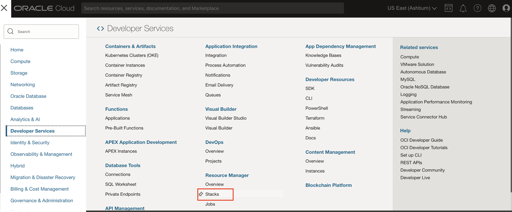
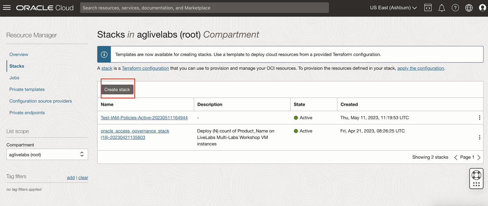
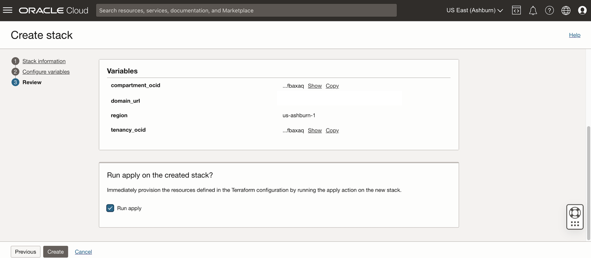
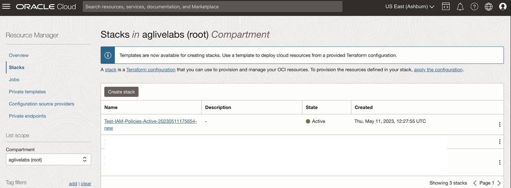

# Create  OCI Policies, Groups and Compartments

## Introduction

As a user with a **Administrator** role, you can create OCI policies, groups and compartments from the **OCI** console.This lab will show you how to download the stack zip file needed to set up the OCI policies,groups and compartments needed to run this OCI-IAM Policy reviews. 

 

* Estimated Time: 15 minutes
* Persona: Administrator

### Objectives

In this lab, you will:
* Download the stack zip file 
* Create  OCI Policies, Groups and Compartments using the stack

## Task 1: Download the Policy stack zip file

1. Click on the link below to download the Resource Manager zip file you need to build your environment:

   [Test-IAM-Policies-Active.zip]()

2. Save in your downloads folder.

## Task 2: Create Stack

1. Identify the Policy stack zip file downloaded in previous task of the Lab. 

2. Log in to Oracle Cloud

3. Open up the hamburger menu in the top left corner. Click Developer Services, and choose Resource Manager > Stacks. Choose the compartment in which you would like to install the stack. Click Create Stack.

  

4. Select My Configuration, choose the .Zip file button, click the Browse link, and select the zip file that you downloaded or drag-n-drop for the file explorer.

  

5. Click Next

  

6. Select Run Apply and click Create.

  

7. Your stack has now been created and the Apply action triggered is running to deploy your environment!

  

  You may now **proceed to the next lab**. 

## Learn More

* [Oracle Access Governance Create Access Review Campaign](https://docs.oracle.com/en/cloud/paas/access-governance/pdapg/index.html)
* [Oracle Access Governance Product Page](https://www.oracle.com/security/cloud-security/access-governance/)
* [Oracle Access Governance Product tour](https://www.oracle.com/webfolder/s/quicktours/paas/pt-sec-access-governance/index.html)
* [Oracle Access Governance FAQ](https://www.oracle.com/security/cloud-security/access-governance/faq/)

## Acknowledgments
* **Authors** - Anuj Tripathi, Indira Balasundaram, Anbu Anbarasu 
* **Contributors** - Edward Lu 
* **Last Updated By/Date** - Anbu Anbarasu, Cloud Platform COE, January 2023
