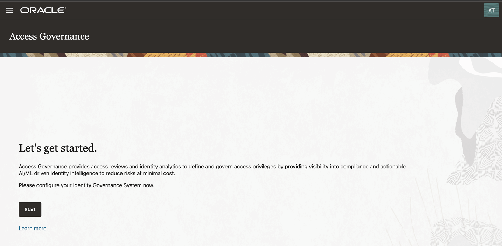

# Create and Perform Policy Review Campaigns

## Introduction

As OCI Tenancy Administrators and Access Governance Administrators they can create policy review campaign and Perform Policy Review tasks. 

* Estimated Time: 15 minutes
* Persona: Administrator

### Objectives

In this lab, you will:
* Create policy review campaigns for OCI IAM Policies
* Examine policy review tasks raised by the campaign
* Evaluate policy review tasks assigned to you as a Cloud Administrator

## Task 1: Sign in to Oracle Access Governance Console

1. From your browser, go to the Oracle Access Governance Console.

2. In the **Username** field, enter Oracle Access Governance Campaign Administrator or Administrator username.

3. In the **Password** field, enter your password and select **Sign In**

  You will be navigated to the home page of your Oracle Access Governance Console.

  

## Task 2: Create a Policy Review Campaign

1.  On the **Oracle Access Governance** console home page, scroll down and select the **“Let’s create some work and define a new campaign”** tile. Alternatively, you can select **Navigation Menu -> Access Reviews -> Campaigns.** On the **Campaigns** page, click the **Create a campaign** button.

  Choose Selection Criteria

  * In the Selection criteria step, select the Which cloud providers? tile. You will see a list of available cloud tenancies.

  * Select an appropriate cloud tenancy. In this tutorial, select the oracleidm tenancy. A green tick is marked against your selection. You can further refine your selection by selecting a specific compartment and a domain, to run domain-specific policy reviews.

  * Move on to the next step to select policies that you want to review. Select **Which policies?** tile. You will see a list of available policies in the domain that you selected.

  * Select the policies that you want to review. In this tutorial, select Admin-Policy  and  Users-Policy and then click **Apply my selections.**

  Assign Policy Review Workflow

  * Proceed to the **Assign workflow** step. To do this, click **I’m good, go to workflows.** Here, you can define the approval workflow for your review tasks.

  * You can modify the suggested workflow by clicking the **I’ll choose my own workflow button.** In this tutorial, you do not need to modify the suggested workflow, click **Next.**

  Add Policy Review Campaign Details

  * In the **Add details** step, you can define the frequency (one-time or periodic) at which to run an access review campaign, give a meaningful name to your campaign, add a supporting description, and assign values to additional attributes, such as who owns it and when the campaign should start or end.

  * For this tutorial make the following changes in the **Add details** step:

      **How often do you want this to run?** : Quarterly

      **What do you want to call this campaign?**: PolicyReview-OCI-IAM

      **How do you want to describe this campaign?**: PolicyReview-OCI-IAM

      **Who owns this campaign?**: Me

  * Select start and end date of this campaign. This policy review campaign will run every quarter, initiating from the start date until the end date.

  * Click **Next.**

  * The **Review and submit** step displays the information you have added in the previous steps. Select **Create** to create the campaign. Your campaign is scheduled and is displayed on the **Campaigns** page. It will run at the mentioned start date and time.

  

## Task 3: Perform Policy Review Tasks

  In this task, you will review and certify OCI IAM review tasks raised by the campaign created in the previous task.

  1. On the Oracle Access Governance Console home page, from the navigation menu, select **Access Reviews -> My Access Reviews.** You will see the My Access Reviews page. By default, the **Identity review tasks** tab is opened, which you will use to conduct user access reviews.

  2. To view review tasks created by your policy review campaign, click the **Policy review tasks** tab. You will see all policy access review tasks assigned to you as a reviewer. Oracle Access Governance uses in-house analytic-based Intelligence system to provide accept/review recommendations.

  3. For this tutorial, let’s check the recommendations given by Oracle Access Governance. Here, the Admin-Policy is marked for Review and Users-Policy is marked to Accept.

  4. Let’s check out the Insights generated by Oracle Access Governance. For Admin_Policy, click the corresponding **Actions** links under the **Insights** column.

  5. On the **Insights** page, you can view our recommendation for the policy review task. On the left-panel, you can view the policy information. On the right, you can view a complete list of actionable and non actionable policy statements, view policy details to see who and what the policy statement is granting access to, and make appropriate decisions on each statement.

  6. To make a review decision, you can either revoke all or accept all actionable statements in that policy at once, or make decision individually on each policy statement. For this tutorial, let’s revoke the first policy to **manage all-resources in compartment** as this as this policy is overly-permissive.

  7. Click **Apply.** The **Confirmation** dialog box is displayed.

  8. Provide justification and then click **Submit.**

  The closed loop access remediation will take place automatically.

  This concludes the tutorial on create and perform OCI IAM policy reviews.

  

  You may now **proceed to the next lab**. 

## Learn More

* [Oracle Access Governance Create Access Review Campaign](https://docs.oracle.com/en/cloud/paas/access-governance/pdapg/index.html)
* [Oracle Access Governance Product Page](https://www.oracle.com/security/cloud-security/access-governance/)
* [Oracle Access Governance Product tour](https://www.oracle.com/webfolder/s/quicktours/paas/pt-sec-access-governance/index.html)
* [Oracle Access Governance FAQ](https://www.oracle.com/security/cloud-security/access-governance/faq/)

## Acknowledgments
* **Authors** - Anuj Tripathi, Indira Balasundaram, Anbu Anbarasu 
* **Contributors** - Abhishek Juneja
* **Last Updated By/Date** - Anbu Anbarasu, Cloud Platform COE, January 2023
