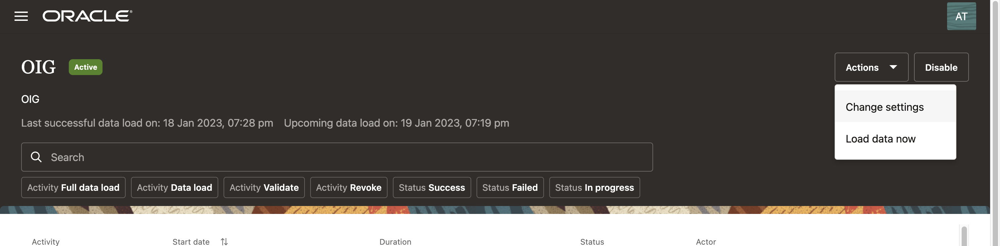

#  AG Data Load and IAM User Creation

## Introduction

To initiate a data load from the target connected system instance, perform the following tasks.

*Estimated Lab Time*: 15 minutes

### Objectives

In this lab, you will:
 * Perform Access Governance Data Load
 * Create IAM users 

### Prerequisites
This lab assumes you have:
- A Free Tier, Paid or LiveLabs Oracle Cloud account


## Task 1: Perform Data load in OAG console

1.  In the Oracle Access Governance Console, access the navigation menu by selecting the Navigation Menu icon. Select **Service Administration → Connected Systems.**

     
    
    
2. In the **Connected Systems** screen, select the **Manage** button for the Oracle Access Governance connected system you want to manage.

     

3. Select the **Load data now** option from the **Actions** drop-down menu in the top right-hand corner. This will initiate a data load which you can track the status of in the **Activity Log.** Refresh screen and wait for the status to be **Successful**

     

     

4. Private IP need to updated in JDBC url and OIG url in AG settings

## Task 2: Create Users in IAM

Create users in IAM and assign them to Application roles.

1. In the Oracle Access Governance Console, access the Cloud Shell.

    

2. Add the below commands to create users in file as **user.sh** file and upload in Cloud shell:

    Quality Asurance: Mark Hernandez
	Operations: Pamela Green 

    ```
    oci iam user create --name mark.hernandez --email <--email-id--> --description OAG-User-Cloud-Shell

	oci iam user create --name pamela.green --email <--email-id--> --description OAG-User-Cloud-Shell 
    oci iam user create --name harlan.bullard --email <--email-id--> --description OAG-User-Cloud-Shell
    ```
    

3. In cloud shell enter the below commands to execute the .sh file:

    ```
    <copy>ls</copy>
    <copy>sh users.sh</copy>
    ```
    

4. Once the users activation mail is received , reset the password to the below mentioned password:

    ```
    Password: Oracl@123456
    ```

5.  Private IP need to updated in JDBC url and OIG url in AG settings

    

6. In the OCI console, navigate to Identity -> Domains -> Default Domain -> Oracle Cloud Services -> AG-service-instance -> Application Role. 


    ```
    Assign AdminAppRole to User Pamela Green 
    ```

    


You may now [proceed to the next lab](#next).

## Learn More

* [Oracle Access Governance Create Access Review Campaign](https://docs.oracle.com/en/cloud/paas/access-governance/pdapg/index.html)
* [Oracle Access Governance Product Page](https://www.oracle.com/security/cloud-security/access-governance/)
* [Oracle Access Governance Product tour](https://www.oracle.com/webfolder/s/quicktours/paas/pt-sec-access-governance/index.html)
* [Oracle Access Governance FAQ](https://www.oracle.com/security/cloud-security/access-governance/faq/)

## Acknowledgments
* **Author** - Anuj Tripathi, Indira Balasundaram, Anbu Anbarasu 
* **Last Updated By/Date** - Anbu Anbarasu, Cloud Platform COE, January 2023