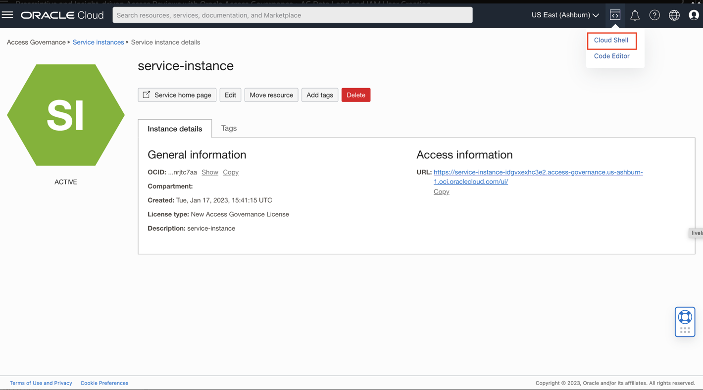

#  Perform AG data load and create IAM users 

## Introduction

To initiate a data load from the target connected system instance, perform the following tasks.

*Estimated Lab Time*: 15 minutes

Watch the video below for a quick walk-through of the lab.
[Perform Data and Create IAM Users](videohub:1_009fisy0)

### Objectives

In this lab, you will:
 * Perform Access Governance Data Load
 * Create IAM users 

### Prerequisites
This lab assumes you have:
- A valid Oracle OCI tenancy, with OCI administrator privileges.


## Task 1: Perform Data load in OAG console

1.  Log in to Oracle Access Governance console. Refer to *Lab 4: Task 1.4* for the Oracle Access Governance service instance URL. In the Oracle Access Governance Console, access the navigation menu by selecting the Navigation Menu icon. Select **Service Administration → Connected Systems.**

     
    
    
2. In the **Connected Systems** screen, select the **Manage** button for the Oracle Access Governance connected system you want to manage.

     

3. Select the **Load data now** option from the **Actions** drop-down menu in the top right-hand corner. This will initiate a data load which you can track the status of in the **Activity Log.** Refresh screen and wait for the status to be **Successful**

     

     

## Task 2: Create Users in IAM

Create users in IAM and assign them to Application roles.

1. In the Oracle Access Governance Console, access the Cloud Shell.

    

2. Follow the below commands to create 3 users - Pamela Green (Campaign Administrator), Harlan Bullard (Manager), Mark Hernandez (Employee User) in IAM.
    * Open the Text Editor inside the Workshop on the Linux environment. 
    
    * Create a new file **user-iam.sh**
    * Add the below contents in the **user-iam.sh** file and save it. Specify any email-id to which you will be receiving *Activation mail* for password reset for the users. 
    ```
    <copy>oci iam user create --name mhernandez --email <--email-id provided--> --description OAG-User-Cloud-Shell
	oci iam user create --name pamela.green --email <--email-id provided--> --description OAG-User-Cloud-Shell 
    oci iam user create --name harlan.bullard --email <--email-id provided--> --description OAG-User-Cloud-Shell</copy>
    ```
    * Save the file **user-iam.sh** 
    
    * Open the Cloud Shell. Click on the right top corner *Settings* icon. Click on *Upload* option.
    * Select the saved file **user-iam.sh**
    * The **user-iam.sh** file upload will be completed. 
    

3. In cloud shell enter the below commands to execute the .sh file:

    ```
    <copy>ls</copy>
    <copy>sh user-iam.sh</copy>
    ```
    

4. For each user created, an activation mail will be sent to the email-id provided in the *Task 2: Step 2* . Reset the password for the 3 users using the *Activation mail* recieved for each of them. 
    Reset password to the below mentioned password:

    **Password:**
     ```
    <copy>Oracl@123456</copy>
    ```
5. Assign Administrator Application Role to User Pamela Green

    * In the OCI console, navigate to Identity -> Domains -> Default Domain -> Oracle Cloud Services -> AG-service-instance -> Application Role. 

    * Notice the *AG Administrator* Role listed. Click on the Downward arrow on the right corner. 

    

    * Click on *Assigned Users -> Manage*. Select *Pamela Green* in *Available Users.* Click on *Assign*

    

    * The user Pamela Green is now visible under *Assigned Users*.

    

    * Pamela Green has been assigned with the *Administrator* application role. You can now close the window.


    You may now **proceed to the next lab.**

## Learn More

* [Oracle Access Governance Create Access Review Campaign](https://docs.oracle.com/en/cloud/paas/access-governance/pdapg/index.html)
* [Oracle Access Governance Product Page](https://www.oracle.com/security/cloud-security/access-governance/)
* [Oracle Access Governance Product tour](https://www.oracle.com/webfolder/s/quicktours/paas/pt-sec-access-governance/index.html)
* [Oracle Access Governance FAQ](https://www.oracle.com/security/cloud-security/access-governance/faq/)

## Acknowledgments
* **Author** - Anuj Tripathi, Indira Balasundaram, Anbu Anbarasu
* **Contributors** - Edward Lu  
* **Last Updated By/Date** - Anbu Anbarasu, Cloud Platform COE, January 2023