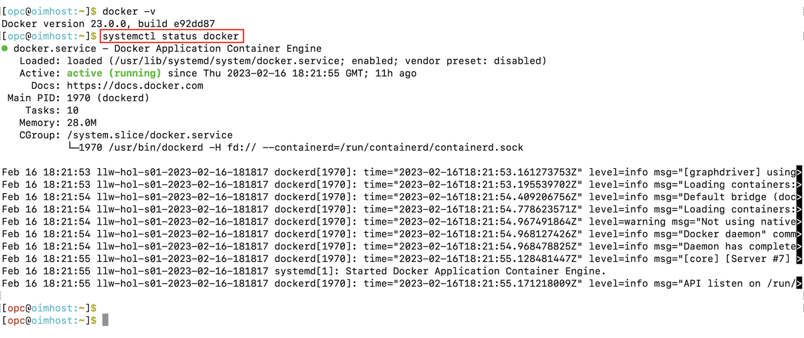

# Environment verification and Initialization

## Introduction

In this lab we will review the environment setup and start all services required to successfully run this workshop.

*Estimated Lab Time*: 15 minutes

### Objectives

In this lab, you will:
 * Verify the docker 
 * Start OIG services
 * Verify the status of all servers

### Prerequisites
This lab assumes you have:
- A Free Tier, Paid or LiveLabs Oracle Cloud account


## Task 1: Validate Docker is up and running

1. Open a terminal session. Check the version of the docker.

    ```
    <copy>docker -v</copy>
    ```
    ```
    Expected output: Docker version 20.10.22, build 3a2c30b
    ```
     
2. Validate the status to verify if docker service is up/running

    ```
    <copy>systemctl status docker</copy>
    ```
    Enter **Ctrl+C** to return to the command prompt

     

## Task 2: Start the Oracle Identity Governance (OIG) Services

1. Move to the directory where the script files are located.
     
    ```
    <copy>cd /scratch/idmqa/scripts</copy>
    ```

    
    


2. Start DB and all servers manually,using below scripts.

    ```
    <copy>./start_db.sh</copy>
    ```
    Wait till DB gets started. Then proceed to start all servers.
     ```
    
    <copy>./start_all_servers.sh</copy>
    ```
    

    

    


You may now [proceed to the next lab](#next).

## Learn More

* [Oracle Access Governance Create Access Review Campaign](https://docs.oracle.com/en/cloud/paas/access-governance/pdapg/index.html)
* [Oracle Access Governance Product Page](https://www.oracle.com/security/cloud-security/access-governance/)
* [Oracle Access Governance Product tour](https://www.oracle.com/webfolder/s/quicktours/paas/pt-sec-access-governance/index.html)
* [Oracle Access Governance FAQ](https://www.oracle.com/security/cloud-security/access-governance/faq/)

## Acknowledgments
* **Author** - Anuj Tripathi, Indira Balasundaram, Anbu Anbarasu 
* **Last Updated By/Date** - Anbu Anbarasu, Cloud Platform COE, January 2023